# Проект «ТЕЧЕНИЕ»

[TOC]

<i>«ТЕЧЕНИЕ» – это проект, который стирает границы между прошлым и настоящим, искусством и технологией, предлагая аудитории уникальный опыт погружения в мир цвета и визуального восприятия.</i>

**Организаторы:** [Креативный Кластер «Дизайн Центр»](https://designcenter.me/), [Фабрика «Лоймина»](https://loymina.ru/), [«Саратовский государственный художественный музеей имени А.Н. Радищева»](https://radmuseumart.ru/).

**Места проведения:** Саратов – Москва – Казань – Нижний Новгород 

**Даты:** 

- Разработка: *март-октябрь 2024*;
- Реализация: *апрель-ноябрь 2025* *(приурочено к 140 летию «Саратовского государственного художественного музея имени А.Н. Радищева»)*.

**При поддержке:** [Министерство Культуры РФ](https://culture.gov.ru/), [Союз Креативных Кластеров](https://www.unitedclusters.ru/), [СГУ](https://www.new.sgu.ru/), [СГТУ](https://www.sstu.ru/), [Сбер](http://www.sberbank.ru/).

**Партнеры:** [«Ковер.ру»](https://kover.ru/)

## Описание проекта «ТЕЧЕНИЕ»

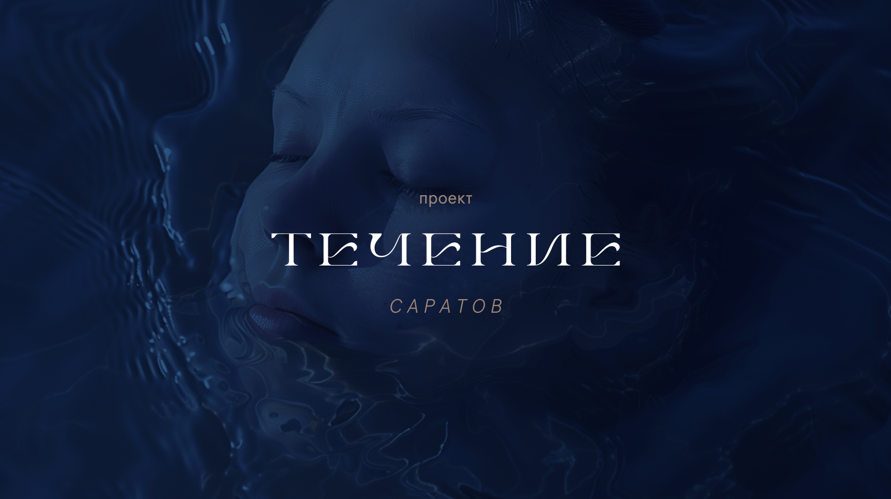

**Инициатива и сотрудничество:** проект «ТЕЧЕНИЕ» инициирован Креативным Кластером «Дизайн Центр» в рамках сотрудничества с фабрикой «Лоймина» и «Саратовским государственным художественным музеем имени А.Н. Радищева». Этот проект представляет собой передовые идеи в области дизайна интерьера и технологии производства красок, уникальное слияние живописи и современных технологий, тем самым отражая глубину и многообразие Саратовской школы живописи. Этот проект объединяет творчество знаменитых местных художников, таких как Александр Савинов, Петр Уткин, Александр Матвеев, Павел Кузнецов и других, создавая уникальные цветовые решения для современного интерьерного дизайна.

**Маркетинговая и коммерческая стратегия:** проект направлен на привлечение внимания к бренду «Лоймина» и расширение его влияния среди архитекторов, дизайнеров интерьера, конечных потребителей, студентов профильных вузов и инфлюенсеров. «ТЕЧЕНИЕ» не только подчеркивает культурное и историческое значение саратовской школы живописи, но и демонстрирует потенциал «Лоймина» в создании инновационных и экологически чистых продуктов для современного рынка интерьерного дизайна. Проект является не просто коллекцией красок, обоев-пано и ковров, но интегрированной маркетинговой кампанией, направленной на увеличение осведомленности и лояльности к бренду «Лоймина». В рамках «ТЕЧЕНИЕ» будут организованы интерактивные выставки, семинары и мастер-классы. Помимо этого, будет задействован ряд цифровых платформ для продвижения этого уникального проекта, тем самым повышая интерес к продукции «Лоймина» и стимулируя её продажи.

## Цели и задачи проекта «ТЕЧЕНИЕ»

Основная **цель** проекта «ТЕЧЕНИЕ» заключается в развитии национальной креативной экономики Российской Федерации путем синтеза человеческого капитала и историко-культурного наследия. Проект стремится к воплощению этой цели через создание инновационной платформы, объединяющей искусство, технологии и культуру, и демонстрацию уникальности и разнообразия национального творческого потенциала.

**Задачи проекта:**

1. **Синтез культурного наследия и инноваций**: объединение традиционного искусства Саратовской школы живописи с современными технологиями производства красок и обоев для создания уникальных цветовых решений в дизайне интерьера.

2. **Анализ и инновационное развитие в креативных индустриях**: исследование текущего положения и потенциала креативных индустрий, выявление новых направлений для развития и инноваций.

3. **Маркетинговое позиционирование и брендовое развитие фабрики «Лоймина»**: разработка и реализация маркетинговой стратегии, направленной на повышение узнаваемости и влияния бренда «Лоймина» в кругах профессионалов и конечных потребителей.

4. **Цифровое продвижение и расширение рынка**: внедрение цифровых маркетинговых кампаний и стратегий для увеличения вовлеченности аудитории и продаж продукции.

5. **Координация и распространение коллекции**: организация и координация деятельности участников проекта для эффективного распространения коллекции.

6. **Вовлечение и поддержка культурного сегмента**: сотрудничество с «Радищевским Музеем» для интеграции историко-культурного контента в проект.

7. **Взаимодействие с технологическими партнерами**: привлечение технологических партнеров, таких как Сбер «Кандинский», для обеспечения проекта современными цифровыми решениями.

> Эти задачи направлены на реализацию комплексного проекта, который не только отражает культурное наследие, но и способствует развитию инноваций в креативной индустрии, укрепляя позиции российских брендов на внутреннем и международном рынках.
>

### Продвижение и популяризация бренда «Лоймина»

Укрепление позиций фабрики «Лоймина» на рынке как инновационного производителя экологически чистых красок и настенных покрытий. Повышение узнаваемости и лояльности к бренду среди широкой аудитории.

**Задачи проекта:**

1. **Разработка и запуск капсульной коллекции красок и обоев**. Создание уникальной линейки красок, коллекции обоев и ковров вдохновленных творчеством саратовской школы живописи.Организация эффективной маркетинговой и рекламной кампании для коллекции.

2. **Организация иммерсивной выставки**. Проведение выставки с использованием AR-технологий в «Радищевском музее». Создание привлекательного и образовательного контента, способствующего глубокому погружению в искусство.

3. **Масштабирование и расширение проекта**. Представление проекта на значимых форумах и мероприятиях, таких как «Российская креативная неделя». Расширение проекта на федеральном уровне через сотрудничество с крупными креативными кластерами и культурными центрами.

4. **Взаимодействие с ключевыми партнерами**. Налаживание партнерских отношений с креативными индустриями, образовательными учреждениями и органами власти для поддержки и развития проекта (Союз Креативных Кластеров). Разработка совместных образовательных (профильные вузы) и культурных инициатив.

> Цели и задачи проекта «ТЕЧЕНИЕ» направлены на создание синергии между искусством, технологическими инновациями и бизнесом, обеспечивая фабрике «Лоймина» устойчивое развитие и конкурентное преимущество на современном рынке. Этот также проект станет важным шагом в продвижении новаторских идей в мире интерьерного дизайна и искусства.
>

## Состав проекта «ТЕЧЕНИЕ»

###  Капсульная коллекция красок от «Лоймина»

**Описание коллекции**: коллекция представляет собой серию уникальных оттенков красок, 64 оттенка (32 темных и 32 белых) каждый из которых вдохновлен ключевыми произведениями художников Саратовской школы живописи.

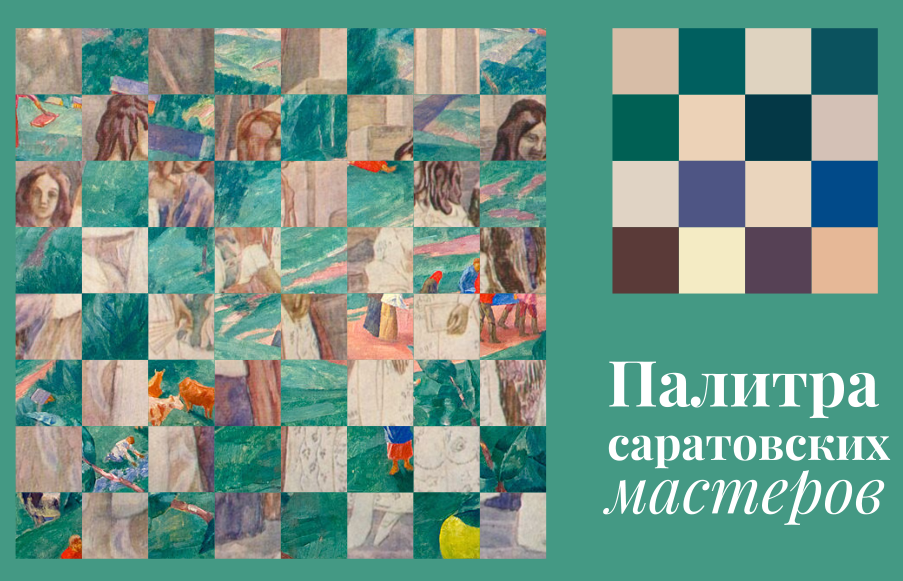

**Создание оттенков**: разработка цветовых решений основывается на тщательном изучении художественных стилей и техник, применяемых мастерами этой школы, при участии искусствоведов и специалистов Радищевского музея.

**Применение и инновации**: оттенки коллекции спроектированы таким образом, чтобы сочетаться с современными трендами в интерьерном дизайне, предлагая как традиционные, так и инновационные решения для оформления пространства.

### Коллекция обоев-пано от «Лоймина»

**Описание коллекции**: эта коллекция включает в себя эксклюзивные обои-пано, ориентировочно 20 штук, дизайн которых также вдохновлен работами художников Саратовской школы.

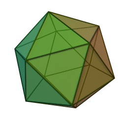

**Художественная основа**: для создания коллекции обоев-пано использованы элементы, мотивы и стилистика произведений известных художников, переосмысленные и адаптированные к современным интерьерам.

**Сотрудничество и интеграция**: разработка дизайна обоев-пано является результатом совместной работы дизайнеров фабрики «Лоймина», искусствоведов Радищевского музея и креативных специалистов из «Дизайн Центра», что обеспечивает глубокое понимание как художественной, так и функциональной стороны продукции.

> Эти коллекции являются ключевым элементом проекта «ТЕЧЕНИЕ», демонстрируя как глубокое уважение к культурному наследию, так и стремление к инновациям в области дизайна и производства отделочных материалов. Они способствуют созданию уникальной эстетики в современном интерьере, привнося в него исторические и культурные мотивы.

### Коллекция ковров от компании «Ковер.ру»

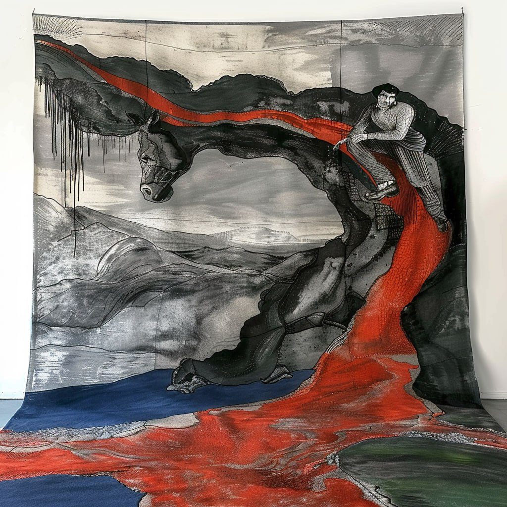

**Описание коллекции**: эта эксклюзивная серия ковров создана в сотрудничестве с компанией «Ковер.ру» и включает в себя дизайны, вдохновленные эстетикой и цветовой палитрой Саратовской школы живописи. Ковры станут не только функциональным элементом интерьера, но и значимым акцентом, подчеркивающим стилистическую концепцию всего проекта.

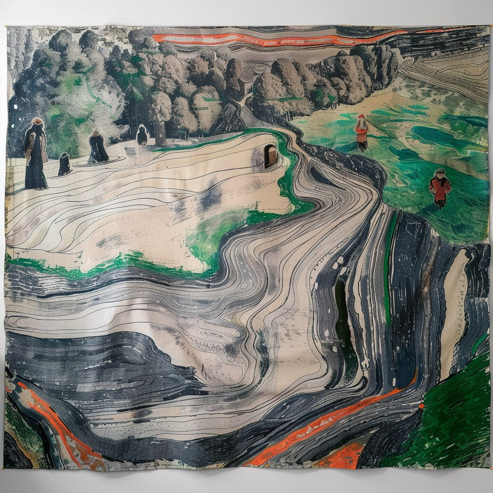

**Дизайн и инновации**: каждый ковер из коллекции будет отличаться уникальным дизайном, который гармонично сочетает классические художественные традиции и современные тенденции в декоре. Элементы из произведений художников саратовской школы будут трансформированы в изысканные узоры и рисунки для ковров.

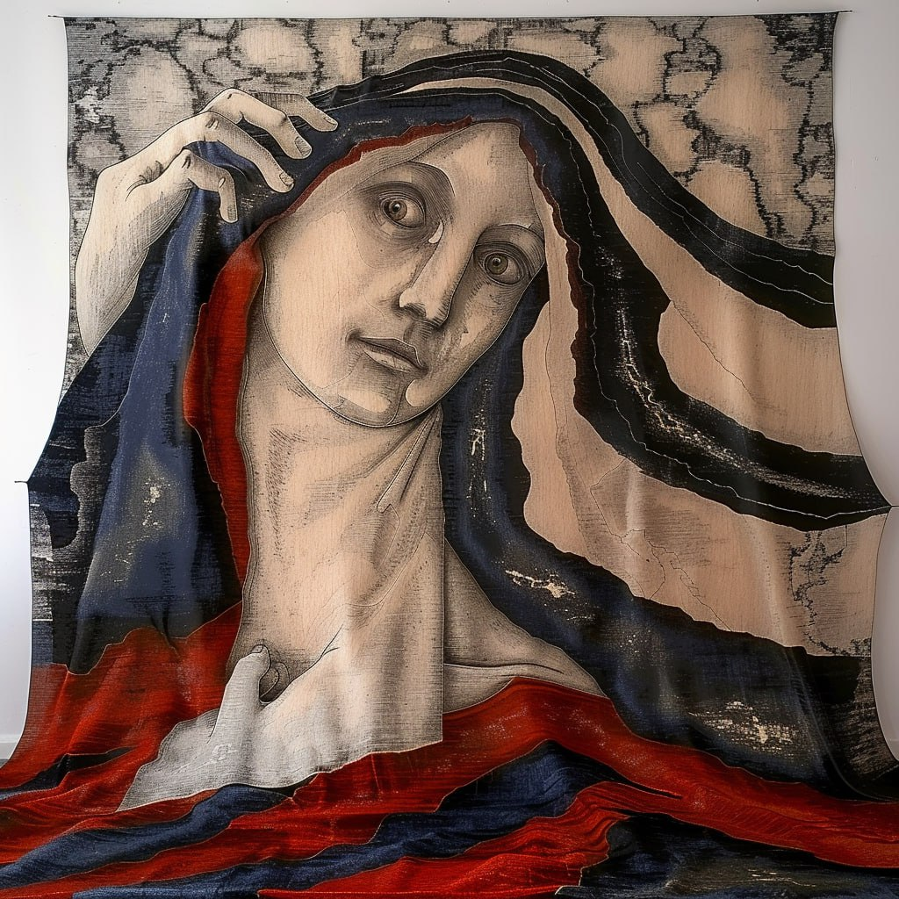

**Качество и материалы**: ковры будут изготовлены из высококачественных материалов, обеспечивая долговечность и удобство в использовании. Внимание к деталям и качеству исполнения гарантируют, что каждый ковер будет являться произведением искусства в собственном праве.

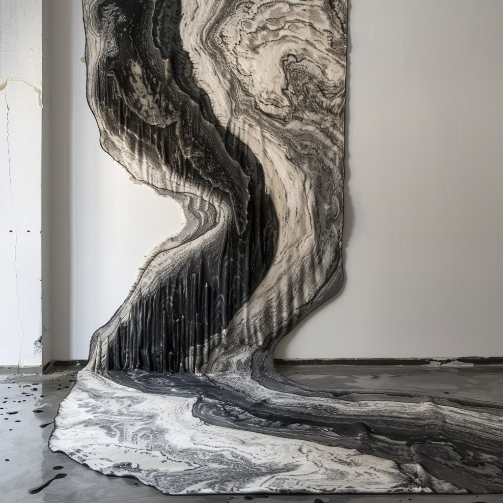

**Интеграция в проект**: коллекция ковров будет интегрирована в общую концепцию проекта «ТЕЧЕНИЕ», дополняя капсульную коллекцию красок и обоев-пано от «Лоймина». Это позволит создать полноценный и уникальный образ интерьера, где каждый элемент взаимодействует и дополняет друг друга, создавая гармоничное и цельное пространственное решение.

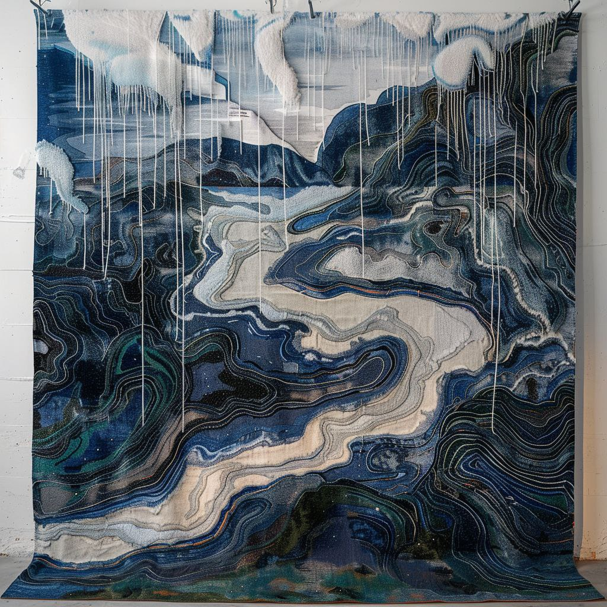

> Таким образом, включение коллекции ковров от «Ковер.ру» в проект «ТЕЧЕНИЕ» расширяет его возможности в сфере интерьерного дизайна, дополняя и усиливая культурное и художественное послание проекта.
>
> Эти коллекции являются ключевым элементом проекта «ТЕЧЕНИЕ», демонстрируя как глубокое уважение к культурному наследию, так и стремление к инновациям в области дизайна и производства отделочных материалов. Они способствуют созданию уникальной эстетики в современном интерьере, привнося в него исторические и культурные мотивы.

### Иммерсивная выставка с AR-Технологиями

Разработка выставки осуществляется «Радищевским Музеем» совместно с резидентами «Дизайн Центра» архитектурным бюро «SNOU». Экспозиционные решения включают использование дополненной реальности (AR) и нейросети «Кандинский» от «СБЕР» для создания уникального визуального опыта.

Выставка будет оформлена оттенками из капсульной коллекции, красок и обоев от «Лоймина» демонстрируя их в действии и создавая уникальную атмосферу.

### Создание сайта со страницами продуктов и описаниями истории разработки

Для коллекции будет создан специальный сайт, каждая страница которого будет содержать описание и историю входящих в неё оттенков. Сайт будет разработан специалистами Креативного Кластера «Дизайн Центр» в сотрудничестве с профильными факультетами Саратовского государственного университета (СГУ).

     
    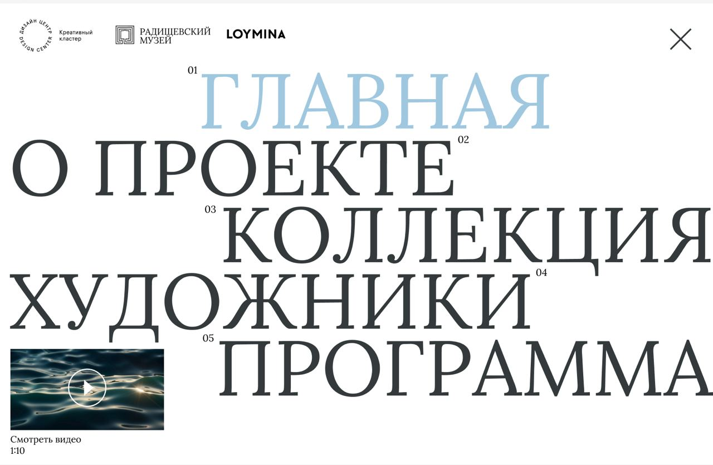
    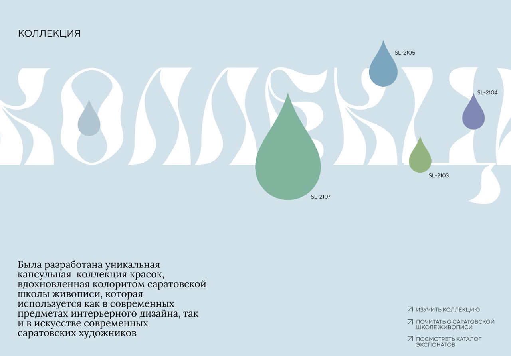
    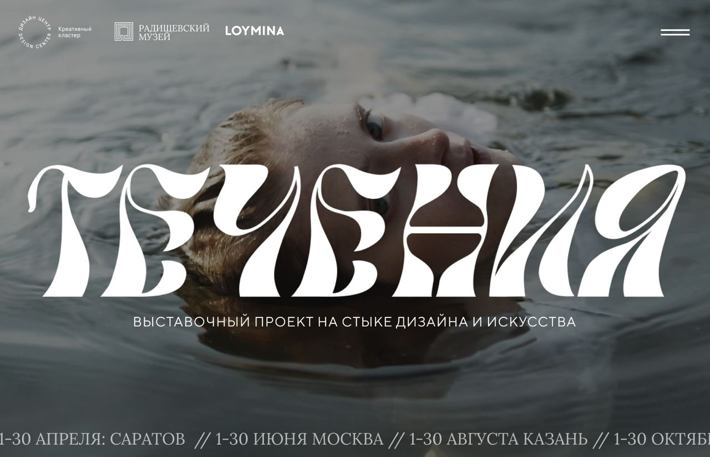
    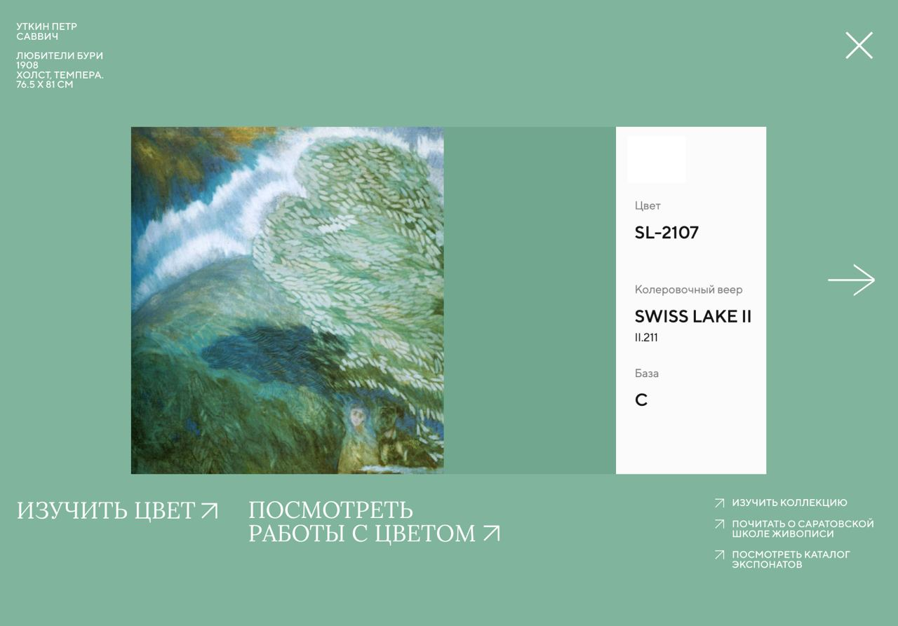

### Социокультурные и образовательные мероприятия для популяризации проекта среди ЦА

Организация серии лекций и интерактивных мастер-классов, направленных на студентов профильных вузов. Целью данных мероприятий будет не только популяризация проекта, но и вовлечение молодежи в дискуссии о современных тенденциях в области дизайна, культуры и технологий.

Профессионалы, задействованные в разработке проекта, будут выступать в роли амбассадоров. Они будут освещать основные аспекты и достижения проекта в профессиональных сообществах, способствуя повышению интереса и участия среди дизайнеров и архитекторов.

Инфлюенсеры из сферы креативных индустрий будут привлечены для продвижения и популяризации проекта. С их помощью планируется расширить охват аудитории и привлечь внимание к уникальным аспектам «ТЕЧЕНИЯ», включая его инновационный подход и культурную значимость.

### Торжественное открытие выставки

Организация церемонии открытия выставки с участием избранных представителей целевой аудитории, включая архитекторов, дизайнеров интерьера, культурных инфлюенсеров и представителей СМИ.

### Печатные и маркетинговые материалы

Издание альбома проекта, который будет включать иллюстрации, истории создания оттенков и фотографии выставки.

Разработка колеровочных карт и других маркетинговых материалов, предназначенных для продвижения коллекции красок.

### Креативные и промо-материалы

Организация креативных фото и видеосъемок, включая TV и OLV (Online Video), которые будут осуществляться командой Креативного Кластера «Дизайн Центр». Эти материалы будут использоваться для продвижения проекта в СМИ и на цифровых платформах.

> В целом, проект «ТЕЧЕНИЕ» становится не только культурной, но и коммерческой платформой, способствующей расширению рынка и повышению продаж продукции «Лоймина», «Ковер.ру», укрепляя ее позиции как лидера в области инновационных и экологически чистых решений для интерьера.

## Роль Креативного Кластера «Дизайн Центр» в проекте

**<u>Как разработчик стратегии и креативный партнер</u>**: Креативный Кластер «Дизайн Центр» выступает в качестве ключевого стратегического и креативного партнера проекта, обеспечивая реализацию масштабных кросс-функциональных задач. Они охватывают широкий спектр деятельности, включая:

- **Креативные и SMM-стратегии**: разработка и реализация интегрированных маркетинговых стратегий, направленных на повышение осведомленности и лояльности к бренду «Лоймина».
- **Digital-кампании и спецпроекты**: организация цифровых мероприятий и кампаний, направленных на привлечение внимания к новой коллекции красок, обоев и выставке.
- **Медиа и PR-кампании**: разработка и реализация эффективных медиастратегий и PR-кампаний для продвижения проекта.
- **Influence-кампании и Бренд-медиа**: сотрудничество с влиятельными персонами и медиа платформами для расширения охвата аудитории.
- **Технологические решения**: разработка AR/VR-проектов, ML/DA-решений и NFT-проектов, чтобы добавить новизны и инновационности проекту.
- **Дизайн и креативная продукция**: разработка брендинга, key visuals, иллюстраций, 3D-графики и других креативных материалов.
- **Видео и фото-продакшн**: организация профессиональных съемок для создания рекламных и промо-материалов.

**<u>Как дилер и дистрибьютор в Саратовской области:</u>** «Дизайн Центр» также выступает в качестве дилера и дистрибьютора продукции «Лоймина» в Саратовской области. Это положение предоставляет уникальные возможности для расширения рынка:

- **Открытие монобрендового салона**: планирование и реализация открытия монобрендового салона «Лоймина» в Саратове, что укрепит позиции бренда в регионе и улучшит доступность продукции для местных потребителей.
- **Партнерство с «Радищевским Музеем»**: использование сертифицированной продукции «Лоймина» для окраски выставочных залов и фасадов музея и его филиалов, демонстрация качества и уникальности продукции в реальных условиях.

> Таким образом, Креативный Кластер «Дизайн Центр» играет многогранную роль в проекте «ТЕЧЕНИЕ», объединяя функции стратегического разработчика, креативного агентства и ключевого распространителя продукции. Это сотрудничество не только способствует успешной реализации проекта, но и открывает новые возможности для продвижения и продаж продукции «Лоймина», укрепляя ее позиции на рынке.

## Роль компании «Loymina» в проекте «ТЕЧЕНИЕ»

Компания «Loymina», признанный эксперт в области создания экологически чистых настенных покрытий премиум-класса, играет ключевую роль в проекте «ТЕЧЕНИЕ». Базируясь в России, в Нижегородской области, фабрика «Loymina» уже на протяжении многих лет специализируется на производстве флизелиновых обоев и панно, сотрудничая с ведущими дизайнерами интерьеров.

### Инновационный подход и качество продукции

**Новый бренд красок «Charmant»**: «Loymina Group» представила линейку интерьерных красок «Charmant», отличающуюся инновационной формулой, роскошью цвета и дизайном будущего. Эта линейка идеально соответствует концепции проекта, предлагая цвета, вдохновленные эпохой Золотого века русской культуры, и сочетая традиционные и современные элементы.

**Экологичность и технологии**: компания также производит экологически чистую лакокрасочную продукцию «Swiss Lake», а также сопутствующие товары, что подчеркивает ее стремление к устойчивости и инновациям.

### Сотрудничество и вклад в проект

**Разработка уникальных оттенков**: в рамках проекта «ТЕЧЕНИЕ» специалисты «Loymina Group» активно работают над созданием уникальных цветов, вдохновленных работами художников Саратовской школы. Эти оттенки не только воссоздают атмосферу и эстетику произведений, но и отражают дух русского искусства.

**Технологические инновации:** использование уретана в составе красок «Charmant» обеспечивает высокую прочность и износостойкость поверхностей, что делает их идеальными для использования в современных интерьерах.

### Культурное и историческое значение

**Участие в реставрации культурных объектов:** сертификация продукции «Loymina Group» для применения в реставрации памятников архитектуры подчеркивает ее культурное и историческое значение. Это делает компанию идеальным партнером для проектов, где культурное наследие играет ключевую роль.

> Компания «Loymina» не просто производитель красок и обоев, а активный участник культурной жизни, стремящийся сочетать искусство, историю и современные технологии в создании уникальных продуктов для интерьера.
>
> В рамках проекта «ТЕЧЕНИЕ» ее продукция станет мостом между прошлым и настоящим, искусством и повседневной жизнью, демонстрируя, как глубокое понимание искусства может обогащать современный дизайн.

## Роль «Радищевского Музея»

**Культурный и исторический эксперт:** «Радищевский Музей», как один из старейших и наиболее уважаемых музеев России, вносит свой уникальный вклад, предоставляя экспертизу в области русского искусства и культуры, включающую в себя знания о Саратовской школе живописи и её представителях, что способствует глубокому и качественному осмыслению культурного контекста проекта.

**Площадка для иммерсивных выставок:** Музей становится основной площадкой для проведения иммерсивных выставок с применением AR-технологий. Эти экспозиции позволяют посетителям погрузиться в мир живописи, отраженный в красках коллекции «ТЕЧЕНИЕ».

**Развитие образовательных инициатив:** Музей активно участвует в разработке и проведении образовательных мероприятий, таких как лекции, мастер-классы и семинары, нацеленные на популяризацию искусства и культуры, а также на расширение знаний о вкладе Саратовской школы живописи в канву мировой культуры.

**Повышение культурного профиля региона:** Участие в проекте позволяет «Радищевскому музею» не только укрепить свой статус как ведущий культурный центр, но и способствует повышению культурного профиля Саратовской области и привлечению внимания к региону как на национальном, так и на международном уровне.

**Долгосрочное партнерство с Фабрикой «Лоймина»:** «Радищевский Музей» выступает в качестве долгосрочного партнера фабрики Лоймина, особенно в плане использования продукции фабрики для окраски экспозиций и фасадов музея, что открывает возможности для демонстрации качества и уникальности красок «Лоймина» в реальных условиях.

«Радищевский Музей», которому принадлежит три корпуса и пять филиалов, являющихся значимыми культурными объектами, может стать постоянным заказчиком фабрики «Лоймина». Она может предоставить продукцию, сертифицированную для работы с объектами культурного наследия и предложить условия, выгодные для обеих сторон: «Лоймина» сможет демонстрировать свою продукцию в реальных условиях, подчеркивая ее качество и эстетическую привлекательность, в то время как музей получит доступ к высококачественным и экономически выгодным решениям для поддержания и обновления своих выставочных залов и фасадов зданий.

> Таким образом, партнерство между «Радищевским Музеем», фабрикой «Лоймина» и Креативным Кластером «Дизайн Центр» в рамках проекта «ТЕЧЕНИЕ» играет ключевую многоаспектную роль. Это сотрудничество не только способствует достижению культурных и образовательных целей проекта, но и открывает новые коммерческие перспективы, значительно укрепляя связи между искусством, историей и современным дизайном.

## Команда проекта

### Лидерство и стратегия

**Лидер проекта (Менеджер проекта)**: руководитель «Дизайн Центра». Отвечает за общую координацию проекта, обеспечивает связь между всеми участниками и контроль за основными направлениями развития проекта. Под его руководством будет сформировано стратегическое видение проекта, обеспечивающее соответствие общим целям и задачам.

**Стратегический директор (из Фабрики «Лоймина»)**: фокусируется на аспектах коммерциализации и максимального использования рыночных преимуществ. Под его руководством «Лоймина» активно участвует в стратегическом планировании проекта, согласовывая свои действия с «Дизайн Центром» для обеспечения синергии между коммерческими и творческими аспектами проекта.

### Креатив и маркетинг

**Креативный директор (из «Дизайн Центра»)**: руководит разработкой креативных концепций, дизайна и маркетинговых материалов. В его задачи входит обеспечение того, чтобы креативная сторона проекта соответствовала как культурным аспектам, так и коммерческим целям, при этом все решения согласуются с Фабрикой «Лоймина» через координацию в «Дизайн Центре».

**Маркетинговый Менеджер (смешанная команда)**: работает на пересечении интересов обеих организаций, разрабатывая и реализуя стратегии продвижения продукции, что способствует сближению маркетинговых целей Кластера и Фабрики. Отвечает за разработку и реализацию маркетинговых стратегий.

> Этот подход подразумевает, что маркетинговые усилия будут направлены на достижение как креативных, так и коммерческих целей проекта, с учётом интересов всех сторон.

### Техническая реализация и качество

**Технический директор (из «Лоймина»)**: ответственен за разработку и качество продукции. Работает в тесном контакте с креативной группой «Дизайн Центра», чтобы обеспечить техническое соответствие продукции креативным замыслам.

**Контролер качества (из «Лоймина»)**: Гарантирует соответствие продукции высоким стандартам качества, что повышает ценность и привлекательность продукции на рынке.

### Культурное наследие и историческая экспертиза

**Искусствовед/Куратор (из Радищевского музея)**: Предоставляет глубокую экспертизу по историко-культурному наследию Саратовской школы живописи, вносит свой вклад в разработку концепции коллекций.

### Синергия и взаимовыгода

Такой подход обеспечивает гармоничное сочетание интересов всех участников: «Дизайн Центр» выступает в роли лидера и креативного мотора проекта, при этом «Лоймина» активно вовлечена в процесс, предоставляя техническую экспертизу и контроль качества. Взаимодействие с Радищевским музеем обогащает проект культурным содержанием и глубиной. Такая структура способствует укреплению партнерских отношений, повышению эффективности управления проектом и обеспечению его успешной реализации

### Руководство проекта

**Денис Козюкин, руководитель Креативного Кластера «Дизайн Центр»:**

- Общее управление проектом. 
- Стратегическое планирование и координация с ключевыми партнерами.
- Представление проекта на «Российской Креативной Неделе».

**Дмитрий Мельничук и команда СГУ:**

- Разработка информационно-аналитических ресурсов для технологической части проекта.
- Привлечение студентов и преподавателей для участия и поддержки проекта.

**Менеджер проекта (Функциональные обязанности):**

- Полное управление проектом, включая планирование, выполнение и контроль.
- Координация работы всех участников проекта.
- Управление рисками, изменениями и качеством проекта.
- Разработка концепции, айдентики и креативных элементов проекта.
- Подготовка и реализация экспозиционных решений и продакшна проекта.
- Разработка и внедрение маркетинговых и коммуникационных стратегий.

**Менеджер проекта (Ответственности):**

- Выполнение конкретных задач и действий в рамках проекта.
- Содействие в достижении проектных целей.
- Поддержание коммуникации и сотрудничества внутри команды.

**Проектный офис – PMO (Функциональные обязанности):**

- Предоставление методологий, стандартов и процессов управления проектами.
- Поддержка проектного менеджера и команды в управлении проектом.
- Мониторинг прогресса проекта и обеспечение соответствия стандартам.

**Проектный офис – PMO (Ответственности):**

- Предоставление методологической поддержки.
- Отслеживание прогресса и документирование проекта.
- Обеспечение соблюдения проектных стандартов и процедур.

**Внешние консультанты и партнеры (Функциональные обязанности):**

- Предоставление специализированных знаний и технических решений.
- Содействие в разработке и реализации технологической части проекта.

**Поставщики и подрядчики (Функциональные обязанности):**

- Поставка необходимых материалов и услуг для проекта.
- Выполнение конкретных заданий и работ в рамках проекта.

## Потенциал масштабирования проекта «ТЕЧЕНИЕ»

Реализация проекта «ТЕЧЕНИЕ» от Креативного Кластера «Дизайн Центр» и фабрики «Лоймина», несет в себе значительный потенциал для увеличения масштаба проекта и его выхода на федеральный уровень. Это можно осуществить через Союз Креативных Кластеров России, вовлекая в проект ведущие площадки творческих индустрий по всей стране.

План масштабирования включает сотрудничество с такими известными центрами, как Центр творческих индустрий «Фабрика» и Центр современного искусства «Винзавод» в Москве, Центр дизайна «ARTPLAY», а также с региональными кластерами: Творческий индустриальный кластер «Октава» в Туле, Креативный кластер «КАМЕНКА» в Красноярске, Центр креативных индустрий «SVOBODA2» в Челябинске, а также другие значимые центры в Уфе, Санкт-Петербурге и Иркутске.

Для каждой из этих площадок проект будет адаптирован с учетом местных культурных особенностей. Это не только расширит географию проекта, но и позволит продемонстрировать уникальное взаимодействие искусства, истории и современного дизайна широкой аудитории. Масштабирование проекта будет способствовать дальнейшему развитию культурного диалога в России, а также повышению осведомленности и интереса к продукции «Лоймина» на общенациональном уровне.

Проект «ТЕЧЕНИЕ», помимо своего потенциала для масштабирования на федеральном уровне через «Союз Креативных Кластеров», также имеет большие перспективы для представления на значимых мероприятиях, таких как «Российская креативная неделя». Этот ежегодный деловой форум в сфере креативных индустрий, проходящий в Москве и других регионах, ориентирован на развитие креативных индустрий и привлечение внимания к креативной экономике.

### Важность «Российской Креативной Недели»

Форум проводится в рамках перечня поручений Президента Российской Федерации и распоряжений Правительства РФ, направленных на поддержку и развитие креативных индустрий. Привлекает тысячи посетителей, включая представителей органов власти, губернаторов крупнейших регионов, представителей креативного бизнеса, институтов развития и образовательных учреждений.

#### Потенциал проекта на форуме

Проект «ТЕЧЕНИЕ» идеально подходит для демонстрации на «Российской Креативной Неделе», так как он наглядно демонстрирует успешное взаимодействие между различными индустриями креативного сектора. Это событие предоставит уникальную платформу для популяризации отечественного продукта и демонстрации эффективности кластерного взаимодействия, включая применение современных цифровых технологий и мультидисциплинарное сотрудничество с экспертами, разработчиками и профильными ВУЗами.

Участие в форуме позволит проекту «ТЕЧЕНИЕ» получить широкое признание и поддержку на государственном уровне, а также привлечь внимание ведущих специалистов и потенциальных инвесторов в сфере креативных индустрий.

> Таким образом, участие проекта «ТЕЧЕНИЕ» в «Российской креативной неделе» станет ключевым шагом в его масштабировании и продвижении, открывая новые возможности для развития и укрепления позиций как компании «Лоймина», так и всего креативного кластера в целом.
>

### Потенциал для продвижения продукции

Проект «ТЕЧЕНИЕ» послужит стратегической платформой для продвижения продукции «Лоймина», включая экологически чистые краски и настенные покрытия премиум-класса. Эта инициатива не только укрепляет имидж «Лоймина» как инноватора в области дизайна, но и расширяет ее влияние на различные целевые аудитории:

- **Дизайнеры и архитекторы**: предоставление уникальных цветовых решений, которые вдохновляют на творчество и инновации в области интерьерного дизайна.
- **Конечные потребители**: привлечение внимания к бренду за счет формирования ассоциации с высокохудожественными и культурно значимыми проектами.
- **Инфлюенсеры в области искусства и дизайна**: создание эмоционального резонанса с брендом через сотрудничество с ведущими инфлюенсерами, которые могут распространить информацию о продукции «Лоймина» среди своих аудиторий.

Проект «ТЕЧЕНИЕ» представляет собой комплексную инициативу, направленную на популяризацию бренда «Лоймина» и его продукции, а также на укрепление связей между искусством, культурой и современным дизайном. Этот проект станет важным шагом в продвижении новаторских идей в мире интерьерного дизайна и искусства.

С помощью описанных инициатив, включая участие в «Российской Креативной Неделе» и сотрудничество с ведущими креативными кластерами, фабрика «Лоймина» имеет все условия для достижения своих целей в области продвижения и расширения своего присутствия на рынке. Успешная реализация проекта «ТЕЧЕНИЕ» и его представление на федеральном уровне позволит не только укрепить бренд «Лоймина», но и установить ценные связи с ключевыми игроками в сфере креативных индустрий и культурного сектора.

Проект «ТЕЧЕНИЕ», реализуемый через партнерство между «Радищевским Музеем», фабрикой «Лоймина» и Креативным Кластером «Дизайн Центр», направлен на достижение цели развития национальной креативной экономики России. Синтезируя человеческий капитал и историко-культурное наследие, проект становится уникальной инновационной платформой, которая объединяет искусство, современные технологии и культурные ценности.

Это партнерство не только демонстрирует глубину и разнообразие российского творческого потенциала, но и способствует его активному использованию в креативных индустриях. Сочетание ресурсов и экспертизы каждого из участников проекта позволяет создавать новые, инновационные продукты и услуги, которые отражают богатство российского культурного наследия, а также открывают новые горизонты для коммерческой деятельности, укрепляя связи между историческим наследием и современным дизайном.

> Данные на странице находятся в разработке и предназначены для внутреннего использования.
