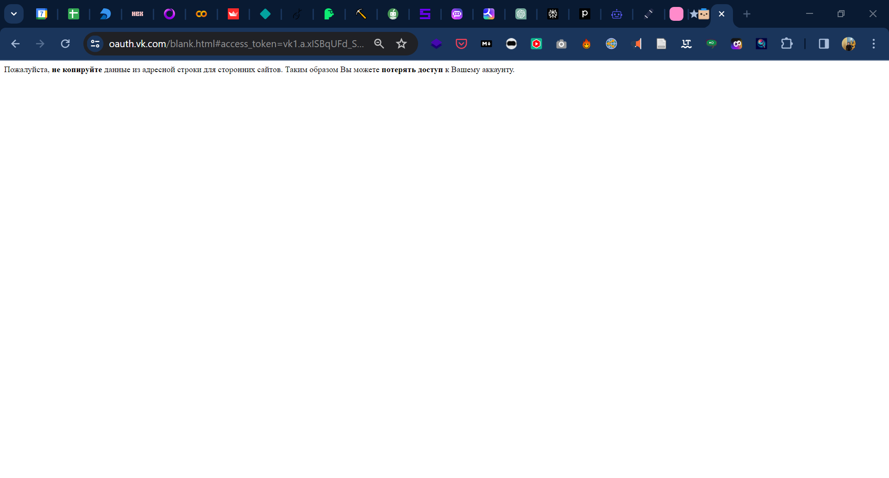

# <div style="text-align: center;">Анализ интернет-данных</div>


| Имя                | № 1  | № 2  | № 3  | Исследование |
| ------------------ | ---- | ---- | ---- | ------------ |
| Кочетков Александр |      |      |      |              |
| Ладягина Валерия   |      |      |      |              |
| Летова Анастасия   |      |      |      |              |
| Мелкумян Анна      |      |      |      |              |
| Самуйлов Александр |      |      |      |              |
| Таборова Юлия      |      |      |      |              |
| Тараскин Максим    |      |      |      |              |
| Юматов Дмитрий     |      |      |      |              |


## Google Trends



### Анализ Трендов Потребительского Спроса с Использованием Интернет-Данных

**Цель задания:** научить студентов-экономистов без навыков программирования анализировать интернет-данные для изучения трендов потребительского спроса.

#### Задачи:
1. **Выбор сферы исследования**: Студенты должны выбрать определенную сферу рынка (например, электронику, одежду, автомобили).

2. **Сбор данных**:
    - Используйте [Google Trends](https://trends.google.ru/trends/) для анализа интереса к выбранной категории товаров/услуг за последние 5 лет.
    - Изучите отзывы потребителей и рейтинги на популярных платформах электронной коммерции (например, Ozon, WB) по выбранным товарам.

3. **Анализ данных**:
    - Определите ключевые тенденции и сезонность спроса на основе данных [Google Trends](https://trends.google.ru/trends/).
    - Проанализируйте общее мнение потребителей о товарах/услугах, используя отзывы и рейтинги.
    - Идентифицируйте основные факторы, влияющие на спрос (например, ценовые изменения, новые модели, маркетинговые кампании).

4. **Составление отчета**:
    - Подготовьте письменный отчет, включающий анализ трендов, выводы и рекомендации для компаний в выбранной сфере.
    - Включите в отчет графики и диаграммы, построенные на основе данных [Google Trends](https://trends.google.ru/trends/) и анализа отзывов.
    - В качестве визуализатора можно использовать Excel или [Yequalx](https://yequalx.com/ru/) —  бесплатный и доступный в браузере сервис, с восемью типами диаграмм и возможностью скачивать в форматах PNG, JPG, GIF и SVG.

**Критерии оценки:**

- Качество и глубина анализа трендов.
- Способность аргументировать свои выводы на основе собранных данных.
- Четкость и структурированность отчета, наличие наглядных иллюстративных материалов.
- Оригинальность подхода и глубина понимания рыночных процессов.




## Rosstat



### Анализ и интерпретация данных от [Федеральной службы государственной статистики России](https://rosstat.gov.ru/statistic) для решения экономических задач

**Цели задания:**

1. Развитие навыков аналитической работы с данными.
2. Знакомство с платформой [rosstat.gov.ru](https://rosstat.gov.ru/statistic) и [showdata.gks.ru](https://showdata.gks.ru/finder/), загрузка и экономическая интерпретация данных.

**Задачи**:

- Посетите официальный сайт Федеральной службы государственной статистики России (Rosstat) по адресу [https://rosstat.gov.ru/statistic](https://rosstat.gov.ru/statistic) и официальный инструмент называемый – Витрина данный по адресу https://showdata.gks.ru/finder/.

- Выберите один из разделов на сайте, например посвященный демографической статистике, внешняя торговля, муниципальная статистика, рынок труда и т.д.

- Загрузите и подготовьте таблицу в Excel или Google Таблицах (файл в формате `.csv` или `.xlsx`), в которой будут систематизированы собранные данные.

- Проанализируйте полученные данные и постарайтесь сделать выводы о текущем состоянии, перспективах и потенциальном влиянии на экономическое развитие страны.

В качестве тем исследования предлагается один из нескольких кейсов, вы также можете предложить свою тему и направление вашего исследования на основе данных с Rosstat:

> #### Кейс 1: Анализ Демографических Тенденций
>
> **Цель**: Изучить демографические изменения в России за последние 10 лет.
>
> **Задачи**:
>
> 1. Собрать данные о численности населения, рождаемости, смертности и миграции.
> 2. Проанализировать динамику и выявить ключевые тенденции.
> 3. Составить прогноз на ближайшие 5 лет на основе анализа.
> 4. Обсудить возможные экономические последствия наблюдаемых демографических изменений.
>

> #### Кейс 2: Исследование Динамики ВВП
>
> **Цель**: Проанализировать изменение ВВП России за последние 20 лет.
>
> **Задачи**:
>
> 1. Изучить годовые отчеты по ВВП с сайта Росстата.
> 2. Сравнить динамику ВВП с мировыми экономическими кризисами.
> 3. Оценить влияние внутренних и внешних факторов на экономику страны.
> 4. Сделать выводы о стабильности экономики России.
>

> #### Кейс 3: Анализ Рынка Труда
>
> **Цель**: Исследовать изменения на рынке труда, включая уровень безработицы и заработные платы.
>
> **Задачи**:
>
> 1. Собрать данные по уровню безработицы и средней заработной плате за последние 5 лет.
> 2. Проанализировать связь между уровнем образования и заработной платой.
> 3. Определить регионы с наибольшей и наименьшей безработицей.
> 4. Обсудить, как экономическая политика и глобальные тренды влияют на рынок труда.
>

> #### Кейс 4: Изучение Структуры Экспорта и Импорта
>
> **Цель**: Анализировать структуру и динамику экспорта и импорта товаров и услуг.
>
> **Задачи**:
>
> 1. Изучить данные о топ-10 экспортируемых и импортируемых товарах и услугах.
> 2. Проанализировать изменения в торговом балансе за последние 10 лет.
> 3. Определить, какие отрасли наиболее зависимы от импорта.
> 4. Оценить влияние международных санкций и торговых соглашений на торговлю.
>

> #### Кейс 5: Исследование Инфляции и Цен
>
> **Цель**: Проанализировать динамику инфляции и изменения цен на основные товары и услуги.
>
> **Задачи**:
>
> 1. Собрать данные об инфляции и индексах потребительских цен за последние 10 лет.
> 2. Проанализировать, как изменения цен влияют на покупательскую способность населения.
> 3. Определить товары и услуги, наиболее подверженные инфляции.
> 4. Обсудить меры экономической политики для контроля инфляции.
>

**Формат отчета**:

- Отчет должен включать в себя таблицы с данными, графики, которые иллюстрируют ключевые тенденции, и подробный анализ ответов на поставленные вопросы.
- Отчет представить в формате PDF или PowerPoint презентации.

**Критерии оценки**:

- Точность и актуальность собранных данных.
- Глубина и логичность аналитического разбора данных.
- Качество и ясность презентации результатов анализа.




## GDELT

[GDELT](../gdelt)



### Анализ Мировых Экономических Событий с Использованием GDELT

**Цель задания**:

Научить студентов-экономистов анализировать глобальные экономические события и тенденций, развить навыки работы с большими данными используя открытые данные из базы [GDELT Summary](https://api.gdeltproject.org/api/v2/summary/summary) и [gdelt.github.io](https://gdelt.github.io/).

**Задачи**:

1. **Выбор Тематики для Исследования**:
   - Определить ключевую экономическую тему или событие для анализа (например, влияние пандемии COVID-19 на мировую экономику, торговые войны, валютные кризисы).

2. **Изучение Источника Данных GDELT**:
   - Ознакомиться с базой данных GDELT, её структурой и способами доступа к данным.
   - Найти и изучить руководства или обучающие материалы по GDELT.

3. **Сбор и Анализ Данных**:
   - С использованием доступных инструментов GDELT собрать данные, относящиеся к выбранной теме.
   - Выполнить первичный анализ собранных данных, определить ключевые тренды и события.

4. **Оформление Отчета**:
   - Подготовить письменный отчет, содержащий анализ выбранной темы на основе данных из GDELT.
   - Включить в отчет графики, диаграммы и таблицы, иллюстрирующие ключевые находки.
   - Сделать выводы о влиянии исследуемого экономического события или тенденции на мировую экономику.

5. **Презентация Результатов**:
   - Подготовить презентацию основных результатов исследования для представления на семинаре или лекции.

Примеры кейсов заданий:

> #### Кейс 1: Мониторинг Глобальных Экономических Событий
>
> **Цель**: Изучить влияние крупных международных событий на мировую экономику.
>
> **Задачи**:
>
> 1. Выбрать значимое международное событие (например, международный саммит или экономический кризис).
> 2. Используя GDELT, собрать данные о новостных сообщениях и отчетах, связанных с этим событием.
> 3. Проанализировать, как отражение события в СМИ соотносится с экономическими показателями (например, курсами валют, индексами фондовых рынков).
> 4. Сделать выводы о влиянии медийного освещения на экономическую ситуацию.
>

> #### Кейс 2: Анализ Экономических Тенденций в Определенном Регионе
>
> **Цель**: Исследовать экономические тенденции в выбранном регионе (например, Юго-Восточная Азия, Латинская Америка).
>
> **Задачи**:
>
> 1. Изучить новостные статьи и отчеты, касающиеся экономической ситуации в регионе, используя GDELT.
> 2. Выявить ключевые экономические события, которые оказали значительное влияние на регион за последние 5 лет.
> 3. Проанализировать, как эти события сказались на торговле, инвестициях и экономическом росте в регионе.
> 4. Обсудить возможные будущие экономические сценарии для региона на основе наблюдаемых тенденций.
>

> #### Кейс 3: Изучение Взаимосвязи Между Политическими Событиями и Экономикой
>
> **Цель**: Оценить влияние важных политических событий на экономику.
>
> **Задачи**:
>
> 1. Выбрать значимое политическое событие (например, выборы, государственный переворот, международные санкции).
> 2. С помощью GDELT собрать данные о новостных сообщениях, связанных с этим событием.
> 3. Проанализировать, как политическое событие повлияло на экономические показатели страны или региона (например, инвестиции, торговлю, валютный курс).
> 4. Сделать выводы о взаимосвязи политики и экономики на конкретном примере.
>

> #### Кейс 4: Анализ Влияния Международных Конфликтов на Экономику
>
> **Цель**: Оценить экономические последствия международных конфликтов.
>
> **Задачи**:
>
> 1. Выбрать международный конфликт за последние несколько лет.
> 2. Используя GDELT, проанализировать новостное освещение и отчеты, связанные с этим конфликтом.
> 3. Изучить, как конфликт повлиял на мировые рынки, цены на сырье, торговлю и инвестиции.
>
> 4. Обсудить долгосрочные экономические последствия конфликта для задействованных стран и мировой экономики в целом.
>

**Критерии оценки**:

- Качество и глубина анализа данных.
- Четкость и логичность структуры отчета и презентации.
- Корректное использование графических материалов для демонстрации результатов анализа.
- Оригинальность и обоснованность выводов.

**Дополнительные советы**:

- Обратить внимание на геополитические и социальные аспекты, которые могут влиять на экономическую ситуацию.
- Использовать дополнительные источники для сопоставления и подтверждения собранных данных.




<!-- ## [Yahoo finance](https://finance.yahoo.com/)



### Анализ Финансовых Рынков с Использованием Данных [Yahoo Finance](https://finance.yahoo.com/)

**Цель задания**:

Научить студентов-экономистов развить навыки работы с реальными финансовыми данными, анализа рыночных тенденций и формирования основ для инвестиционных решений, используя открытую информацию с сайта [Yahoo Finance](https://finance.yahoo.com/).

**Задачи**:

1. **Выбор Финансовых Инструментов для Исследования**:
   - Выбрать конкретные финансовые инструменты (акции, облигации, валютные пары, сырьевые товары) для анализа.

2. **Изучение Инструмента и Его Рыночной Среды**:
   - Провести исследование выбранного инструмента: история, основные события, влияющие на его стоимость.
   - Анализировать рыночную среду: основные факторы, влияющие на цену, сезонность, политические и экономические события.

3. **Сбор и Анализ Данных**:
   - Собрать исторические данные о ценах выбранных инструментов с [Yahoo Finance](https://finance.yahoo.com/).
   - Выполнить анализ данных: изменения цен, тенденции, сравнение с основными рыночными индексами.

4. **Оформление Отчета**:
   - Подготовить письменный отчет, включающий анализ данных, графики и таблицы.
   - Представить исторический анализ и текущую рыночную ситуацию.
   - Сделать выводы о потенциале инструмента и рекомендации для инвесторов.

5. **Презентация Результатов**:
   - Подготовить краткую презентацию основных результатов исследования.

**Критерии оценки**:

- Качество и глубина анализа финансовых данных.
- Четкость и логика в подготовке отчета и презентации.
- Правильное использование графиков и таблиц для демонстрации данных.
- Осмысленность и обоснованность выводов.

 -->


## VK



Для генерация `access token` необходимо перейти на сайт https://vkhost.github.io/ нажать на `Настройки »`, далее выбрать пункты `Стена` и `Доступ в любое время`, после чего нажать на кнопку `Получть`:


На следующем шаге появляется запрос на разрешение к доступу к вашему аккаунту, которое следует подтвердить нажав на кнопку `Разрешить`:




Далее появится окно с уникальным URL-ом, который необходимо сохранить в отдельное место. Примерный вид такого URL адреса: https://oauth.vk.com/blank.html#access_token=vk1.a.xISBqUFd_SDo-DwPkrvBrfU03mkeHrZxo1t-7F7MmOdfVpXcdegTq7ZvOHjY4qDaWqlnUqaFrhgeFWB7m5Rp8O7QBjiDB0fMZHGwksR2ePLlCCPdyBquYbGj7WA07pEL7-f0E60gYneg-ANWq0pCPF4QOOM9n6f7oADZWgo6sJKPj-L_nIvDaWMubuF2zLqJEdkEGA&expires_in=86400&user_id=888827370

Как вы видите URL состоит из нескольких частей разделенные знаком `&`:

- `access_token=`
- `expires_in=`
- `user_id=`

Нам для дальнейшей работы необходим только длинный ключ который находится между `access_token=` и `&expires_in=`, в нашем примере это: `vk1.a.xISBqUF…LqJEdkEGA`. Скопируйте и вставьте в код ниже, в переменную `access_token = "your_token"`.





Прежде чем запускать код ниже, не забудьте скопировать и заменить в переменной `access_token = "your_token"` на ваш токен.

```python
import requests
import json
import pandas as pd
import datetime
import time
from tqdm import tqdm

def get_unixtime_from_datetime(date_time):
    return str(time.mktime(date_time.timetuple()))

def get_vk_newsfeed(query, start_time, end_time):
    df = pd.DataFrame()

    access_token = "your_token"
    q = query
    count = "200"

    start_time = datetime.datetime.strptime(start_time, "%Y-%m-%d").date()
    end_time = datetime.datetime.strptime(end_time, "%Y-%m-%d").date()

    # шаг дельта равен 30 дням, если у вас очень популярный запрс (превышающий 200 постов в месяц), то уменьшите до 1 дня
    delta = datetime.timedelta(days=30)
    start_delta_time = start_time
    end_delta_time = start_time + delta

    n_days = int((end_time - start_time).days)
    pbar = tqdm(desc="Progress", total=n_days, leave=False)

    while end_delta_time <= end_time:
        url = str(
            "https://api.vk.com/method/newsfeed.search?q="
            + q
            + "&count="
            + count
            + "&access_token="
            + access_token
            + "&start_time="
            + get_unixtime_from_datetime(start_delta_time)
            + "&end_time="
            + get_unixtime_from_datetime(end_delta_time)
            + "&v=5.131"
        )

        res = requests.get(url)
        text = res.text
        json_text = json.loads(text)

        df = pd.concat([df, pd.json_normalize(json_text['response'], record_path =['items'])])

        start_delta_time += delta
        end_delta_time += delta
		
        # ожидание 3 секунды между запросами
        time.sleep(3)
        # если вы смените шаг на 1 день, то заменить значение ниже также на 1
        pbar.update(30)

    return df

vk_df = get_vk_newsfeed(query = "%23советскийкосмос", start_time = "2022-01-01", end_time = "2023-12-31")
vk_df = vk_df[['id', 'date', 'owner_id', 'short_text_rate', 'text', 'comments.count', 'likes.count', 'reposts.count', 'views.count', 'attachments']]
vk_df['date'] = pd.to_datetime(vk_df['date'], unit='s')
vk_df.to_csv("vk_data.csv")
```

В примере выше загружаются и сохраняются в файл `vk_data.csv` содержимое всех постов и информации о них за период c `2022-01-01` по `2023-12-31` содержащих ключевое слово `#советскийкосмос`, символ `#` в запросе заменяется [кодом ACSII](https://wm-school.ru/html/html_url_acsii.html) `%23`.

Вы можете менять период и ключевые слова на своё усмотрение, в том числе загружать данные нетолько по хэштегам (как в примере выше), но и просто по ключевому слову или словам (в таком случае достаточно использовать код пробела `%20`, тогда запрос будте выглядеть следующим образом: `ЕГЭ%20Математика%20график%20функции`).

Таким образом вы получите таблицу содержащую следующую информацию:

- `id` – уникальный порядковый номер поста в рамках стены или сообщества источника;
- `date` – дата публикации поста;
- `owner_id` – уникальный идентификатор автора поста, причем если число начинается со знака минус `-`, это означает что источником служит сообщество, в противном случае источник это стена пользрвателя;
- `short_text_rate` – коэффициент длины поста;
- `text` – текст поста;
- `comments.count` – количество комментариев;
- `likes.count` – количесвто лайков;
- `reposts.count` – количество репостов;
- `views.count` – количесвто просмотров;
- `attachments` – прикрепленные файлы к посту (фото, видео и т.д).




## Финальный проект

**Цель исследования** заключается в детальном анализе и оценке текущего состояния и динамики рынка <mark>обоев, красок, ковров, а также услуг дизайнеров и мастеров</mark> в Российской Федерации за последние два года (2022-2024). Основное внимание уделяется выявлению ключевых рыночных тенденций, оценке потенциала роста, анализу конкурентной среды и потребительского поведения. Исследование направлено на получение ценных инсайтов и стратегических данных, которые могут быть использованы заинтересованными сторонами для формирования эффективной бизнес-стратегии, оптимизации маркетинговых и операционных процессов и повышения конкурентоспособности на рынке.



Исследование включают в себя достижение следующих результатов:

1. **Анализ Рыночных Трендов**: Определение основных тенденций и драйверов роста в данной отрасли, включая анализ спроса, предложения и ключевых игроков на рынке.

2. **Конкурентный Анализ**: Идентификация и оценка основных конкурентов на рынке, анализ их стратегий, рыночных позиций и бизнес-моделей.

3. **Потребительский Анализ**: Понимание предпочтений, потребностей и поведения целевой аудитории, включая сегментацию и анализ целевых рынков.

4. **Технологический и Инновационный Анализ**: Оценка влияния новых технологий и инноваций на отрасль и возможности для развития рынка.

5. **Регуляторный и Правовой Анализ**: Анализ правовой среды и её влияния на рыночную деятельность.

6. **Анализ Рисков**: Определение и оценка потенциальных рисков и вызовов, которые могут повлиять на дальнейшее развитие рынка.





Аналитический отчет должен содержать следущие пункты:

1. **Введение**:
   - Цель исследования.
   - Обзор методологии: описание подходов и инструментов анализа.
2. **Анализ Рыночных Трендов**:
   - Изучение рыночных тенденций за последние 2 года.
   - Анализ спроса и предложения на рынке.
   - Обзор основных игроков рынка и их рыночных стратегий.
3. **Анализ Конкурентной Среды**:
   - SWOT-анализ ключевых компаний рынка.
   - Исследование стратегий ценообразования конкурентов.
4. **Потребительский Анализ**:
   - Оценка предпочтений и требований потребителей.
   - Сегментация потребителей и анализ целевых групп.
5. **Анализ Цепочек Поставок**:
   - Оценка логистики и цепочек поставок на рынке.
   - Влияние глобальных и локальных факторов на цепочки поставок.
6. **Технологический Анализ**:
   - Обзор современных технологий в производстве и дизайне.
   - Анализ влияния технологических инноваций на рынок.
7. **Регуляторный и Правовой Анализ**:
   - Анализ текущего законодательства и его влияние на рынок.
   - Влияние изменений в правовой сфере на операции на рынке.
8. **Анализ Рисков и Вызовов**:
   - Идентификация и оценка потенциальных рисков на рынке.
   - Разработка стратегий для минимизации рисков.
9. **Выводы и Рекомендации**:
   - Обобщение ключевых выводов исследования.
   - Формулировка стратегических рекомендаций для заинтересованных сторон.
10. **Приложения**:
    - Таблицы, графики, диаграммы, поддерживающие анализ. 





Методики и источники данных:

**Количественный Анализ**:
  - Анализ продаж и финансовых отчетов компаний.
  - Изучение отчетов по импорту и экспорту.

**Качественный Анализ**:
  - Интервью с экспертами отрасли.
  - Анкетирование и опросы потребителей.

**Анализ Вторичных Данных**:
  - Отчеты исследовательских агентств (например, Nielsen, GfK).
  - Статистические данные (Росстат, Федеральная таможенная служба).

**Интернет-Аналитика**:
  - Анализ трендов и запросов в поисковых системах.
  - Изучение отзывов и оценок на специализированных площадках.

**SWOT и PEST Анализы**:
  - Исследование внешних и внутренних факторов, влияющих на рынок.

**Анализ Социальных Медиа и Открытых Источников**:
  - Изучение активности и предпочтений потребителей в социальных сетях.



