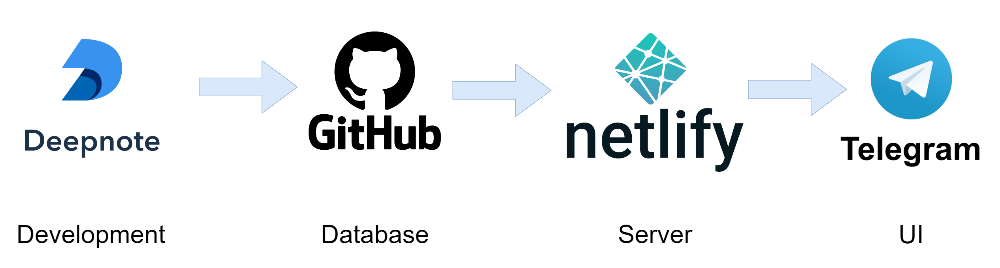
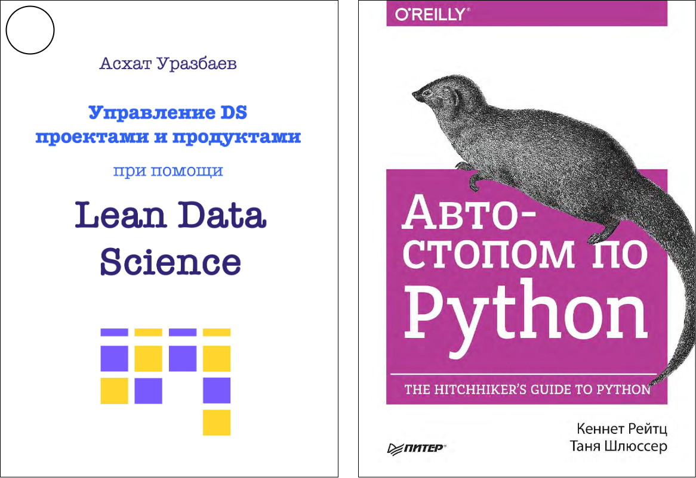
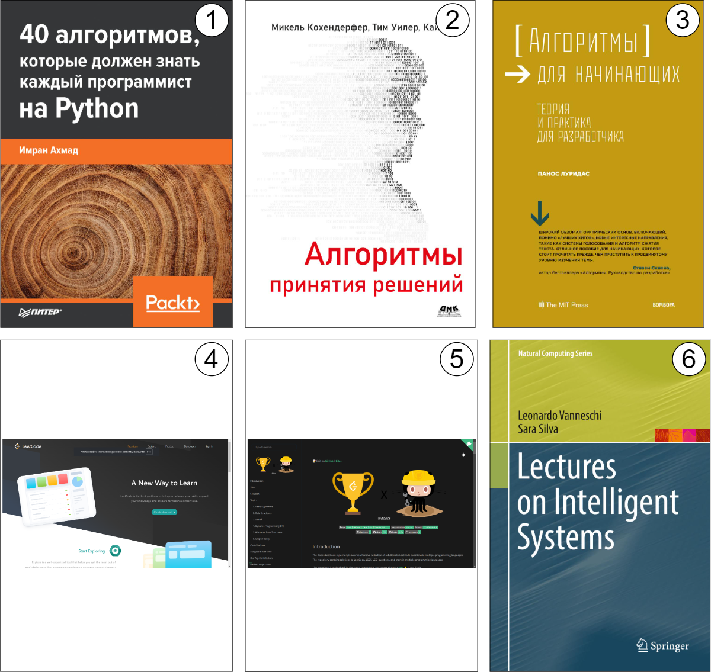
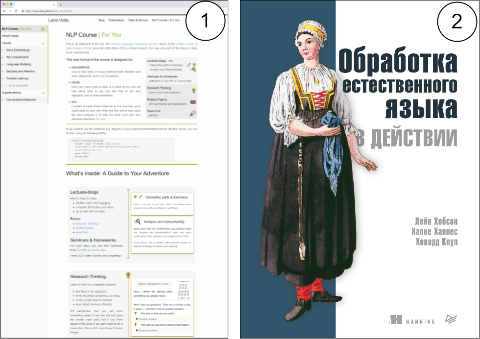

# 
Проектирование и разработка интеллектуальных информационных систем

<!--



<iframe src="https://docs.google.com/spreadsheets/d/e/2PACX-1vQzrzoTnnXC7iszTCoCmujs903jVUV1tZc8FTPioC8kA6_EVCooT8cwGhnvV-rjLHFbp0Vi2TNGCM5e/pubhtml?gid=0&amp;range=B1:I47&single=true&widget=false&chrome=false&headers=false" width="100%" height="514px" frameborder="0" scrolling="no"></iframe>



-->



<iframe src="https://docs.google.com/spreadsheets/d/e/2PACX-1vS7A26ptPjkjJXg-2-u0Q3xEmi-MdDwh097U6oVyVCGXRbPrr1DgoLKczym0TxhokTlD_3aI9H_sEKi/pubhtml?gid=0&amp;range=B1:F73&single=true&widget=false&chrome=false&headers=false" width="100%" height="514px" frameborder="0" scrolling="no"></iframe>



    
До защиты проектов:

    
Загрузка...

    <!-- Первая полоса загрузки -->
    
Семестр 1

    

        
0%

        

        

        

        
<b><i style="color: red;">Initial Assessment</i></b>

        
<i>Submission</i>

        
<i>Pitching 1</i>

    

    <!-- Вторая полоса загрузки -->
      
    
Семестр 2

    

        
0%

        

        

        

        

        

        
<b><i style="color: red;">Interim Assessment</i></b>

        
<i>Pitching 2</i>

        
<i>Pitching 3</i>

        
<b><i style="color: red;">Final Assessment</i></b>

        
<i>Project Defense</i>

    

**Целью курса** является изучение базовых парадигм разработки интеллектуальных информационных систем (ИИС), т.е. систем обладающих способностью собирать, обрабатывать и анализировать большое количество данных, на основе которых она может автоматически принимать решения и выполнять задачи. Такие системы могут быть использованы для широкого круга задач в различных отраслях, включая финансы, здравоохранение, транспорт, производство и множество других областей.

Интеллектуальные системы могут автоматизировать процессы и улучшать качество принимаемых решений. Они могут анализировать данные и выдавать рекомендации или предсказания, учитывая сложные факторы и зависимости, вычисляемые на основе статистических данных.

## Разделы

[**Intro**] Введение в ИИС и выравнивание знаний.

> Определение, основные принципы, характеристики; анализ существующих примеров ИИС и их роли в различных областях; этические и социальные аспекты разработки и использования ИИС. Оформление кода, разработка проектов на языке Python, а также хранение и извлечение данных.



- Отличающие характеристики интеллектуальных системы от информационных;
- Основные этапы жизненного цикла разработки интеллектуальных информационных систем;
- Требования к данным, обучающим выборкам и инфраструктуре, при разработке интеллектуальных систем;
- Структура кода (PEP8) и проекта на *Python*;
- Модульное тестирование (автотесты);
- Типы лицензий;
- Документирование и журналирование;
- Роль обучающей, валидационной и тестовой выборок данных при разработке интеллектуальных систем;
- Несбалансированные данные для обучения моделей;
- Извлечение данных;
- Безопасность и конфиденциальность данных;
- Реляционные и нереляционные базы данных;
- Графовые базы данных;
- Векторная базы данных.



- [:(fa-solid fa-flag-checkered): Введение](../intro/)
- [:(fa-brands fa-python): Пишем отличный код](../codestyle/)
<!-- - [:(fa-solid fa-database): Работа с данными]() -->

[**Algo**] Алгоритмизация стратегий и решений для разработки ИИС.

> Базовые возможности ИИС на примерах задач оптимизации и анализа данных, сравнение эффективности реализаций и основы теории алгоритмов.



- Концепции разработки алгоритмов;
- Линейное, вероятностное и функциональное программирование в решении практических задач;
- Алгоритмы на графах и сетях;
- Генетические алгоритмы;
- Алгоритмы решения задач большой размерности;
- Подходы для ускорения работы алгоритмов.



- [:(fa-solid fa-route): Разработка алгоритмов](../algo/)
- [:(fa-solid fa-circle-nodes): Алгоритмы на графах и сетях](../graph/)
<!-- - [:(fa-solid fa-code-branch):]()
- [:(fa-solid fa-code):]()
- [:(fa-solid fa-chart-line):]()
- [:(fa-solid fa-chart-pie):]()
- [:(fa-solid fa-circle-nodes):]()
- [:(fa-solid fa-network-wired):]() -->

[**ML**] Классификация и описание моделей и их метрик в машинном обучении.

> Обзор на классические задачи машинного обучения и разбор ключевых алгоритмов, с точки зрения их принципа работы и сравнения при помощи базовых метрик оценки.



- Модели и метрики, общий подход
- Обучение с учителем
- Обучение без учителя
    - Модели кластеризации и её метрики
    - Ансамблевые модели и метрики
    - Снижение размерности
- Рекомендательные системы 



<!-- - [:(fa-solid fa-robot):]() -->

- [:(fa-solid fa-robot): Модели и метрики в ML](../models/)
- [:(fa-solid fa-diagram-project): Классификация, деревья решений и k-ближайших соседей](../classification/)
- [:(fa-solid fa-magnifying-glass-chart): Рекомендательные системы](../)

[**NLP**] Техники и Модели обработки естественного языка (NLP).

> Формирование понятийного аппарата и обзор открытых инструментов в области анализа естественного языка, навыки поиска и использования готовых NLP-моделей, и создание исследовательского цикла от исходных текстовых данных до отчета с артефактами.



- Терминология, базовые возможности и инструменты в NLP
- Векторизация и группировка (embedding) слов 
- Рекуррентная нейросеть (RNN) в NLP
- Тональность и эмоциональная классификация текста
- NER



- <a href="../8_word_embeddings/Word Embeddings.pptx" download>:(fa-solid fa-paragraph): Word Embeddings</a>
- [:(fa-solid fa-list-ol): Text Classification](../9_text_classification/text_classification.pdf)

[**LLM**] Большие языковые модели (LLM) для ИИС.

> На основе OpenAI API и комбинации запросов, создание приложений для генеративной текстовой модели (>GPT-3.5).



- Работа с OpenAI API 
- Базовые понятия в Prompt Engineering



<!-- - [:(fa-solid fa-brain):]() -->

## Задания

[**Intro**] Введение в ИИС и выравнивание знаний.

1. Python, Numpy, Pandas: <a href="../tasks/1_python_numpy_pandas_manual.ipynb" download>:(fa-solid fa-book): Manual</a>, <a href="../tasks/1_python_numpy_pandas.ipynb" download>:(fa-solid fa-file-code): Notebook</a>, [:(fa-solid fa-database): Titanic data](../data/titanic.csv), [:(fa-solid fa-database): Iris data](../data/iris.csv)
2. Работа с данными: <a href="../tasks/2_data _sql.ipynb" download>:(fa-solid fa-file-code): Notebook</a>
3. Визуализация данными: <a href="../tasks/3_visualize_data.ipynb" download>:(fa-solid fa-file-code): Notebook</a>

[**Algo**] Алгоритмизация стратегий и решений для разработки ИИС.

<!-- 3. Линейное программирование: -->

4. Алгоритмы на графах: <a href="../tasks/4_graph.ipynb" download>:(fa-solid fa-file-code): Notebook</a>

[**ML**] Классификация и описание моделей и их метрик в машинном обучении.

5. Основы машинного обучения: <a href="../tasks/6_ml_classic.ipynb" download>:(fa-solid fa-file-code): Notebook</a>

6. Деревья решений (Decision Tree): <a href="../tasks/7_decision_tree-2.ipynb" download>:(fa-solid fa-file-code): Notebook</a>, [:(fa-solid fa-database): ans data](../data/ans.csv), [:(fa-solid fa-database): train data](../data/train.csv), [:(fa-solid fa-database): test data](../data/test.csv)

    <!--5. Рекомендательные системы: -->

[**NLP**] Техники и Модели обработки естественного языка (NLP).

7. Word Embeddings: <a href="../tasks/8_torch_intro.ipynb" download>:(fa-solid fa-file-code): Notebook</a>

8. Streamlit: <a href="../tasks/9_streamlit_example.py" download>:(fa-solid fa-file-code): Notebook</a>
9. Латентное размещение Дирихле (LDA): <a href="../tasks/LDA_topic_models.ipynb" download>:(fa-solid fa-file-code): Notebook</a>, [:(fa-solid fa-database): Elon Musk data](../data/data_elonmusk.csv)
10. Анализ текста: <a href="../tasks/10_text_analysis_part1.ipynb" download>:(fa-solid fa-file-code): Notebook 1</a>, <a href="../tasks/10_text_analysis_part2.ipynb" download>:(fa-solid fa-file-code): Notebook 2</a>, [:(fa-solid fa-database): Text data](../data/texts.zip)

## Проекты



#### **Проект: Визуализация данных о заболеваемости COVID-19**
- **Описание**: Разработка интерактивного веб-приложения для визуализации статистики заболеваемости COVID-19 по регионам, странам и времени. Приложение позволяет пользователям выбирать регионы и периоды времени для анализа графиков и тенденций.
- **Стек**: <button class="tech-button">Python</button>, <button class="tech-button">Streamlit</button>, <button class="tech-button">Plotly</button>
- **Источник данных**: [Our World in Data](https://ourworldindata.org/coronavirus), [Johns Hopkins University](https://github.com/CSSEGISandData/COVID-19)
- **Источник модели**: Не требуется
- **Системные характеристики**: CPU с 2 ядрами, 4 ГБ ОЗУ, 10 ГБ свободного места на диске
- **Роли в команде**: 
  - <button class="role-button">🖥️ Разработчик бэкенда</button> – отвечает за сбор, очистку и обработку данных из внешних источников, интеграцию данных в приложение, настройку сервера и API.
  - <button class="role-button">🎨 Разработчик фронтенда</button> – создает пользовательский интерфейс, настраивает визуализацию данных с помощью Plotly и Streamlit, следит за отзывчивостью интерфейса.
  - <button class="role-button">📊 Аналитик данных</button> – анализирует данные, выявляет тренды и паттерны, предоставляет рекомендации по улучшению визуализаций.
  - <button class="role-button">✅ Тестировщик/менеджер проекта</button> – проверяет функциональность и корректность приложения, управляет задачами и сроками команды.

---

#### **Проект: Приложение для отслеживания личных финансов**

- **Описание**: Веб-приложение для управления личными финансами с возможностью учета доходов и расходов, анализа и генерации отчетов.
- **Стек**: <button class="tech-button">Python</button>, <button class="tech-button">Flask</button> или <button class="tech-button">Django</button>, <button class="tech-button">SQLite</button>, <button class="tech-button">Bootstrap</button>
- **Источник данных**: Открытые API банков ([Plaid API](https://plaid.com/))
- **Источник модели**: Не требуется
- **Системные характеристики**: CPU с 2 ядрами, 4 ГБ ОЗУ, 10 ГБ свободного места на диске
- **Роли в команде**:
  - <button class="role-button">🖥️ Разработчик бэкенда</button> – создает серверную часть приложения, интегрирует API для получения данных банков, обрабатывает данные и настраивает их хранение в базе данных.
  - <button class="role-button">🎨 Разработчик фронтенда</button> – отвечает за визуальное представление данных, создает формы ввода и таблицы, разрабатывает адаптивный интерфейс с использованием Bootstrap.
  - <button class="role-button">📊 Аналитик данных</button> – создает алгоритмы для анализа финансовых данных, разрабатывает отчеты и инструменты визуализации для пользователя.
  - <button class="role-button">🎨 UX/UI дизайнер</button> – проектирует пользовательский интерфейс, разрабатывает макеты и взаимодействия, оптимизирует приложение для удобства использования.

---

#### **Проект: Telegram-бот для рекомендаций фильмов**

- **Описание**: Создание Telegram-бота, который предоставляет рекомендации фильмов на основе жанра, года выпуска или рейтинга.
- **Стек**: <button class="tech-button">Python</button>, <button class="tech-button">Telegram Bot API</button>, <button class="tech-button">OMDb API</button>
- **Источник данных**: [OMDb API](https://www.omdbapi.com/)
- **Источник модели**: Не требуется
- **Системные характеристики**: CPU с 2 ядрами, 4 ГБ ОЗУ, 5 ГБ свободного места на диске
- **Роли в команде**:
  - <button class="role-button">🤖 Разработчик бота</button> – реализует функциональность бота, создает логику обработки команд и ответов, интегрирует бот с Telegram API.
  - <button class="role-button">🌐 Разработчик API-интеграции</button> – отвечает за подключение к OMDb API, получение данных о фильмах и их обработку.
  - <button class="role-button">✅ Тестировщик/контент-менеджер</button> – проверяет работу бота, управляет контентом (данные фильмов), создает тестовые сценарии.
  - <button class="role-button">🎨 UX/UI дизайнер</button> – разрабатывает текстовые и визуальные элементы взаимодействия с ботом, улучшает пользовательский опыт.

#### **Проект: Приложение для учёта спортивных достижений**
- **Описание**: Веб-приложение для спортсменов, позволяющее отслеживать спортивные достижения и прогресс (например, бег, велосипед, плавание).
- **Стек**: <button class="tech-button">Python</button>, <button class="tech-button">Flask</button>, <button class="tech-button">Chart.js</button>, <button class="tech-button">HTML/CSS</button>
- **Источник данных**: [Strava API](https://developers.strava.com/)
- **Источник модели**: Не требуется
- **Системные характеристики**: CPU с 2 ядрами, 4 ГБ ОЗУ, 10 ГБ свободного места на диске
- **Роли в команде**:
  - <button class="role-button">🖥️ Разработчик бэкенда</button> – создает API для работы с данными пользователей, интегрирует Strava API для получения данных о спортивных достижениях.
  - <button class="role-button">🎨 Разработчик фронтенда</button> – разрабатывает интерфейс приложения, настраивает визуализацию данных с использованием Chart.js.
  - <button class="role-button">📊 Аналитик данных</button> – анализирует спортивные данные, создает отчеты и графики прогресса.
  - <button class="role-button">✅ Менеджер проекта/тестировщик</button> – организует процессы разработки, тестирует функциональность и координирует команду.

#### **Проект: Приложение для планирования задач с использованием Kanban-доски**
- **Описание**: Приложение для планирования задач, основанное на методологии Kanban, с функциями добавления, изменения и удаления задач.
- **Стек**: <button class="tech-button">Python</button>, <button class="tech-button">Django</button>, <button class="tech-button">React.js</button>
- **Источник данных**: Нет (приложение использует внутренние данные пользователя)
- **Источник модели**: Не требуется
- **Системные характеристики**: CPU с 2 ядрами, 4 ГБ ОЗУ, 10 ГБ свободного места на диске
- **Роли в команде**:
  - <button class="role-button">🖥️ Разработчик бэкенда</button> – разрабатывает серверную часть приложения, отвечает за управление данными задач, их хранение и обработку.
  - <button class="role-button">🎨 Разработчик фронтенда</button> – создает пользовательский интерфейс Kanban-доски, настраивает взаимодействие с сервером.
  - <button class="role-button">✅ Тестировщик</button> – проводит тестирование функциональности приложения, выявляет и исправляет ошибки.
  - <button class="role-button">🎨 UX/UI дизайнер</button> – проектирует макеты Kanban-доски, улучшает пользовательский опыт и удобство использования.

#### **Проект: Приложение для рекомендаций книг по жанрам**
- **Описание**: Веб-приложение, которое предлагает пользователю книги для чтения на основе выбранных жанров.
- **Стек**: <button class="tech-button">Python</button>, <button class="tech-button">Flask</button>, <button class="tech-button">Goodreads API</button>, <button class="tech-button">Bootstrap</button>
- **Источник данных**: [Goodreads API](https://www.goodreads.com/api)
- **Источник модели**: Не требуется
- **Системные характеристики**: CPU с 2 ядрами, 4 ГБ ОЗУ, 10 ГБ свободного места на диске
- **Роли в команде**:
  - <button class="role-button">🌐 Разработчик API</button> – реализует взаимодействие с Goodreads API, получает и обрабатывает данные о книгах.
  - <button class="role-button">🎨 Разработчик фронтенда</button> – создает интерфейс для выбора и просмотра книг, разрабатывает страницы с использованием Bootstrap.
  - <button class="role-button">📚 Менеджер контента</button> – управляет базой данных книг, следит за актуальностью и качеством данных.
  - <button class="role-button">🎨 UX/UI дизайнер</button> – проектирует и улучшает внешний вид приложения, разрабатывает макеты интерфейсов.

#### **Проект: Приложение для управления списками покупок**
- **Описание**: Веб-приложение для создания и управления списками покупок с возможностью делиться ими с другими пользователями.
- **Стек**: <button class="tech-button">JavaScript</button>, <button class="tech-button">Node.js</button>, <button class="tech-button">MongoDB</button>, <button class="tech-button">React</button>
- **Источник данных**: Нет (локальные данные пользователя)
- **Источник модели**: Не требуется
- **Системные характеристики**: CPU с 2 ядрами, 4 ГБ ОЗУ, 10 ГБ свободного места на диске
- **Роли в команде**:
  - <button class="role-button">🖥️ Разработчик бэкенда</button> – разрабатывает серверную логику для управления списками покупок, настраивает базы данных.
  - <button class="role-button">🎨 Разработчик фронтенда</button> – создает интерфейс приложения, реализует взаимодействие с сервером и базой данных.
  - <button class="role-button">✅ Тестировщик</button> – проверяет функциональность приложения, устраняет ошибки и улучшает производительность.
  - <button class="role-button">🎨 UX/UI дизайнер</button> – проектирует пользовательский интерфейс, оптимизирует приложение для лучшего опыта.

#### **Проект: Веб-приложение для изучения иностранных языков**
- **Описание**: Приложение, которое помогает учить новые слова и фразы, используя флэш-карты и мини-тесты.
- **Стек**: <button class="tech-button">Python</button>, <button class="tech-button">Django</button>, <button class="tech-button">Vue.js</button>, <button class="tech-button">SQLite</button>
- **Источник данных**: [Open Multilingual Wordnet](http://compling.hss.ntu.edu.sg/omw/)
- **Источник модели**: Не требуется
- **Системные характеристики**: CPU с 2 ядрами, 4 ГБ ОЗУ, 10 ГБ свободного места на диске
- **Роли в команде**:
  - <button class="role-button">🖥️ Разработчик бэкенда</button> – создает серверную часть приложения, отвечает за хранение и обработку данных о словах и тестах.
  - <button class="role-button">🎨 Разработчик фронтенда</button> – создает интерфейс приложения, разрабатывает компоненты для флэш-карт и тестов.
  - <button class="role-button">📚 Контент-менеджер</button> – управляет базой данных слов и выражений, следит за их актуальностью и полнотой.
  - <button class="role-button">✅ Тестировщик</button> – проверяет корректность работы приложения, выявляет и устраняет баги.

#### **Проект: Интерактивное приложение для расчета калорийности блюд**
- **Описание**: Веб-приложение, которое позволяет пользователям вводить ингредиенты и рассчитывать калорийность блюда.
- **Стек**: <button class="tech-button">Python</button>, <button class="tech-button">Flask</button>, <button class="tech-button">Chart.js</button>, <button class="tech-button">HTML/CSS</button>
- **Источник данных**: [USDA Food Data Central](https://fdc.nal.usda.gov/)
- **Источник модели**: Не требуется
- **Системные характеристики**: CPU с 2 ядрами, 4 ГБ ОЗУ, 10 ГБ свободного места на диске
- **Роли в команде**:
  - <button class="role-button">🌐 Разработчик API</button> – интегрирует приложение с базой данных продуктов, реализует API для обработки пользовательских запросов.
  - <button class="role-button">🎨 Разработчик фронтенда</button> – разрабатывает интерфейс приложения, настраивает визуализацию данных с использованием Chart.js.
  - <button class="role-button">✅ Тестировщик</button> – тестирует приложение, выявляет и исправляет ошибки.
  - <button class="role-button">🎨 UX/UI дизайнер</button> – разрабатывает макеты интерфейса, оптимизирует приложение для удобства использования.

#### **Проект: Приложение для мониторинга уровня шума в городах**
- **Описание**: Приложение для сбора и отображения данных о уровне шума в разных частях города. Использует данные, полученные с мобильных устройств пользователей.
- **Стек**: <button class="tech-button">JavaScript</button>, <button class="tech-button">Node.js</button>, <button class="tech-button">Google Maps API</button>, <button class="tech-button">MongoDB</button>
- **Источник данных**: [London Datastore](https://data.london.gov.uk/), данные пользователей
- **Источник модели**: Не требуется
- **Системные характеристики**: CPU с 2 ядрами, 4 ГБ ОЗУ, 10 ГБ свободного места на диске
- **Роли в команде**:
  - <button class="role-button">🖥️ Разработчик бэкенда</button> – разрабатывает серверную часть приложения, настраивает базы данных для хранения и обработки данных о шуме.
  - <button class="role-button">🎨 Разработчик фронтенда</button> – создает интерфейс для отображения данных о шуме, интегрирует карты и визуализации.
  - <button class="role-button">✅ Тестировщик</button> – проверяет корректность работы приложения, находит и исправляет баги.
  - <button class="role-button">📊 Аналитик данных</button> – анализирует данные о шуме, выявляет паттерны и тренды, предлагает улучшения.











<!--



1. **Трекер финансовых расходов**. Разработайте приложение с использованием `Streamlit`, которое позволит пользователям вводить свои ежедневные финансовые расходы. Приложение должно агрегировать данные и предоставлять пользователю статистику о том, сколько он потратил по категориям за месяц. Рекомендуемый стэк: `Python`, `Streamlit`, `Pandas`.
2. **Анализ данных о фильмах**. Используя библиотеку `Pandas`, разработайте скрипт для анализа данных о фильмах. Вам нужно будет загрузить данные, выполнить базовый анализ жанров, годов выпуска и рейтингов, а затем визуализировать результаты с помощью графиков. Рекомендуемый стэк: `Python`, `Pandas`.
3. **Текстовый анализатор тональности**. Создайте приложение с использованием `Streamlit`, которое позволит пользователям вводить текст и определять его тональность (положительная, нейтральная или отрицательная). Для анализа тональности используйте библиотеки для обработки текста и машинного обучения. Рекомендуемый стэк: `Python`,  `Streamlit`, `Pandas`, `NLTK`, `spaCy`, `pymorphy2` .
4. **Генератор случайных фактов**. Разработайте приложение с использованием `Streamlit`, которое будет предоставлять пользователю случайные факты из разных областей знаний. Используйте библиотеки для генерации случайных чисел и создания интерактивных интерфейсов. Рекомендуемый стэк: `Python`,  `Streamlit`, `Pandas`, `random`, `wikipediaapi`, `NLTK`.
5. **Анализ данных о продажах**. Воспользуйтесь библиотекой `Pandas` для анализа данных о продажах определенного продукта за несколько месяцев. Создайте отчет с общей статистикой, графиками продаж по дням и анализом популярных товаров. Визуализируйте результаты с помощью библиотеки `Matplotlib` или `Seaborn`. Рекомендуемый стэк: `Python`, `Pandas`.





1. **Калькулятор с автозаполнением**. Разработайте простой калькулятор, который предоставляет автозаполнение для операторов и чисел при вводе математических выражений. Например, при вводе «2+» калькулятор должен предложить автозаполнение с операторами «+», «-», «*», «/», а также предыдущими результатами вычислений. Рекомендуемый стэк: `Python`, `Streamlit`, `Pandas`.
2. **Система рекомендаций для книжного магазина**. Создайте систему, которая предоставляет рекомендации пользователям книг на основе их предыдущих покупок. Используйте простые алгоритмы, такие как рекомендации на основе наиболее популярных книг или схожих интересов. Рекомендуемый стэк: `Python`, `Pandas`.
3. **Конвертер валют с анализом трендов**. Реализуйте инструмент для конвертации валют с возможностью отображения графика изменения курса валюты за определенный период времени. Возможно, используйте сторонние API для получения данных о курсах валют. Рекомендуемый стэк: `Python`, `Streamlit`, `Pandas`, `yfinance`.
4. **Простой чат-бот для путешествий**. Разработайте чат-бота, который может отвечать на вопросы пользователей о популярных туристических направлениях, предоставлять информацию о погоде, достопримечательностях и ценах на билеты. Рекомендуемый стэк: `Python`, `Streamlit`, `Pandas`, `telebot`.
5. **Определение тональности текстовых отзывов**. Создайте интеллектуальную информационную систему, которая может автоматически анализировать тональность текстовых отзывов (положительная, нейтральная или отрицательная). Используйте простые алгоритмы анализа сентиментов, например, на основе ключевых слов или частоты использования позитивных и негативных слов. Рекомендуемый стэк: `Python`,  `Streamlit`, `Pandas`, `NLTK`, `spaCy`, `pymorphy2` .





1. **Генератор автоматических резюме**. Разработайте инструмент на `Streamlit`, который принимает на вход текст статьи или блога и создает автоматическое резюме этого текста. Воспользуйтесь методами анализа текста и выделения ключевых предложений.
2. **Анализ новостных статей**. Создайте приложение на `Streamlit`, которое позволит пользователю вводить ключевое слово или фразу, после чего приложение будет анализировать новостные статьи и выводить сводку основных событий и информации по данной теме.
3. **Система вопрос-ответ для FAQ**. Разработайте чат-бота, который будет отвечать на часто задаваемые вопросы (FAQ) по определенной теме. Используйте методы обработки текста и анализа интентов, чтобы чат-бот понимал вопросы и предоставлял соответствующие ответы.
4. **Анализ новостных трендов**. Создайте интерактивную дашборд-панель на `Streamlit`, которая будет отображать актуальные новости и анализировать тренды по ключевым словам. Используйте API новостных источников, библиотеки для обработки текста и визуализации данных.
5. **Детекция аномалий в временных рядах**. Разработайте систему, которая автоматически обнаруживает аномалии в временных рядах данных, например, в метриках производительности серверов или финансовых показателях. Используйте методы машинного обучения, такие как `Isolation Forest`, `One-Class SVM`, для обнаружения аномалий.



-->

## Критерии оценки



Вы должны уметь правильно формулировать свою мысль вне зависимости от ее наличия!



<!--

##### Оценка за курс

Конечная оценка за весь курс, суммируется по следующей формуле:

- [*Project*] Сумма всех баллов за проектные задания (<u>минимум 2 проекта</u>);
- [*Test*] Сумма баллов за тестовые задания;
- [*Other*] Индивидуальные достижения – при защите, разработке и т.д. (до 50 баллов)
- [*Exam*] Экзамен (до 50 баллов);
- [*Rate*] Коэффициент посещаемости (от 1 до 1,51 из расчета 1 посещение = 0,015).

$$
\bf{\text{Grade}} = \frac{\left [ \text{Project} + \text{Test} + \text{Exam} + \text{Other} \right ] \cdot \text{Rate}}{453} \cdot 100
$$


Значение под знаменателем бралось из расчета:

- 2 проекта по <u>50 баллов</u>, 
- выполнение всех тестовых заданий на 100% = <u>100 баллов</u>, 
- экзамен на <u>50 баллов</u>,
- личные достижения на <u>50 баллов</u>,
- полная посещаемость 34 занятий даёт $1+34\cdot 0.015$ <u>коэффициент 1,51</u>.

$$
\left [100 + 100 + 50 + 50\right ] \cdot 1.51 = 453
$$



В результате, конечная оценка, будет соответствовать:

- 0-39 – **Неудовлетворительно**
- 40-59 – **Удовлетворительно** 🥉
- 60-79 – **Хорошо** 🥈
- 80-100 – **Отлично** 🥇

-->

##### Оценка проектного задания

Для оценки проектного задания используются следующие критерии, от 1 до 10 баллов за каждый пункт:

- **Техническая реализация (Код)** – оценивается качество кода, архитектурные решения, соответствие требованиям, а также новизна и актуальность с точки зрения использованных технологий.

- **Качество результата (Результат)** – оценка точности, эффективности и достигнутых результатов, их соответствие целям проекта, при необходимости сравнение эффективни решения задачи по метрикам.

- **Функциональность и алгоритмы (Функциональность)** – оценивается разработанная функциональность интеллектуальной системы (удобство в использовании) и адекватность использованных подходов, моделей, алгоритмов, т.е. реализация моделей машинного обучения, обработка данных, генерация выводов и рекомендаций и т.д.

- **Интеграция, документация и тестирование (Интеграция)** – оценивается способность интеграции различных компонент разработанной системы в другие проекты. Тестирование должно быть документировано и обосновано.

- **Презентация проекта (Презентация)** – оценивается представление проекта, понятность и суть.

| Баллы | Код                                                          | Результат                                                    | Функциональность                                             | Интеграция                                                   | Презентация                                                  |
| :---: | ------------------------------------------------------------ | ------------------------------------------------------------ | ------------------------------------------------------------ | ------------------------------------------------------------ | ------------------------------------------------------------ |
|  1-3  | Отсутствие реализации или неполная реализация основных компонентов системы. | Результат не соответствует требованиям задания, неудовлетворительный уровень выполнения. | Отсутствие или неправильная реализация основных алгоритмов и функциональностей. | Отсутствие интеграции, недостаточная документация и неполное тестирование. | Неудовлетворительное представление проекта, неясное изложение информации. |
|  4-6  | Реализованы основные компоненты системы, но присутствуют существенные недоработки или ошибки. | Результат частично соответствует требованиям, но присутствуют значительные недоработки. | Алгоритмы и функциональности частично реализованы, но работоспособность сомнительна. | Некоторая интеграция, базовая документация и неполное тестирование. | Базовое представление проекта, но присутствуют недоработки в организации и структуре презентации. |
|  7-9  | Основные компоненты системы реализованы, большинство функциональностей работает корректно. | Результат соответствует большей части требований, но есть небольшие недочеты. | Большая часть функциональностей и алгоритмов реализована и работает корректно. | Хорошая интеграция, достаточная документация и системное тестирование. | Хорошо организованная презентация, четкое и логичное изложение информации. |
|  10   | Качественная техническая реализация всех компонентов системы, минимальное количество ошибок. | Качественный результат, полностью соответствующий требованиям задания. | Качественная реализация всех алгоритмов и функциональностей, точность и эффективность доказаны. | Качественная интеграция, полная и структурированная документация, широкий спектр тестов. | Профессиональное и убедительное представление проекта, умение ответить на вопросы. |



title:
  text: Пример оценки
tooltip:
  trigger: axis
legend:
  data:
    - Project 1
    - Project 2
radar:
  indicator:
    - name: Код
      max: 10
    - name: Результат
      max: 10
    - name: Функциональность
      max: 10
    - name: Интеграция
      max: 10
    - name: Презентация
      max: 10
series:
  - name: Budget vs spending
    type: radar
    tooltip:
      trigger: item
    areaStyle: {}
    data:
      - value:
          - 9
          - 7
          - 6
          - 3
          - 5
        name: Project 1
      - value:
          - 5
          - 4
          - 8
          - 7
          - 10
        name: Project 2



<!-- ##### Тестирование

Тестирование по теоретическим основам курса:

[
:(fa-solid fa-robot fa-bounce): Telegram-bot для тестирования
]() -->

## Рекомендации



[JupyterLab](https://github.com/jupyterlab/jupyterlab/releases) – гибкая, интегрируемая и легко расширяемая среда, поддерживающая одновременную работу с несколькими блокнотами Jupyter (`*.ipynb`), текстовыми файлами, датасетами и терминалами (поддерживает  также изображения, CSV, JSON, Markdown, PDF [и другие форматы](http://jupyterlab.readthedocs.io/en/latest/user/file_formats.html#file-and-output-formats)).

[Spyder](https://www.spyder-ide.org/) – бесплатная среда разработки предназначенная для ученых, инженеров и аналитиков данных, интерфейс очень похож на RStudio.





- [Deepnote](https://deepnote.com/) – удобная платформа для командной работы, имеет множество возможностей для интеграции, имеется [educatiaon plan](https://deepnote.com/docs/edu-verification) (`Python`, `R`, `SQL`).
- [HEX](https://hex.tech/) – мощная онлайн платформа делающая упор на работу с данными, интегрированные инструменты позволяют не только подключить данные из множества источников, но и увидеть множество вариантов визуализации (`Python`, `R`, `SQL`).
- [GoogleColab](https://colab.research.google.com/) – относительно хорошая производительность бесплатно предоставляемых мощностей (`Python`).





- [EmEditor](https://en.wikipedia.org/wiki/EmEditor) –  [коммерческий](./soft/Emurasoft_EmEditor_Professional_v18.6.8_Final_2019_x86_x64_RUS_rutracke.torrent) текстовый редактор для Windows, способный работать с очень большими объемами табличных данных  (до 248 ГБ или 2,1 миллиарда строк).





<!--  -->

- [Streamlit Share](https://share.streamlit.io/)
- [Netlify](https://netlify.com/)



## Источники

[**Intro**] Введение в ИИС и выравнивание знаний.



[[1](./books/Андрейчиков-Интеллектуальные_информационные_системы_и_методы_искусственного_интеллекта.pdf)] *Андрейчиков Александр – Интеллектуальные информационные системы и методы искусственного интеллекта, 2023.*

[[2](./books/Остроух-Интеллектуальные_информационные_системы_и_технологии.pdf)] *Остроух Андрей, Николаев Андрей – Интеллектуальные информационные системы и технологии : монография, 2021.*

[[3](./books/LeanDS_Managing_ML_products.pdf)] *Асхат Уразбаев – Управление DS проектами и продуктами при помощи Lean Data Science, 2020.*

[[4](./books/Agile.pdf)] *Коул Роб, Скотчер Эдвард – Блистательный Agile. Гибкое управление проектами с помощью Agile, Scrum и Kanban, 2019.*

[[5](./books/Дизайн_мышление.pdf)] *Леврик Михаэль, Линк Патрик, Лейфер Ларри – Дизайн-мышление. От инсайта к новым продуктам и рынкам, 2020.*

[[6](./books/Автостопом_по_Python_-_Кеннет_Рейтц,_Таня_Шлюссер.pdf)] *Кеннет Рейтц, Таня Шлюссер – Автостопом по Python, 2017.*

[[7](./books/Python_Лучшие_практики_и_инструменты_4_е_изд.pdf)] *Яворски Михал, Зиаде Тарек – Pythoп. Лучшие практики и инструменты. 4-е изд., 2024.*

[[8](./books/Кэти_Танимура_SQL_для_анализа_данных_2024.pdf)] *Танимура Кэти – SQL для анализа данных, 2024.*

[[9](./books/ChatGPT_ваш_наставник_по_Python.pdf)] *Серхио Рохас-Галеано – ChatGPT: ваш наставник по Python, 2023.*



***

[**Algo**] Алгоритмизация стратегий и решений для разработки ИИС.



[[1](./books/40_alghoritmov_Python.pdf)] *Ахмад Имран – 40 алгоритмов, которые должен знать каждый программист на Python, 2023.*

[[2](./books/Alghoritmy_priniatiia_rieshieni.pdf)] *Кохендерфер Микель, Уилер Тим, Рэй Кайл – Алгоритмы принятия решений, 2023.*

[[3](./books/Алгоритмы_для_начинающих.pdf)] *Луридас Панос – Алгоритмы для начинающих: теория и практика для разработчика, 2018.*

[4] *LeetCode: Online Programming Learning Platform – https://leetcode.com*

[5] *LeetCode & Coding Interview Guide – https://doocs.github.io/leetcode/#/README_EN*

[[6](./books/Lectures_on_Intelligent_Systems.pdf)] *Leonardo Vanneschi, Sara Silva – Lectures on Intelligent Systems, 2023.*



***

[**ML**] Классификация и описание моделей и их метрик в машинном обучении.



[[1](./books/Alghoritmy_DataScience.pdf)] *Протодьяконов А.В. – Алгоритмы DataScience и их практическая реализация на Python, 2022.* 

[2] *labml.ai: Annotated PyTorch Paper Implementations – https://nn.labml.ai*



***

[**NLP**] Техники и Модели обработки естественного языка (NLP).

<!--  -->



[1] *NLP Course | For You – https://lena-voita.github.io/nlp_course.html*

[[2](./books/Обработка_естественного_языка_в_действии.pdf)] *Хобсон Лейн, Ханнес Хапке, Коул Ховард – Обработка естественного языка в действии, 2020.*



***

[**LLM**] Большие языковые модели (LLM) для ИИС.



[[1](./books/GPT-3_programmirovanie_na_Python.pdf)] *Aймен Эль Амри – GPT-3: программирование на Python в примерах, 2023.*

[2] 

[3] *Brex's Prompt Engineering Guide – https://github.com/brexhq/prompt-engineering*

