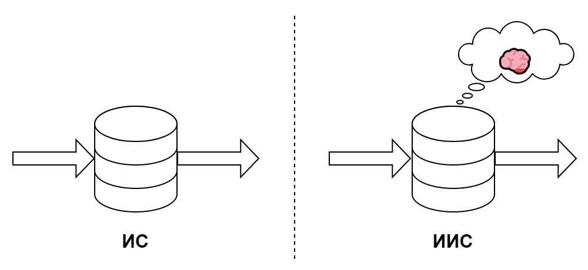

Проектирование и разработка интеллектуальных информационных систем (ИИС) – это важный аспект современного управления и бизнеса. Понятие ИИС было введено в научный оборот в конце 1980-х годов, однако, точная дата и автор введения этого понятия неизвестны. ИИС включают в себя использование информационных технологий и искусственного интеллекта для управления и обработки информации, которая становится интеллектуальным капиталом предприятия.

> Интеллектуальные информационные системы (ИИС) – это системы, которые используют методы искусственного интеллекта для обработки и управления информацией. Они могут быть использованы в различных областях, таких как управление знаниями, поддержка принятия управленческих решений, корпоративные информационные системы и т.д.

В общих чертах, как информационные, так и интеллектуальные системы занимаются обработкой и управлением информацией. Однако, есть несколько ключевых различий, которые различают их друг от друга:

1. **Использование искусственного интеллекта (AI)**. ИИС используют методы искусственного интеллекта и анализа данных для обработки информации. Это позволяет им выполнять более сложные задачи, такие как анализ, прогнозирование и принятие решений.

    Примером может служить система, предсказывающая продажи на основе предыдущих данных. Такая система может анализировать и обрабатывать большие объемы информации для выделения трендов и определения будущих продаж.

    С другой стороны, традиционные информационные системы (ИС) обычно не используют AI, их главная функция – <mark>обеспечивать хранение, поиск, обработку и доступ к информации</mark>.

2. **Обработка естественного языка (NLP)**. Ряд ИИС способны вести продвинутый диалог на естественном языке. Это значит, что они способны понимать и генерировать текст, что позволяет пользователям взаимодействовать с системой более естественно и интуитивно. 

    В ИС, как правило, требуется только ввод данных в определенном формате, не  имея при этом способности обрабатывать запросы, написанные на естественном языке.

3. **Уровень интеллектуализации**. ИИС способны обучаться и адаптироваться, используя полученные данные для улучшения своей производительности.

    ИС обычно не способны обучаться или адаптироваться, их функция в основном ограничивается фиксированными процедурами обработки данных.

Этапы разработки и проектирования ИИС крайне важны для понимания всего процесса, начиная с идеи и заканчивая внедрением системы. Рассмотрим общую хронологию разработки подобных систем:

1. **Предпроектный этап**. Формулируются основные требования и ожидания от системы, а также, сбор информации про исходные данные и параметры, которые будут обрабатываться системой. При необходимости выбирается одна из парадигм разработки и управление проектами (LeanDS, Agile, Scrum и Kanban).

2. **Проектирование**. Выбор технологического стэка, структуры, архитектуры и дизайна будущей системы. На данном этапе, создаются модели данных и процессы связанные с ними, определяются модули и интерфейсы, проводится поиск алгоритмов работы системы и других аналогов.

3. **Разработка и тестирование**. Разработка приложения, сбор и заполнение информационных баз, формулирование пользовательских инструкций. Сбор обратной связи и тестирование – для проверки работоспособности системы и исправления возможных ошибок.

4. **Опытное и промышленное внедрение**. После успешного тестирования система готова к внедрению в работу предприятия. Главный акцент здесь - обучение персонала работе с новой системой, адаптация системы к специфике работы конкретного предприятия.

5. **Эксплуатация**. Этот этап охватывает фактическое использование системы пользователями. На этом этапе происходит интерпретация и анализ полученных результатов, мониторинг и контроль системы.

6. **Сопровождение**. Внесение изменений в систему с целью исправления ошибок, повышения производительности, адаптации к новым требованиям или условиям работы. Сюда может входить обновление программного обеспечения, развитие и оптимизация функционала, техническая поддержка пользователей.

Важно помнить, что, хотя эти этапы часто представлены как последовательные, на практике они часто взаимосвязаны и перекрываются. Например, в процессе разработки может выясниться, что нужно вернуться к этапу проектирования для корректировки некоторых аспектов дизайна системы.

Данные – ключ к успешному обучению интеллектуальных систем. От качества и количества данных во многом зависит успешность системы. Выделим, общие требования для данных:

   - **Репрезентативность**. Данные, которые используются для обучения, должны быть релевантны задаче, которую вы пытаетесь решить. Это значит, что они должны адекватно отражать все возможные вариации сценариев и условий, которые система может встретить в реальной жизни.
   - **Качество данных**. Качество данных также играет критическую роль. Данные обычно должны быть предобработаны, чтобы устранить шумы, пропущенные значения и очистить от ошибок, которые могут привести к плохому обучению вашей модели.
   - **Количество данных**. Количество данных тоже очень важно. В большинстве случаев, чем больше данных может быть предоставлено для обучения модели, тем лучше.
   - **Лицензии и доступность**.

Обучающие выборки – это подмножества из всего набора данных, которые используются для обучения модели. Существуют важные требования и к ним:

   - **Баланс классов**. Если вы работаете с задачами классификации, важно, чтобы обучающие выборки были сбалансированными, то есть имели примерно одинаковое количество примеров каждого класса.
   - **Разнообразие**. Обучающие выборки также должны быть разнообразными и отражать все возможные вариации сценариев и условий, с которыми может столкнуться модель.

