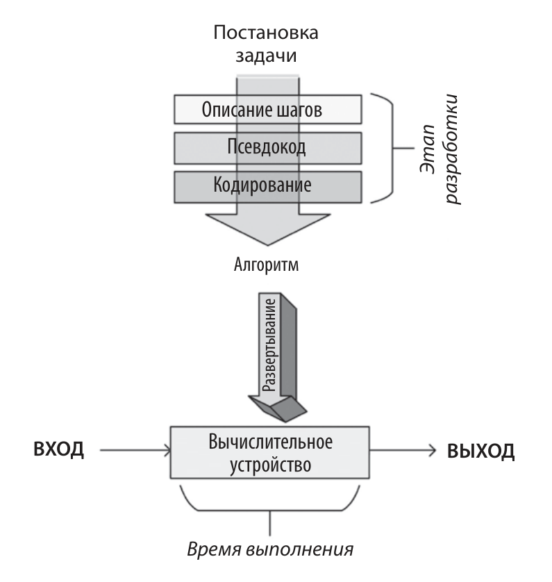
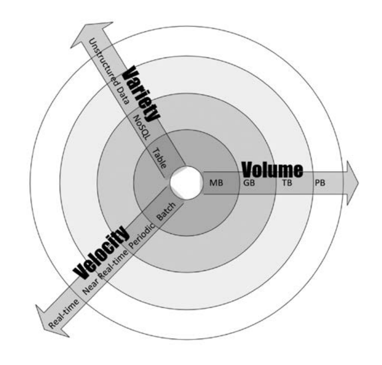
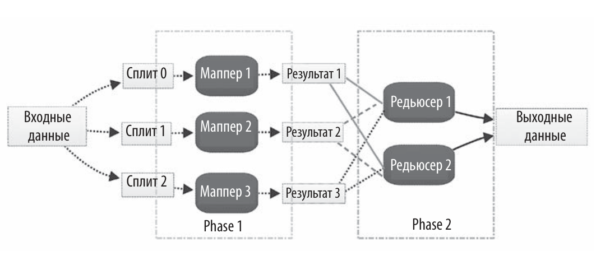
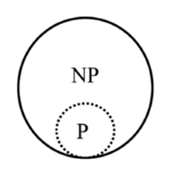
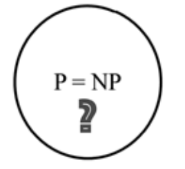
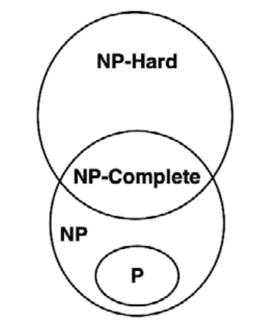

Говоря простым языком, алгоритм – это набор правил для выполнения опреде­ленных вычислений‚ направленных на решение определенной задачи. Он пред­назначен для получения результатов при использовании любых допустимых входных данных в соответствии с точно прописанными командами. Словарь American Heritage дает такое определение:

> «Алгоритм – это конечный набор однозначных инструкций, которые при заданном наборе начальных условий могут выполняться в заданной последовательности для достижения определенной цели и имеют определимый набор конечных условий».

Разработка алгоритма – это создание набора математических правил для эффективного решения реальной практической задачи. На основе такого набора правил можно создать более общее математическое решение, многократно при­менимое к широкому спектру аналогичных задач. Разработка состоит из двух этапов:

- **Проектирование**. На этом этапе разрабатываются и документируются архитектура, логика и детали реализации алгоритма. При разработке алгоритма мы учитываем как точность, так и производительность. Часто для решения одной и той же задачи можно использовать два или несколько разных алгоритмов. Этап проектирования – это итеративный процесс, который включает в себя сравнение различных потенциально пригодных алгоритмов. Некоторые алгоритмы могут давать простые и быстрые решения, но делают это в ущерб точности. Другие могут быть очень точными, но их выполнение занимает значительное время из-­за их сложности. Одни сложные алгоритмы эффективнее других. Прежде чем сделать выбор, следует тщательно изучить все компромиссы. Разработка наиболее эффективного алгоритма особенно важна при решении сложной задачи. Правильно разработанный алгоритм приведет к эффективному решению, способному одновременно обеспечить как надлежащую производительность, так и достаточную степень точности.
- **Реализация**. Разработанный алгоритм превращается в компьютерную про­грамму. Важно, чтобы программа учитывала всю логику и архитектуру, пре­дусмотренную на этапе проектирования.

Этапы проектирования и реализации алгоритма носят итеративный характер.
Разработка алгоритма, отвечающего как функциональным, так и нефункциональным требованиям, занимает массу времени и усилий. Функциональные требования определяют то, какими должны быть правильные выходные данные для конкретного набора входных данных. Нефункциональные требования алгоритма в основном касаются производительности для заданного объема данных. Проверку алгоритма и анализ его производительности мы обсудим далее в этой главе. Проверка должна подтвердить, соответствует ли алгоритм его функциональным требованиям. Анализ производительности — подтвердить, соответствует ли алгоритм своему основному нефункциональному требованию: производительности.

## Логика алгоритма

При разработке алгоритма важно найти различные способы его детализировать. Нам необходимо разработать как его логику, так и архитектуру. Этот процесс можно сравнить с постройкой дома: нужно спроектировать структуру, прежде чем фактически начинать реализацию. Для эффективности итеративного процесса проектирования более сложных распределенных алгоритмов важно предварительно планировать, как их логика будет распределена по нодам кластера во время выполнения алгоритма. Этого можно добиться с помощью псевдокода и планов выполнения.

### Псевдокод

Самый простой способ задать логику алгоритма – составить высокоуровневое неформальное описание алгоритма, которое называется псевдокодом. Прежде чем описывать логику в псевдокоде, полезно сформулировать основные шаги на простом человеческом языке. Затем это словесное описание структурируется и преобразуется в псевдокод, точно отражающий логику и последовательность алгоритма. Хорошо написанный псевдокод должен достаточно подробно описывать алгоритм, даже если такая детализация не обязательна для описания основного хода работы и структуры алгоритма.



Как только псевдокод готов, мы можем написать код алгоритма, используя выбранный язык программирования.

## Разработка алгоритма

Алгоритм – это математическое решение реальной проблемы. При разработке и настройке алгоритма мы должны задавать себе следующие вопросы:

Вопрос 1. Даст ли алгоритм тот результат, который мы ожидаем?

Вопрос 2. Является ли данный алгоритм оптимальным способом получения этого результата?

Вопрос 3. Как алгоритм будет работать с большими наборами данных?
Важно оценить сложность задачи, прежде чем искать для нее решение. При разработке подходящего решения полезно охарактеризовать задачу с точки зрения ее требований и сложности. Как правило, алгоритмы можно разделить на следующие типы в зависимости от характеристик задачи:

- Алгоритмы c интенсивным использованием данных. Такие алгоритмы предъявляют относительно простые требования к обработке. Примером является алгоритм сжатия, применяемый к огромному файлу. В таких случаях размер данных обычно намного больше, чем объем памяти про­цессора (одной ноды или кластера), поэтому для эффективной обработки данных в соответствии с требованиями может потребоваться итеративный подход.

- Вычислительноемкие алгоритмы. Такие алгоритмы предъявляют значи­тельные требования к обработке, но не задействуют больших объемов данных. Пример – алгоритм поиска очень большого простого числа. Чтобы добиться максимальной производительности, нужно найти способ разделить алгоритм на фазы так, чтобы хотя бы некоторые из них были распаралле­лены.

- Вычислительноемкие алгоритмы с интенсивным использованием данных. Хорошим примером здесь служат алгоритмы, используемые для анализа эмоций в видеотрансляциях. Такие алгоритмы являются наиболее ресурсо­емкими алгоритмами и требуют тщательной разработки и разумного рас­пределения доступных ресурсов.

Чтобы определить сложность и ресурсоемкость задачи, необходимо изучить  параметры данных и вычислений, чем мы и займемся в следующем разделе.

### Параметры данных

Чтобы классифицировать параметры данных задачи, мы рассмотрим ее объем, скорость и разнообразие (часто называемые «три V» — Volume, Velocity, Variety):

- Объем (Volume). Ожидаемый размер данных, которые будет обрабатывать
    алгоритм.
- Скорость (Velocity). Ожидаемая скорость генерации новых данных при ис­
    пользовании алгоритма. Она может быть равна нулю.
- Разнообразие (Variety). Количество различных типов данных, с которым, как ожидается, будет работать алгоритм.



В центре диаграммы рас­положены максимально простые данные с небольшим объемом, малым разно­образием и низкой скоростью. По мере удаления от центра сложность данных возрастает. Она может увеличиваться по одному или нескольким из трех пара­метров. К примеру, на векторе скорости располагается пакетный процесс как самый простой, за ним следует периодический процесс, а затем процесс, близкий к реальному времени. Наконец, мы видим процесс в реальном времени, который является наиболее сложным для обработки в контексте скорости передачи данных.

Например, если входные данные представляют собой простой csv-­файл, то объ­ем, скорость и разнообразие данных будут низкими. С другой стороны, если входные данные представляют собой прямую трансляцию с камеры видеонаблю­дения, то объем, скорость и разнообразие данных будут довольно высокими, и эту проблему следует иметь в виду при разработке соответствующего алгоритма.

### Параметры вычислений

Параметры вычислений касаются требований к обработке рассматриваемой задачи. От этих требований зависит, какой тип архитектуры лучше всего подой­дет для алгоритма. Например, алгоритмы глубокого обучения, как правило, требуют большой вычислительной мощности. Это означает, что для таких ал­горитмов важно иметь многоузловую параллельную архитектуру везде, где это возможно.

Предположим, что мы хотим провести анализ эмоциональной окраски в видео­ записи. Для этого мы должны отметить на видео человеческие эмоции: печаль, счастье, страх, радость, разочарование и восторг. Это трудоемкий процесс, тре­бующий больших вычислительных мощностей. 



Для измерения вычислений мы разделили обработку на пять задач, состоящих из двух этапов. Все преобразование и подготовка данных осуществляются в трех мапперах. Для этого мы делим видео на три части, которые называются сплитами. После выполнения маппинга обработанное видео попадает в два агрега­тора, которые называются редьюсерами. Чтобы провести анализ эмоциональной окраски, редьюсеры группируют части видео в соответствии с эмоциями. На­конец, результаты объединяются в выводе данных. Количество мапперов напрямую зависит от параллельности выполнения алгоритма. Оптимальное количество мапперов и редьюсеров зависит от характеристик данных, типа алго­ритма, который необходимо использовать, и количества доступных ресурсов.

## Анализ производительности

Анализ производительности алгоритма – важная часть его разработки‚ и одним из способов такой оценки выступает анализ сложности алгоритма.

Теория сложности – это изучение того, насколько сложны алгоритмы. Что­ бы быть полезным, алгоритму необходимо обладать тремя ключевыми функциями:

- Он должен быть верным. От алгоритма мало пользы, если он не дает пра­
    вильных ответов.
- Хороший алгоритм должен быть понятным для компьютера. Лучший алгоритм в мире окажется бесполезным, если его слишком сложно реализо­вать.
- Хороший алгоритм должен быть эффективным. Невозможно использовать
    алгоритм, который даст правильный результат, но при этом на его работу уйдет тысяча лет или потребуется 1 миллиард терабайт памяти.

Существуют два типа анализа для количественной оценки сложности алгоритма:

- Анализ пространственной сложности (space complexity analysis) – оценка требований к памяти во время выполнения алгоритма.
- Анализ временной сложности (time complexity analysis) – оценка времени, необходимого для выполнения алгоритма.

### Анализ пространственной сложности

При анализе пространственной сложности оценивают объем памяти, необходи­мый алгоритму для хранения структур временных данных в процессе работы. Способ разработки алгоритма влияет на количество, тип и размер этих структур данных. В эпоху распределенных вычислений и постоянно растущих объемов данных, которые необходимо обрабатывать, анализ пространственной слож­ности приобретает все большее значение. Размер, тип и количество структур данных определяют требования к памяти для соответствующего оборудования. Современные структуры данных, используемые в распределенных вычислени­ях, такие как устойчивые распределенные наборы данных (Resilient Distributed Datasets‚ RDDs), должны иметь эффективные механизмы распределения ре­сурсов, учитывающие требования к памяти на различных этапах выполнения алгоритма.

Анализ пространственной сложности необходим для эффективного проектирования алгоритмов. Если при разработке алгоритма не провести надлежащий анализ, то недостаток памяти для временных структур данных может привести к ненужным перегрузкам диска. Это способно значительно повлиять на произ­водительность и эффективность алгоритма.

### Анализ временной сложности

Анализ временной сложности позволяет узнать, сколько времени потребуется алгоритму для выполнения задачи, исходя из его структуры. В отличие от про­странственной сложности, временная сложность не зависит от оборудования, на котором будет выполняться алгоритм. Она зависит исключительно от струк­туры алгоритма. Основная цель анализа временной сложности — ответить на ключевые вопросы: 

- Будет ли этот алгоритм масштабироваться? 

- Насколько хо­рошо алгоритм будет обрабатывать большие наборы данных?

Для этого нужно определить влияние увеличения объема данных на произво­дительность алгоритма и убедиться, что алгоритм точен и хорошо масштабиру­ется. Производительность алгоритма становится все более важным показателем в современном мире «больших данных».

Часто мы можем разработать несколько алгоритмов для решения одной и той же задачи. В таком случае нужно проанализировать временную сложность, чтобы ответить на следующий вопрос:

«С учетом обозначенной проблемы какой из нескольких алгоритмов наиболее эффективен с точки зрения экономии времени?»

Существуют два основных подхода к вычислению временной сложности алго­
ритма:

- Профилирование после реализации. При данном подходе реализуются раз­личные алгоритмы­кандидаты и сравнивается их производительность.

- Теоретический подход до реализации. При этом подходе производительность каждого алгоритма математически аппроксимируется перед запуском алго­ритма.

Преимущество теоретического подхода заключается в том, что он зависит лишь от структуры самого алгоритма. Он не зависит от оборудования, на котором будет выполняться выбранный алгоритм, или от языка программирования, ис­пользуемого для реализации алгоритма.

### Оценка эффективности

Производительность алгоритма обычно зависит от типа входных данных. Например, если данные уже отсортированы в соответствии с контекстом задачи, алгоритм может работать невероятно быстро. Если отсортированные входные данные используются для проверки конкретного алгоритма, то он даст неоправданно высокое значение производительности. Это не будет истинным отражением настоящей производительности алгоритма в большинстве сценариев. Чтобы решить проблему зависимости алгоритмов от входных данных, мы должны учитывать различные типы сценариев при проведении анализа производительности.

#### Наилучший сценарий

При наилучшем сценарии входные данные организованы таким образом, чтобы алгоритм обеспечивал наилучшую производительность. Анализ наилучшего сценария дает верхнюю границу производительности.

#### Наихудший сценарий

Второй способ оценить производительность алгоритма – попытаться найти максимально возможное время, необходимое для выполнения задачи при заданном наборе условий. Такой анализ алгоритма весьма полезен, поскольку мы при этом гарантируем, что независимо от условий производительность алгоритма всегда будет лучше результатов нашего анализа. Анализ наихудшего сценария лучше всего подходит для оценки производительности при решении сложных проблем с большими наборами данных. Анализ наихудшего сценария дает нижнюю границу производительности алгоритма.

#### Средний сценарий

Этот подход начинается с разделения всех возможных входных данных на группы. Затем проводится анализ производительности на основе ввода данных от каждой группы. Далее вычисляется среднее значение производительности для каждой из групп. 

Анализ среднего сценария не всегда точен, так как он должен учитывать все возможные комбинации входных данных, что не всегда легко сделать.

## Выбор алгоритма

Как узнать, какой алгоритм является наилучшим решением? Как узнать, какой алгоритм сработает быстрее? Временная сложность (time complexity) и «О-большое» – хорошие инструменты для получения ответов на такие вопросы.

Рассмотрим простую задачу сортировки списка чисел. Существует несколько доступных алгоритмов, которые способны выполнить эту работу. Вопрос в том, как выбрать правильный. 

Прежде всего следует заметить, что если в списке не слишком много чисел, то не имеет значения, какой алгоритм мы выберем для сортировки. Например, если в списке всего 10 чисел (n = 10), то какой бы алгоритм мы ни выбрали, его выполнение вряд ли займет более нескольких микросекунд, даже при очень плохой разработке. Но как только размер списка достигнет одного миллиона, выбор правильного алгоритма станет важным шагом. Плохой алгоритм может выполняться несколько часов, в то время как хороший способен завершить сортировку списка за пару секунд. Таким образом, в случае большого объема входных данных имеет смысл приложить усилия: выполнить анализ производительности и выбрать алгоритм, который будет эффективно решать требуемую задачу.

### «$О$-большое»

«$О$­-большое» используется для количественной оценки производительности алгоритмов по мере увеличения размера входных данных. Это одна из самых популярных методик, используемых для проведения анализа наихудшего сценария. <mark>Вычислительная сложность алгоритма – это функция, определяющая зависимость объёма работы, выполняемой некоторым алгоритмом, от размера входных данных</mark>. 

#### Константная временная сложность – $O(1)$

Если выполнение алгоритма занимает одинаковое количество времени независимо от размера входных данных, то про него говорят, что он выполняется постоянное время. Такая сложность обозначается как $O(1)$. 

В качестве примера рассмотрим доступ к $n$-­му элементу массива. Независимо от размера массива для получения результата потребуется одно и то же время. Например, следующая функция вернет первый элемент массива (ее сложность $O(1)$):

```python
def getFirst(myList):
    return myList[0]
```

- Добавление нового элемента в стек с помощью push или удаление элемента из стека с помощью pop. Независимо от размера стека добавление или удаление элемента займет одно и то же время.

- Доступ к элементу хеш­таблицы.

- Блочная (иначе называемая корзинная или карманная) сортировка (Bucket sort).

#### Линейная временная сложность – $O(n)$

Считается, что алгоритм имеет линейную временную сложность, обозначаемую $O(n)$, если время выполнения прямо пропорционально размеру входных данных. Простой пример – добавление элементов в одномерную структуру данных:

```python
def getSum(myList):
    sum = 0
    for item in myList:
    	sum = sum + item
    return sum
```

Взгляните на основной цикл алгоритма. Число итераций в основном цикле линейно увеличивается с увеличением значения $n$, что приводит к сложности $O(n)$.

Другие примеры операций с массивами:
- Поиск элемента.
- Нахождение минимального значения среди всех элементов массива.

#### Квадратичная временная сложность – $O(n^2)$

Считается, что алгоритм выполняется за квадратичное время, если время выполнения алгоритма пропорционально квадрату размера входных данных. Например, простая функция, которая суммирует двумерный массив, выглядит следующим образом:

```python
def getSum(myList):
	sum = 0
	for row in myList:
		for item in row:
			sum += item
	return sum
```

Обратите внимание на вложенный цикл внутри основного цикла. Этот вложен­ный цикл и придает коду сложность $O(n^2)$.

Другим примером квадратичной временной сложности является алгоритм сортировки пузырьком.

#### Логарифмическая временная сложность – $O(\log n)$

Считается, что алгоритм выполняется за логарифмическое время, если время выполнения алгоритма пропорционально логарифму размера входных данных. С каждой итерацией размер входных данных уменьшается в несколько раз. Примером логарифмической временной сложности является бинарный поиск. Алгоритм бинарного поиска используется для поиска определенного элемента в одномерной структуре данных, такой как список в Python. Элементы в структуре данных должны быть отсортированы в порядке убывания. Алгоритм бинарного поиска реализован в функции с именем searchBinary следующим образом:

```python
def searchBinary(myList,item):
    first = 0
    last = len(myList)-1
    foundFlag = False
    while( first <= last and not foundFlag):
    	mid = (first + last)//2
        if myList[mid] == item :
        	foundFlag = True
        else:
        	if item < myList[mid]:
        		last = mid - 1
        	else:
        		first = mid + 1
    return foundFlag
```

Работа основного цикла подразумевает тот факт, что список упорядочен. На каждой итерации список делится пополам, пока не будет получен результат.


Обратите внимание, что среди четырех последних представленных типов вре­ менной сложности $O(n^2)$ имеет худшую производительность, а $O(\log n)$ – луч­шую. Фактически производительность $O(\log n)$ можно рассматривать как золо­той стандарт производительности любого алгоритма (что, однако, не всегда достижимо). С другой стороны, $O(n^2)$ не так плох, как $O(n^3)$, но все же алгорит­мы этого типа нельзя использовать для больших данных, поскольку временная cложность ограничивает объем данных, которые они способны обработать за разумное количество времени. Чтобы понизить сложность алгоритма, мы можем пожертвовать точностью и использовать приближенный алгоритм.

## Концепции разработки алгоритмов

**Результат**

Алгоритм – это математическое решение реальной задачи. Чтобы быть полезным, он должен давать точные результаты. О проверке правильности алгоритма нужно думать заранее‚ и она должна быть заложена в его архитектуру. Прежде чем разрабатывать стратегию проверки алгоритма, нам нужно рассмотреть следующие два аспекта:

- Определение истины (truth). Для проверки алгоритма нам нужны некоторые известные правильные результаты для заданного набора входных данных. В контексте поставленной задачи такие результаты называются истинами. Пытаясь найти лучшее решение, мы последовательно совершенствуем наш алгоритм и используем истину в качестве ориентира.

- Выбор метрик. Кроме того, нужно решить, как именно мы собираемся колиественно оценивать отклонение от определенной истины. Выбор правильных показателей (метрик) поможет точно оценить качество нашего алгоритма. 

Например, для алгоритмов машинного обучения в качестве истины можно использовать существующие размеченные данные. Для количественной оценки отклонения от истины можно выбрать одну или несколько метрик, таких как доля правильных ответов (accuracy), полнота (recall) или точность (precision). Важно отметить, что в некоторых случаях результат не ограничен одним значением‚ а представляет собой диапазон для заданного набора входных данных. Во время разработки нашей целью будет итеративное улучшение алгоритма до тех пор, пока результат не окажется в пределах диапазона, указанного в требованиях.

**Оптимальность**

Полиномиальный алгоритм (polynomial algorithm). Если алгоритм имеет временную сложность $O(n^k)$, мы называем его полиномиальным, где $k$ – константа.

Сертификат (certificate). Предлагаемый вариант решения, полученный по окончании итерации, называется сертификатом. По мере итеративного продвижения к решению конкретной задачи мы обычно генерируем серию сертификатов. Если решение стремится к сходимости, каждый сгенерированный сертификат будет лучше предыдущего. В какой-­то момент, когда сертификат будет соответствовать требованиям, мы выберем его в качестве окончательного решения.

Таким образом, время, необходимое алгоритму для получения предлагаемого решения, на­зываемого сертификатом: $t_r$. А время, необходимое для проверки предлагаемого решения (сертификата): $t_s$.

### Определение сложности задачи

На протяжении многих лет исследовательское сообщество делило задачи на различные категории в зависимости от их сложности. Прежде чем разрабатывать решение, имеет смысл охарактеризовать задачу. Как правило, задачи делятся на три типа:

**Тип 1**. Задачи, для которых доказано существование полиномиального алгоритма.

**Тип 2**. Задачи, для которых доказано, что они не могут быть решены с помощью полиномиального алгоритма.

**Тип 3**. Задачи, для которых не найден полиномиальный алгоритм, но не доказано, что его не существует.

<u>Классы задач:</u>

**Недетерминированные полиномиальные, NP** (non­deterministic polynomial). Чтобы задача была NP­задачей, она должна удовлетворять следующему условию: гарантированно существует полиномиальный алгоритм, который может быть использован для проверки оптимальности варианта решения (сертификата).

**Полиномиальные, P** (polynominal). Это типы задач, которые можно рассматривать как подмножество NP. В дополнение к выполнению условия задачи NP задачи P должны удовлетворять еще одному условию: гарантированно существует по крайней мере один полиномиальный алгоритм, который может быть использован для их решения.



> Если задача принадлежит к классу NP, то принадлежит ли она так­же и к классу P? Это одна из величайших проблем в информатике, которая до сих пор остается нерешенной. Математический инсти­тут Клэя включил ее в число Задач тысячелетия. За решение этой проблемы предлагается 1 миллион долларов, так как оно оказало бы значительное влияние на такие области, как искусственный интеллект, криптография и теоретические компьютерные науки.
>
> 

**NP-полные** (NP ­complete). Данная категория содержит самые сложные задачи из всех NP. NP­полная задача удовлетворяет следующим двум условиям: не существует известных полиномиальных алгоритмов для генерации сертификата; существуют известные полиномиальные алгоритмы для проверки того, что предлагаемый сертификат является оптимальным.

**NP-трудные** (NP­ hard). Эта категория содержит задачи, которые по крайней мере так же сложны, как и любая задача категории NP; при этом они необязательно принадлежат категории NP.



Исследовательскому сообществу еще предстоит доказать, является ли P = NP. И хотя это еще не доказано, весьма вероятно, что P ≠ NP. В таком случае для NP ­полных задач не существует полиномиального решения. Предыдущая диаграмма основана на этом предположении.
