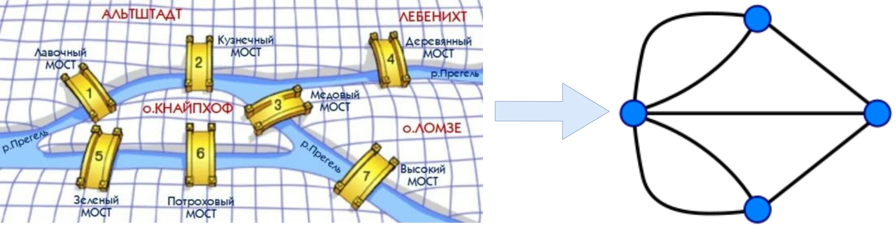
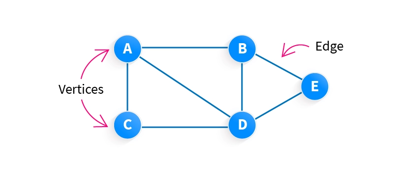

Существует класс вычислительных задач, решить которые проще всего, представив их в виде графов и применив алгоритмы, называемые графовыми (graph algorithms). Например, графовые алгоритмы используются для эффективного поиска значения в графическом представлении данных. Прежде всего алгоритм определяет структуру графа, затем ищет правильную стратегию прохода по его ребрам с целью получить данные, хранящиеся в вершинах. 

Современная теория графов применяется в очень многих научных и промышленных сферах. Любая сеть независимо от вида взаимоотношений среди объектов может быть представлена в формате требуемого графа. Объектами графа могут быть нейронные связи в человеческом мозге, объединённые в сеть персональные компьютеры или просто взаимоотношения среди большой группы людей. 

## Вводные определения

Теория графов и сетей – это один из разделов дискретной математики, изучающий свойства графов. Граф – это структура (топологичекая модель), которая отображает данные в виде вершин и ребер.



Основоположником теории графов считается Леонард Эйлер, великий математик восемнадцатого века. Он решил задачу семи мостов в Кенигсберге, которая формулировалась следующим образом:

«Как пройти по всем мостам города, не проходя ни по одному из них дважды?»

В то время в Кенигсберге на реке Преголя было построено семь мостов, которые соединяли два больших речных острова и берега реки. Эйлер обозначил речные берега и острова в реке точками, а мосты, которые их соединяют, обозначил линиями. То есть он построил первый в мире граф, получивший название графа Кенигсбергских мостов. 

Эйлер доказал, что решения этой задачи не существует, и определил <mark>необходимое условие наличия искомого маршрута в произвольном графе</mark>, а именно, <mark>число вершин, из которых идёт нечётное количество линий обязано равняться или двум, или нулю</mark>. Для первого варианта такими вершинами являются начальная и конечная точки маршрута. Позднее было доказано, что это условие является и достаточным.



Формально граф может быть определён как два множества $V = (n_1, \dots, n_k)$ и $E = (e_1, \dots, e_m)$, которые называются <mark>вершинами</mark> (vertices, nodes) и <mark>рёбрами</mark> (edges). Рёбрами являются соединяющие вершины линии, а <mark>число рёбер, которые выходят из вершины графа, определяют степень вершины</mark>.
$$
G = (V, E)
$$
Граф является ориентированным, если его рёбра имеют направление. То есть ребро обозначается стрелкой, выходящей из начальной точки (вершины), и приходящей в конечную точку.

Мультиграфом называется такой граф, у которого две вершины соединены более чем одним ребром. 

Часто рёбра обладают весом, этот параметр, как правило, является положительным числом. К примеру, если представить схему Московского метро в виде графа, то в качестве вершин будут станции, а в качестве рёбер можно принять туннели, которые их соединяют. В таком случае, вес ребра будет временной интервал, затрачиваемый на проезд между станциями, соединяемыми ребром.

В ряде источников можно встретить следующие названия типов графов, обладающих определенными свойствами и характеристиками:

1. **Finite Graph (Конечный граф)**: Граф, который содержит конечное количество вершин и рёбер.
    ")

2. **Infinite Graph (Бесконечный граф)**: Граф, который содержит бесконечное количество вершин или рёбер.
    ")

3. **Trivial Graph (Тривиальный граф)**: Граф, который состоит из одной вершины, без рёбер.
    ")

4. **Simple Graph (Простой граф)**: Граф, в котором каждая пара вершин соединена не более чем одним ребром, и нет петель (рёбер, соединяющих вершину саму с собой).
    ")

5. **Multi Graph (Мультиграф)**: Граф, который может содержать несколько рёбер между одной и той же парой вершин. В таком графе можно найти более одного маршрута (ребра), соединяющего 2 места (вершины), причем одни из них могут быть длиннее, другие короче.
    ")

6. **Null Graph (Пустой граф)**: Граф, имеющий только изолированные вершины, т.е. такой граф не имеет ребер, соединяющих вершины.
    ")

7. **Complete Graph (Полный граф)**: Граф, в котором каждая пара вершин соединена ровно одним ребром, то есть каждая вершина связана с каждой другой вершиной. Неориентированный полный граф с $n$ вершинами будет иметь $\frac{n(n-1)}{2}$ ребер, а направленный полный граф с $n$ вершинами будет иметь $n(n-1)$ ребер.
    ")

8. **Pseudo Graph (Псевдограф)**: Граф, который может содержать петли (рёбра, соединяющие вершину саму с собой) и множественные рёбра между вершинами.
    ")

9. **Regular Graph (Регулярный граф)**: Граф, в котором каждая вершина имеет одинаковое количество инцидентных рёбер, т.е. каждая вершина $V$ графа является смежной или соединенной с одинаковым числом вершин. Все полные графы регулярны, но не наоборот.
    ")

10. **Bipartite Graph (Двудольный граф)**: Граф, вершины которого можно разделить на две непересекающиеся доли таким образом, что каждое ребро соединяет вершины из разных долей. В двудольных графах не будет ребер, соединяющих вершины из одного и того же множества.
    ")

11. **Labelled Graph (Граф с метками)**: Граф, в котором каждая вершина или ребро имеет ассоциированную метку (символ), данные или вес. Этот тип графа также известен как взвешенный граф, поскольку ребра могут содержать некоторую полезную информацию. Такие графы очень полезны для различных целей, например, для вычисления минимального расстояния или кратчайшего пути между двумя точками.
    ")

12. **Digraph Graph (Ориентированный граф)**: Граф, в котором каждое ребро имеет направление, то есть оно идет от одной вершины к другой. Ориентированные графы, широко используются для обозначения иерархий в сетевом администрировании, графов связей в социальных сетях и дорожных магистралей.
    ")

13. **Subgraph (Подграф)**: Граф, который является частью другого графа, включая некоторые из его вершин и рёбер.
    ")
    Существует 2 вида подграфов. 
    **Vertex Disjoint Subgraph (Вершинно-неразрывный подграф)** – подграф, не имеющий общей вершины, называется вершинно-неразрывным подграфом. Считается, что любые два графа $A = (V1, E1)$ и $B = (V2, E2)$ являются вершинно-неразрывными графами $G = (V, E)$, если пересечение $V1(A)$ и $V2(B) = null$. подграфы $EFG$ и $ABCD$ не имеют ни одной общей вершины, говорят, что они являются вершинно-неразрывными подграфами.
    **Edge Disjoint Subgraph (Реберно-неразрывный подграф)** – подграф, не имеющий общего ребра, называется подграфом, не имеющим общих ребер. Подграф считается реберно-неразрывным, если пересечение $E1(A)$ и $E2(B) = null$. В приведенном ниже примере, поскольку графы $ABCD$ и $BEFG$ не имеют общего ребра, считается, что они являются подграфами с расходящимися ребрами.

    ")

14. **Connected or Disconnected Graph (Связанный или Несвязанный граф)**: Граф, в котором все вершины связаны между собой (связанный), или граф, в котором существуют вершины, не соединенные ни с одной другой вершиной (несвязанный).
    ")

15. **Cyclic Graph (Циклический граф)**: Граф, который содержит один или более циклов, то есть последовательность вершин и рёбер, начинающуюся и заканчивающуюся в одной и той же вершине. Граф, имеющий один или несколько циклов, называется циклическим. Циклическим графом можно считать маршрут по городу, соединяющий различные достопримечательности. На следующем рисунке $ABCDE$ представляет собой циклический граф, поскольку состоит из цикла, обозначенного $BCDE$.
    ")

16. **Vertex Labeled Graph (Граф с метками вершин)**: Граф, в котором каждая вершина имеет свою уникальную метку или символ. Такие графы наиболее полезны в дорожной карте, где метки вершин можно рассматривать как названия ориентиров.
    ")

17. **Directed Acyclic Graph (Ориентированный ациклический граф, DAG)**: Граф, в котором существует направление рёбер, и при этом не существует циклов. Графы DAG могут использоваться для представления потоков данных, сети обрабатывающих элементов и управлении проектами.
    ")

Таким образом, графы, условно, можно разделить на четыре больших типа:

- Неориентированные графы (undirected graphs);
- Ориентированные графы (directed graphs);
- Неориентированные мультиграфы (undirected multigraphs);
- Ориентированные мультиграфы (directed multigraphs).

<mark>Дерево – частным случаем графа и является ациклической структурой данных</mark>, т.е. деревом называют граф у которого:

- <mark>иерархическая структура</mark>, что означает наличие верхнего узла, называемого корнем, и последующих уровней узлов, отображающих отношения «родитель-ребенок», 
- не содержит циклов (<mark>ацикличность</mark>), 
- <mark>отношения между ребрами и узлами</mark>, так между каждой парой вершин существует ровно один путь, число ребер всегда на единицу меньше числа вершин (узлов), если дерево имеет $n$ вершин, то оно будет иметь $n-1$ ребер,
- <mark>является связным графом</mark>, что означает, что между любыми двумя вершинами дерева существует путь.

Лес - граф, в котором несколько деревьев.

Эти свойства делают дерево полезной структурой данных в различных областях, например для организации данных для быстрого доступа (деревья поиска), представление иерархических отношений (организационные диаграммы, файловые системы) и разработку алгоритмов (деревья принятия решений, деревья разбора).

<mark>Сетью (network) – называют коллекция связанных объектов</mark>. Сети могут представлять все виды систем в реальном мире. Например, Интернет можно описать как сеть, где узлами являются компьютеры или другие устройства, а ребрами – физические (или даже беспроводные) связи между устройствами.

> Важно отметить, что в некоторых контекстах термины «граф» и «сеть» используются взаимозаменяемо. Также стоит отметить, что в некоторых дисциплинах, «сеть» часто используется для описания систем, в которых узлы и ребра могут иметь дополнительные атрибуты, такие как веса, в то время как термин «граф» может использоваться для описания более абстрактных структур без каких либо дополнительных атрибутов.

<mark>Случайным графом – называется граф порожденный некоторой моделью</mark>, как правило используется для обозначения вероятностных распределений над графами. Случайные графы могут быть описаны с помощью вероятностного распределения или с помощью случайного процесса, который их генерирует. 

С математической точки зрения, случайные графы используются для ответа на вопросы о свойствах типичных графов. Их практические приложения находятся во всех областях, где требуется моделирование сложных сетей – таким образом, известно множество моделей случайных графов, отражающих разнообразные типы сложных сетей, встречающихся в различных областях.

> Случайный граф отличается от обычного графа или сети тем, что свойства, такие как количество вершин графа, ребер и связей между ними, определяются некоторым случайным образом. Это позволяет моделировать и анализировать разнообразные сетевые структуры и процессы, которые могут быть подвержены случайности или неопределенности. Например, случайные графы часто используются в теории сетей для моделирования случайных сетей, таких как Интернет, где связи между узлами могут быть случайными или изменяться со временем.

## Представление (хранение) графа

Выбор представления графов (Graph Representation) зависит от того, какие именно отношения между элементами и в каком объеме их необходимо хранить в рамках решаемой задачи, т.е. для лучшего понимания, манипуляции  и визуализации сложных структур.

Существуют различные способы представления графов, базовые из которых это матрицы смежности, списки смежности и визуальные диаграммы. Выбор метода представления графа зависит от целей исследования и конкретных требований к визуализации. Например:

1. <mark>Матрица смежности – двумерный массив</mark>, в котором ячейки отражают наличие или отсутствие связи между вершинами графа. Этот метод подходит для графов с большим количеством связей (плотных графов), но может быть неэффективным для графов с малым количеством связей (разреженных графов) из-за большого количества пустого пространства в матрице.
2. <mark>Список смежности –  массив списков</mark>. Каждый список соответствует вершине графа и содержит вершины, с которыми она связана. Этот метод более эффективен для разреженных графов, поскольку он использует меньше памяти и позволяет быстро определить соседей конкретной вершины.
3. <mark>Визуальные диаграммы</mark>, такие как диаграммы сетей или деревьев, являются наиболее интуитивно понятными и позволяют наглядно представить структуру графа. Они особенно полезны для визуализации малых графов или подграфов больших графов.
4. <mark>Сетевые диаграммы</mark> используются для отображения связей между множеством элементов. В некоторых вариантах сетевой диаграммы, позиция точки зависит от количества связей, которые у этой точки есть, и группы, к которой она принадлежит. Сетевые диаграммы часто используются для показа кластеров элементов на основе интенсивности связей [datylon.com](https://www.datylon.com/blog/types-of-charts-graphs-examples-data-visualization).

Выбор способа представления графа зависит от конкретной задачи и ваших потребностей в визуализации. Важно учитывать, что разные методы представления графов могут быть более или менее эффективными в зависимости от размера графа, количества связей и специфических требований к визуализации.

#### Перечисление множеств (Set enumeration)

По определению, граф – это топологическая модель, которая состоит из множества вершин и множества рёбер, их соединяющих. Значит, самый «простой» способ представить граф – определить оба этих множества.

")

Недостаток такого подхода: использование достаточно тяжеловесной структуры – хэш таблицы – для хранения множества, когда проще и быстрее работать с обычными массивами или списками, к тому же, во множестве нет возможности получить перечисление вершин в порядке их добавления (особенность хэш-таблицы). 

Алгоритмы обработки графов, не используют такой способ хранения вершин и рёбер.

Вершины обычно отдельно не хранятся, а указываются только их количество $V$, они автоматически принимают номера от $0$ до $V-1$. Для хранения цвета  или веса или других характеристик вершин можно использовать параллельные массивы для каждого критерия.

#### Матрица смежности (Adjacency matrix)

Это самый популярный и расточительный способ представления графа в памяти. Его уместно использовать, если количество рёбер велико, порядка $V2$. Для хранения рёбер используется двумерная матрица размерности $[V, V]$, каждый $[a, b]$ элемент которой равен $1$, если вершины $a$ и $b$ являются смежными и $0$ в противном случае. 

В случае неориентированного графа матрица является симметричной относительно главной диагонали, а сумма каждой строчки и каждого столбца равна степени вершины. В связи с этим, при записи рёбер-петель в матрицу необходимо записывать число $2$. 

")

Сложность по памяти: $O(V^2)$.

Сложность перечисления всех рёбер: $O(V^2)$.

Сложность перечисления всех вершин, смежных с $a$: $O(V)$.

Сложность проверки смежности вершин $a$ и $b$: $O(1)$.

#### Матрица инцидентности (Incidence matrix)

Это самый расточительный способ хранения графа, его уместно использовать, если количество рёбер невелико. Для хранения используется двумерная матрица размера $[V, E]$, в каждом столбце которой записано одно ребро таким образом: напротив вершин, инцидентных этому ребру, записаны $1$, в остальных случаях $0$.

Таким образом, сумма чисел в каждом столбце равна $2$, а сумма чисел в строчке a равна степени вершины а.

")

Сложность по памяти: $O(V \times E)$.

Сложность перечисления всех рёбер: $O(V \times E)$ – хоть каждое ребро и хранится в отдельном столбце, но для получения информации об инцидентных ему вершинах нужно перебрать все числа в столбце.

Сложность перечисления всех вершин, смежных с $a$: $O(V \times E)$.

Сложность проверки смежности вершин $a$ и $b$: $O(E)$ - достаточно пройтись по строчкам $a$ и $b$ в поисках двух единиц.

#### Перечень рёбер (List of edges)

Если из матрицы инцидентности убрать все нули, в каждом столбце останется только два числа для каждого ребра – номера инцидентных ему вершин. То есть, для перечисления рёбер достаточно составить список из пар чисел, это очень экономный способ: каждое ребро хранится один раз, когда во всех других вариантах каждое ребро, как правило, записывается дважды.

Недостаток – при поиске вершин в списке рёбер нужно выполнять по две проверки – сравнивать и первую вершину, и вторую.

")

Сложность по памяти: $O(E)$.

Сложность перечисления всех рёбер: $O(E)$.

Сложность перечисления всех вершин, смежных с а: $O(E)$.

Сложность проверки смежности вершин $a$ и $b$: $O(E)$.

Список рёбер можно сгруппировать по вершинам, что позволит ускорить поиск смежных вершин. У нас получится ещё три очередных способа, которые очень похожи друг на друга, отличаются лишь способом записи векторов.

#### Векторы смежности ( Adjacency vectors)

Для записи вектора смежности используется двумерная матрица размером $[V, S]$, где $S$ – максимальная степень вершины в графе.

В каждой строчке $a$ записаны номера вершин, смежных с $a$, после чего записаны нули (несуществующие номера вершин).

")

Сложность по памяти: $O(V \times S)$.

Сложность перечисления всех рёбер: $O(V \times E)$.

Сложность перечисления всех вершин, смежных с $a$: $O(Sa)$ ($Sa$ = степень вершины $a$) = $O(E)$.

Сложность проверки смежности вершин $a$ и $b$: $О(Sa) = O(Sb) = O(E)$.

#### Массивы смежности (Adjacency arrays)

Для экономии памяти, используется ступенчатый массив, длина каждой строки равна степени данной вершины.

")

Сложность по памяти: $O(\text{сумма степеней всех вершин}) = O(E)$.

#### Списки смежности ( Adjacency lists)

Здесь используется односвязный список для перечисления всех смежных вершин.

")

Сложность по памяти: $O(V + \text{сумма степеней всех вершин}) = O(V + 2xE) = O(V + E)$.

#### Структура с оглавлением (Table of contents)

Один из самых экономных способов представления графа в памяти. Фактически, мы записываем все массивы смежности в одну строчку, в один линейный массив, и создаём массив-оглавление, с указателями на начало списка для каждой вершины.

")

Сложность по памяти: $O(V + \text{сумма степеней всех вершин}) = O(V + E)$.

#### Список вершин и список рёбер (List of vertices and list of edges)

Самый экстравагантный способ хранения графа. Вершины записываются в односвязных список, от каждой вершины есть указатель на список всех рёбер, инцидентных данной вершины. Каждое ребро, в свою очередь, имеет указатель на вторую инцидентную ей вершину и на следующее ребро. 

")

Получается весьма разветвлённый граф для представления графа.

")

Сложность по памяти: $O(V + \text{сумма степеней всех вершин}) = O(V + E)$.

Сложность перечисления всех рёбер: $O(V \times E)$.

Сложность перечисления всех вершин, смежных с $a$: $O(Sa) (Sa = \text{степень вершины } a) = O(E)$.

Сложность проверки смежности вершин $a$ и $b$: $O(Sa) = O(Sb) = O(E)$.

Теперь, когда мы знаем способы представления графа в памяти компьютера, можем выбирать наиболее приемлемые варианты для каждой конкретной задачи.

####  Log(Graph)

Log(Graph) – это новый способ представления графов, который позволяет быстрее и дешевле обрабатывать графы различных типов. Он работает путем применения логарифмических терминов к различным элементам графа, чтобы достичь соответствующих границ хранения. Это достигается через процесс, называемый «логарифмизацией (logarithmize) графа», где логарифмические термины применяются к различным элементам графа для получения соответствующих границ. Этот подход использует различные техники и понятия, включая краткость, компактность и целочисленное линейное программирование. Результатом является представление графа, которое достигает значительного сокращения хранилища, сохраняя при этом высокую производительность для без потерь сжатия. 

Принцип работы Log(Graph) можно описать следующими шагами: 

1. Логарифмизация графа: Применение логарифмических терминов к различным элементам графа, чтобы достичь соответствующих границ хранения. Это достигается путем применения логарифмических функций к различным параметрам графа, таким как количество вершин, количество ребер и т.д. Например, вместо хранения идентификаторов вершин в виде целых чисел, можно использовать битовые строки фиксированной длины, что позволяет существенно сократить объем хранимых данных.   

2. Расширение до распределенной памяти: Log(Graph) расширяется до настроек распределенной памяти. 

Оценка производительности: Log(Graph) оценивается на различных графах (синтетических и реальных) с широким набором алгоритмов (BFS, PageRank, Connected Components, Betweenness Centrality, Triangle Counting, Single Source Shortest Paths). Результаты показывают, что графы, сжатые с помощью Log(Graph), могут быть обработаны так же быстро, как и несжатые граф.

Статья: [Log(Graph): A Near-Optimal High-Performance Graph Representation (ethz.ch)](https://spcl.inf.ethz.ch/Research/Performance/LogGraph/loggraph_full.pdf).

## Характеристики графа

Любой граф обладает числовыми мерами, которые описывают (характеризуют) его структуру и свойства. 

- **Количество вершин**: любой граф может быть характеризован целым числом $n$ – количество вершин. $|V| = n$
- **Количество ребер**: граф может быть описан как имеющий $m$ ребер, где $m$ – целое число. $|E| = m$
- **Плотность (Density)**: мера, которая показывает насколько «плотно» или «разреженно» заполнен граф, т.е. <mark>на сколько близко количество ребер в графе к максимально возможному количеству ребер</mark>. Плотность графа определяется как отношение числа ребер к максимально возможному числу ребе. Для неориентированного графа с вершинами $V$, максимальное количество ребер равно $\frac{|V| \times (|V|-1)}{2}$, тогда плотность графа определяется как $D=\frac{2 |E|}{|V| \times (|V|-1)}$. В то время как для ориентированного графа плотность графа определяется как $D=\frac{|E|}{|V| \times (|V|-1)}$. <mark>Граф, имеющий малое число рёбер, принято называть разреженным графом</mark>.
- **Расстояние между вершинами (Distance)**: для неориентированного графа расстояние $d(u,v)$ между двумя вершинами $u$ и $v$ определяется как длина кратчайшего пути от $u$ к $v$, при условии, что хотя бы один такой путь существует, при этом для ориентированного графа расстояние $d(u,v)$ определяется как длина кратчайшего направленного пути от $u$ к $v$, при условии, что хотя бы один такой путь существует и при этом $d(u,v)$ не обязательно совпадает с $d(v,u)$.  Также существует понятие взвешенного расстояния кратчайшего пути, где вес ребра представляет его длину или, для сложных сетей, стоимость взаимодействия, и взвешенное расстояние кратчайшего пути $d(u, v)$ – это минимальная сумма весов по всем путям, соединяющим $u$ и $v$.
- **Степень узла (Node degrees)**:  у неориентированных узлов степень равна количеству его соседей, у ориентированных графов степень узлов может быть входящая (In-Degree) и исходящая (Out-Degree). Обозначается: $\deg(v)$.
- **Коэффициент кластеризации (Clustering coefficient)**: мера, используемая  для оценки степени кластеризации или связности вершин в графе, позволяет определить, <mark>насколько сильно соседние вершины графа связаны друг с другом</mark>. В начале коэффициент кластеризации вычисляется для каждой вершины, называемый локальным коэффициентом кластеризации (Local Clustering Coefficient) по формуле $\text{LCC}(v) = \frac{2 \times N(v)}{\deg(v) \times (\deg(v) - 1)}$, где $N(v)$ – количество рёбер, соединяющих соседние вершины $v$, а $\frac{\deg(v) \times (\deg(v) - 1)}{2}$ – максимальное число рёбер, которое могло бы существовать между этими соседними вершинами, так если  $\text{LCC}$ равен $1$, это означает, что все соседние вершины данной вершины соединены друг с другом, если равен $0$, то соседние вершины не соединены между собой. Далее вычисляется для всего графа глобальный коэффициент кластеризации (Global Clustering Coefficient), как среднее арифметическое всех локальных коэффициентов кластеризации для всех вершин в графе: $\text{GCC}(G) = \frac{\sum \text{LCC}}{\abs{V}}$, в результате <mark>высокий коэффициент кластеризации указывает на то, что граф имеет более плотные кластеры вершин и более высокую связность, а низкий коэффициент кластеризации может указывать на более разреженную и менее связную структуру графа</mark>.
- **Распределение по степеням (Degree distribution)**: отражает, <mark>как количество вершин в графе зависит от их степеней</mark>. У графов с равномерным распределением (Uniform Distribution) степени вершин  примерно равны, и нет ярко выраженных вершин с очень высокими или очень низкими степенями, это типично для случайных графов или графов с равномерно распределенными связями. При экспоненциальном распределении (Exponential Distribution)  большинство вершин имеют низкие степени, но есть небольшое количество вершин с очень высокими степенями, такое распределение характерно для многих реальных сетей, таких как Интернет, социальные сети и транспортные сети. Степенное распределение (Power Law Distribution) содержит множество вершин с низкими степенями, но существует небольшое количество вершин с очень высокими степенями, что создает «хвост» распределения, графы с таким распределением степеней называются «безмасштабными» (scale-free) и часто встречаются в комплексных сетях, таких как интернет и социальные сети. Графы с биномиальным распределением (Binomial Distribution) имеют степени вершин сосредоточенные вокруг определенных значений, и  и при этом граф имеет определенную структуру, такие распределения могут встречаться в графах с определенной геометрией.

<!--
## Визуализация графов

https://github.com/vasturiano/3d-force-graph

## Графовые алгоритмы

### Сетевой анализ

#### Кратчайший путь

Путь представляет собой маршрут между выбранной начальной и конечной вершинами; это набор вершин, p, соединяющих начальную вершину с конечной. Ни одна вершина в p не повторяется.

Длина пути равна количеству входящих в его состав ребер. Из всех вариантов путь с наименьшей длиной называется кратчайшим. Расчет такого пути широко используется в алгоритмах теории графов, но не всегда прост для вычисления. Существуют различные алгоритмы поиска кратчайшего пути между начальным и конечным узлами. Один из самых популярных — алгоритм Дейкстры, опубликованный в конце 1950­х годов. Его можно использовать в системе глобального позиционирования, GPS (Global Positioning System), для расчета минимального расстояния между источником и пунктом назначения. Алгоритм Дейкстры также применяется в алгоритмах сетевой маршрутизации.

Алгоритм Дейкстры вычисляет кратчайший путь от одной из вершин. Если мы хотим найти все пары кратчайших путей, нужно использовать алгоритм Флойда-Уоршелла (Floyd­-Warshall algorithm).

#### Создание окрестностей

#### Показатели центральности

### Обход графа

#### Поиск в ширину (BFS)

#### Поиск в глубину (DFS)

Расчет характеристик графа (про степенной закон)

Визуализация графа

Алгоритмы ширина, глубина, жадный



Рассмотрим реальный пример. Учёные высшей технической школы Цюриха (Швейцария) исследовали информацию о тридцати семи миллионах «экономических объектов», фирм, компаний, разных фондов и частных предпринимателей, которых объединяет то обстоятельство, что все они являются участниками экономического процесса. Сначала они решили выполнить отделение реальной экономики от сложных взаимоотношений финансовых институтов. С этой целью из тридцати семи миллионов объектов они выбрали лишь транснациональные корпорации, владеющие прямо или через посредников по крайней мере десятью процентами фирм, находящихся в разных странах. В случае, когда корпорация является группой связанных фирм с единым хозяином, то вместо всех их учитывался только владелец. К примеру, The Coca-Cola Company является владельцем Coca-Cola Hellenic Bottling Company, у которой во владении находится Coca-Cola Beverages Austria, но учитывалась, в данном случае, только The Coca-Cola Company.

Таким образом учёные сформировали единый изучаемый объект, который включал в свой состав 43060 корпоративных объекта, действующих в 116 мировых государствах. Всю эту базу научные работники сформировали в виде взвешенного ориентированного мультиграфа. Множеством его вершин является набор экономических объектов (сущностей). Две сущности соединялись ребром, начинающимся в вершине А, и оканчивающимся в вершине В, в случае, когда вершине А принадлежит часть, отображаемая вершиной В. Далее специалисты все 43060 корпораций и отобрали из тридцати семи миллионов вершин лишь те, в которые возможно попасть при движении по стрелкам из вершин, являющихся корпорациями, или откуда возможно дойти до этих вершин. В итоге был сформирован граф, явившийся главным исследуемым объектом. Он состоял из 600508 вершин и 1006987 рёбер. Такая схема сети с ядром приведена на рисунке ниже:

Рисунок 2. Схема сети с ядром. Автор24 — интернет-биржа студенческих работ

В сформированном графе каждое ребро получало числовое значение от нуля до единицы, что является долей владения компаний. То есть, когда, к примеру, ребро, соединяющее вершины А и В, обладало весом 0.51, то это обозначало, что компания А владеет 51 процентом компании В. Помимо этого каждая вершина тоже имела вес, обозначающий стоимость определённой компании. Естественно, для того, чтобы оценить влияние компании на рынок будет мало оценки, с какими из вершин соединены исходящие из неё рёбра. Следует учитывать и те вершины, до которых при движении по стрелкам возможно добраться за серию переходов. В таком случае веса рёбер перемножаются.

На заключительном этапе специалисты применяли различные методики по анализу контроля компании над рынком:

1.  **_Линейная модель_**. Контроль над компанией делился среди всех её собственников согласно доле владения.
2.  **_Пороговая модель_**. Аналог предыдущего, но для долей менее 0,5. Когда у компании обнаруживался мажоритарный совладелец, то есть имеющий во владении более пятидесяти процентов компании, то компания считалась целиком под его контролем.
3.  **_Плотностная модель_**. Контроль над компанией делится согласно соотношению долей её совладельцев.

Учёные выполнили анализ топологии без анализа контроля, который показал, что в сформированной сети присутствует только один так называемый сильно связанный компонент. Это 1347 экономических сущностей, прямо или косвенно владеющих всеми другими компаниями сети. Данное множество называется ядром, которое в данном случае является сильно взаимосвязанным. Усреднённая степень вершины в ядре равняется примерно двадцати.



## Как выбрать лучшую структуру сети

-->