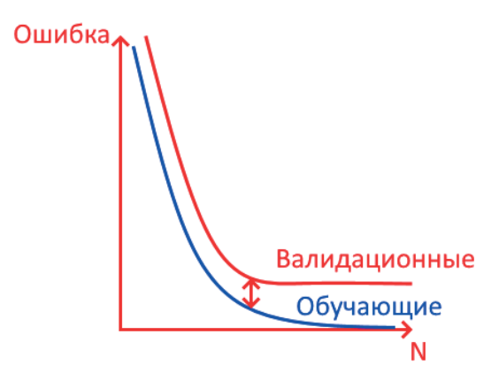

## Задача машинного обучения

Классификаций задач в машинном обучении очень много (некоторые идут от способа решения, другие от метода решения), в нашем случае примем за основу самую общую и наиболее простую классификацию, выделяющую три основных группы в задачах машинного обучения:

1. Обучение с учителем.

2. Обучение без учителя.

3. Обучение с подкреплением.

Начнем с первой группы задач. Такая концепция подразумевает под собой тот факт, что у нас есть на входе некоторые данные, для которых известен ответ (задача очень похожа на арифметическую/геометрическую прогрессию, когда нужно угадать следующее/предыдущее число в ряду чисел). При этому у нас есть некоторые новые данные, для которых требуется найти правильное значение (наиболее правильное), так как машинное обучение предполагает возможность, при котором может не быть однозначно правильного ответа на поставленный вопрос. То есть существует некоторый набор ответов, каждый из которых по-своему близок к правильному, но, скорее всего, правильным не является (всегда существует определенная статистическая ошибка).



Обучение с учителем наиболее простой класс задач в машинном обучении, так как предполагает, что у нас уже есть собранные данные, на эти данные есть правильный ответы и по аналогичным данным нам нужно предсказать ответ, который будет похож на правильный и максимально близок к правильному (во всяком случае мы сможем оценить, насколько предсказываемый ответ близок к правильному). 

В обучении с учителем выделяют две основные задачи:

- задача регрессии;

- задача классификации.

По сути, они достаточно похожи друг на друга, только в задачи регрес- сии мы предсказываем числовое значение, а в задачи классификации ответ представлен в виде ранга или категории (по факту нечисловое значение). Задачи решаются одними и теми же алгоритмами, но принято их разделять и говорить, что если предсказывается числовое значение то это точно задача регрессии (у неё свой набор методов линейная регрессия, нелинейная регрессия), в то время как предсказание рангов и классов относится к задаче классификации (у неё существует другой набор алгоритмов метод ближайших соседей, множественная классификация).

Обучение без учителя вторая группа задач говорит, что у нас нет правильного ответа. Существуют данные, но ответа на них нет. Соответственно возникает ряд задач в связи с тем, что у нас нет ответа на данные.

Первая подзадача задача кластеризации. В ней по определённым параметрам (например, количество кластеров) необходимо предсказать каким образом данные распределены между собой. Это позволяет разнести данные по кластерам, основываясь на среднем удалении от центра кластера, на количестве кластеров и других признаков, тем самым решив задачу кластеризации таким образом.

Кроме того, группа задач обучения без учителя включает в себя методы понижения размерности, когда существует огромное количество признаков и нам требуется уменьшить их до нескольких, чтобы потом применить задачу кластеризации или задачу обучения с учителем (чтобы на разных параметрах определить какие параметры важны и, снизив размерность, решить задачу обучения с учителем. При большой размерности решить задачу с учителем не представляется возможным без серьезного аппаратного обеспечения).

Также к классу задач обучения без учителя относится класс задач по выявлении аномалий. Они похожи на кластеризацию, где есть все данные и дополнительно могут быть ещё какие-то. Обращаем особое внимание на то, что «каких-то дополнительных данных» может и не быть, то есть мы можем не знать какая конкретно будет аномалия, однако мы можем предположить, что некоторые зависимости в данных уже являются аномалиями. Например, задача Фродо относится к классу задач обучения без учителя, так как в ней нужно предсказать пытается ли кто-то обмануть систему или нет. Из практики можно привести пример автоматического распознавания Ddos-атаки, когда алгоритм сам определяет, что такого количества посетителей не должно быть и, скорее всего прирост запросов на сайт действие злоумышленников.

Третий тип задач машинного обучения это обучение с подкреплением. Оно похоже на обучение, но это его единственное сходство с двумя другими категориями, потому что обучение с подкреплением предполагает, что у нас нет данных как таковых, но у нас есть среда, которая генерирует поток сигналов. На основании данных сигналов система должна принимать решения самостоятельно.

Разумеется, задачу третьего типа можно свести к одной из двух типов задач машинного обучения, однако важное отличие третьего типа от двух остальных состоит в том, что существует положительная обратная связь от среды. Обучение предполагает, что у нас будет ответ, насколько мы правильно или неправильно решили поставленную от среды задачу (правильно повернули на автомобиле или нет). Подкрепление есть как система обратной связи - положительной или отрицательной; в любом случае у нас должен существовать новый ассортимент методов и алгоритмов для решения узконаправленной задачи.

### Модель и процесс машинного обучения

Модель машинного обучения это некоторая функция или алгоритм (порядок действий), который по набору входных параметров (десятки, сотни, тысячи значений) выдает какой-то ответ или оценку ситуации (какое-то число; действия, которые необходимо предпринять; категорию; набор ответов).

Функция ставит в соответствие некоторый образец данных некоторому решению (решение может быть достаточно произвольным: число, действие, категория, отсутствие действия).

Этому результату модель может обучаться (может не обучаться, а просто выдавать его). Чтобы получить эту главную функцию необходимо выполнить определенный, достаточно трудоёмкий процесс.

Процесс всегда начинается с выбора источника данных, а также обязательная постановка цели, метрики или критерия. То есть того, каким должен быть результат, который нам нужен (насколько точный он должен быть; путь, который он должен проходить). В любом случае всегда должна стоять некоторая цель или метрика результата. Каким образом эта цель (метрика) формулируется в конкретных задачах машинного обучения будет исследовано в следующих главах учебного пособия, но очень важно, что перед тем, как начинать делать модель машинного обучения, необходимо четко понимать, что от дан- ной модели нам необходимо получить.

Без двух вышеописанных основополагающих блоков (цель и выбор источника данных) процесс машинного обучения теряет смысл.

После того, как определены два блока, наступает процесс сбора, очистки и объединения данных; после него может идти процесс исследовательского анализа данных (EDA) - в случаях, если данных очень много и необходимо предварительно найти взаимосвязи в данных, исключить лишние информационные ветви. Также процесс EDA может вернуть какие-то данные вновь в процесс обработки.

То есть, поменяв что-то в процессе обработки данных, вернули результат и далее, основываясь на результате двигаемся дальше.

Затем следует процесс очистки данных (допустим, перевод категориальных данных в числовые).

После очистки данных можно произвести выбор модели машинного обучения и произвести её обучение. После обучения обязательно следует проверка результата по заранее выставленной метрике (для каждого алгоритма существует своя собственная метрика. Например, для задачи регрессии метрикой может выступать метод наименьших квадратов; для задачи классификации - матрица неточности).

Завершающий этап – оценка модели. После оценки модели можно вновь вернуться к выбору модели, если оценка является неудовлетворительной или улучшить данные на разных этапах.

После всех этапов, в случае, когда нас устраивает оценка модели, модель может быть внедрена в виде черного ящика/набора функций/оборудования, на котором работает нейросеть отгружается на операционное устройство для вы- полнения интеграции с сервисом (мобильная платформа, ПК и так далее).

### ETL (Extract, Transformer, Load)

Процесс ETL – Extract, Transform, Load. В переводе с английского оригинала звучит как «Выбрать, Преобразовать, Загрузить» процесс препреподготовки данных, когда нам необходимо понять всё ли у нас готово для того, чтобы начинать работать с моделью.

Процесс ЕTL обычно включает некоторый первичный анализ исходных данных. Допустим, у нас существуют данные по энергопотреблению зданий, но в них нет погодных данных в выборке. У нас есть гипотеза, что наличие погодных данных так или иначе позволит уточнить модель. В таком случае, на этапе процесса ETL необходимо добавить погодные и гидрометеорологические данные, чтобы ими обогатить модель и проверить больше гипотез на этапе построения модели.

К этапу сбору и подготовки данных допустимо возвращаться по несколько раз по ходу оценки точности работы модели.

Однако, процесс является базовым и состоит из нескольких инструментов. Первый из них это получить данные из нескольких источников. То есть настройка получения данных, так как процесс может выполняться множество раз, нам требуется процедура, позволяющая регулярно получать данные.

Вторым аспектом является очистка данных, либо заполнить пропуски при существовании таких. Пропуски являются наиболее частой проблемой при работе с моделью машинного обучения. Существует несколько вариантов заполнения пропусков:

1. Провести интерполяцию значений (заполнение близкими значениями). Предположить, что у нас также развивалась ситуация и заполнить наиболее характерное значение. Не работает для категориальных данных! Однако хорошо справляется с числовыми или ранговыми значениями.

2. Заполнить пропуски никогда не встречающимися значениями (~1 или -100). Таким образом мы отмечаем, что эти данные никак не должны участвовать в оценке модели, но при этом они не должны испортить сам модель сам пропуск данных «выключает» тот экзем- пляр данных (или целый кортеж), который есть с этим пропуском. 

При преобразовании данных всегда следует помнить о том, что данные нельзя «ломать». Намеренная замена пропусков отличными от реальности значениями приведет к основному правилу машинного обучения «мусор на входе - мусор на выходе», что отличным образом описывает качество модели машинного обучения. Поэтому данные должны остаться корректными, сохраняя в себе свою главную суть, а не просто поправленными по нашей необходимости.

Третьим аспектом в ETL является объединение данных из нескольких источников. Предположим, существуют данные по городу, людям и автомобилям. Чтобы провести аналитику замкнутого цикла человек автомобиль-город, достаточно будет объединить данные по человеку, автомобилю, который с ним связан и городу, в котором он проживает.

Таким образом, произойдет расширение параметров, но модель сможет работать с каждым кортежем данных атомарно, что позволит распараллелить процесс и разбить данные на тренировочную и тестовую выборку без потерь.

На этапе ETL, при необходимости, должно быть объединение данных, чтобы каждая строка данных исчерпывающим образом описывала ситуацию предметной области без пропусков в них.

Только после подготовки данных можно переходить к непосредственному построению модели машинного обучения.

### EDA (Exploratory Data Analysis)

Важной частью процесса машинного обучения является разведка или исследовательский анализ данных (EDA, от английского Exploratory Data Analysis - Исследовательский анализ данных).

Зачем он нужен? Он позволяет на самом деле заглянуть немножко вперед, как бы представить, что вдруг у нас модель машинного обучения уже по- строена, что она из себя могла бы представлять.

Иногда на этапе разведывательного анализа данных у нас получается выбрать некоторую очень простую модель, то есть увидеть какую-то простую взаимосвязь в исходных данных, которая позволит получить точный ответ. Это бывает редко, но это одна из задач исследовательского анализа данных.

Вторая задача, на самом деле более важная задача, это найти про- пуски в данных. Поскольку с пропусками мы не можем построить адекватную модель, то нам нужно провести анализ данных и найти все пропуски во всех сериях, во всех параметрах, которые у нас присутствуют и, возможно, это будет даже не явные пропуски, но какие-то нулевые значения, например, или любые, скажем так, некорректные значения, которые нам нужно на этапе очистки данных каким-то образом преобразовать.

Исследовательский анализ данных проводится обычно единожды для каждой конкретной задачи машинного обучения на основании этих данных что у нас есть и его результаты (они представлены в виде некоторого отчета) обычно появляется ряд графиков и замечаний и по его итогам идут исправления, либо улучшения.

То есть EDA сам по себе не строит никакую модель, однако, он позволяет существенным образом улучшить данные, которые для этой модели делаются:

1. Первое улучшение: находим пропуски в данных.

2. Второе: оценивается параметр распределения наших параметров, то есть какие это распределения (равномерное и т. д.).

3. Корреляции. Причём рассматриваются как корреляции между самими параметрами (чтобы понять какие из них, например, можно отбросить), так и на корреляцию между предсказываемыми значениями (в случае обучения с учителем, и даже обучение с подкреплением. Предсказываемое значение одного из параметров, чтобы понять, какую самую простую модель мы можем использовать по параметрам поиска по неизвестным причинам, которые в наибольшей степени коррелирует с результатом).

Собственно, это одна из задач исследовательского анализа данных: помочь определиться с наиболее важными параметрами, в том числе за счет корреляции между этими параметрами и предсказываемым значением.

И, естественно, здесь (в EDA) смотрят на примеры данных, потому что иногда эти три ранее представленные метода не позволяют что-то выявить. Однако на примерах данных, то есть на нескольких образцах данных легко видеть одни и те же значения параметров и какую-то сложную корреляционную связь между рядом параметров.

Поэтому всегда исследовательский анализ данных включают примеры того, что за данные будут использоваться, как они выглядят, могут ли быть какие-то ограничения на них.

Например, если у нас есть задача сегментации изображения, то нам важно оценить какая в задаче область сегмента. И здесь только по примерам данных мы сможем понять, на фотографии какая максимальная область сегментации, поэтому уже по оценке этой области можно на исходные данные наложить какие-то ограничения. Без примеров данных это сделать очень сложно или даже невозможно (основываясь только на пропусках параметров или на корреляции).

В любом случае, следует помнить, что разведывательный анализ данных выполняется единожды и его результаты используются в дальнейшем при по- строении всей модели машинного обучения.

### Подготовка данных

Предобработка (препроцессинг) данных является логическим продолжением процесса ETL и в большинстве случаев его даже объединяют с этим процессом, однако, принято разделять эти два понятия, потому что в процессе ETL нам нужно получить чистые данные (заполнить пропуски, найти опечатки, объединить все данные в источники), на этапе подготовки данных мы эти данные уже соответствующим образом обрабатываем, преобразовываем, переформатируем, чтобы их можно было подать на вход модели машинного обучения. И именно это форматирование, что существенно, сильно зависит от используемой модели машинного обучения.

Например, ряд моделей не требует разбиения категориальных данных на One Hot Vector, они могут работать с категориальными данными непосредственно так, как вы их передаете.

Другие модели, например, линейной регрессии не умеют работать с категориальными данными, поэтому данные нужно предварительно обработать. Также, в ряде случаев, у нас данные могут быть уже примерно одного диапазона – нам их не нужно будет формировать.

В другом случае нам переменные в исходных данных не помогают уточнить постановку задач и не помогают повысить точность модели машинного обучения. Соответственно, этап обработки данных не всегда является обязательным, однако, в большинстве задач он требуется и обычно включают этот блок обработки данных. Всё вместе, в большинстве решений задач машинного обучения, называют препроцессингом данных.

На практике, это еще один шаг, который необходимо выполнить с данными, но он не всегда требуется.

Итак, в основном выделяют три основных аспекта подготовки данных. 

1. **Нормирование данных**, когда нам нужно их привести к одному диапазон. Математика очень любит работать с диапазоном от $0$ до $1$, соответственно, все пакеты они заточены на то, чтобы приводить данные к диапазону $[0; 1]$.

Рассмотрим конкретный пример:
$$
x: 1, 2, 4, 5 \\
y: -100, 300, 1100
$$
Нам нужно привести данные к одному диапазону. $x$ у нас «маленький», а $y$ «большой», поэтому погрешность по У будет превалировать над погрешностью по $x$. Требуется свести данные к диапазону от $0$ до $1$.

Для этого из всех значений вычитается минимальное, чтобы нам сдвинуть на ноль, а потом, соответственно, делится на разность между минимальным и максимальным значением.
$$
x \rightarrow \frac{x - \min}{\max - \min}.
$$
В первом случае (по $x$) получается следующее:
$$
x: 1, 2, 4, 5 \rightarrow 0, \frac{1}{4}, \frac{3}{4}, 1.
$$
Во втором случае (по $y$):
$$
y: -100, 300, 1100 \rightarrow 0, \frac{1}{3}, 1
$$
Как видно, цифры уже примерно одинаковые, поэтому с ними работать намного приятнее. Процесс называется нормированием, он подходит для всех числовых перемен.

Отметим, что если данные необходимо проследить после обучения модели, то необходимо провести процедуру обратного масштабирования. Так как нормализация относится к типу преобразования данных.

Если у нас данные распределены нормально и нам необходимо отбросить выбросы, то мы можем привести данные к диапазону $[-3; 3]$ и затем просто отбросить крайние значения, чтобы у нас какие-то «хвосты», статистически выбросы, либо просто не характерные точки, которые нежелательны для модели, мы можем автоматически отбросить, если распределение близко к нормальному.

2. **Категориальные данные**. Это второй тип преобразования, который производится над данными. Категориальные данные приводят к единичным векторам (One Hot Vector).

Давайте посмотрим на конкретном примере, в чем это заключается. Предположим, что у нас есть $3$ категории: М - мужской, Ж - женский, Д - другой.

Категории распределены по полу (женский, мужской и другой). Пол – это категория. Не все модели машинного обучения умеют работают с категориальными данными. Чтобы нам эти данные подать всем моделям на вход, нам нужно преобразовать этот набор данных к другому набору данных (к так называемым единичным векторам).

Для этого мы также оставляем идентификатор и добавляем параметров по значениям категорий. По предыдущему примеру:

|      |  Ж   |  М   |  Д   |
| :--- | :--: | :--: | :--: |
| 1    |  1   |  0   |  0   |
| 2    |  0   |  1   |  0   |
| 3    |  0   |  0   |  1   |

Параметры по столбцам взаимоисключающие, поэтому в каждой строке будет только одна $1$. Именно поэтому кодировка и называется One Hot Vector. Преобразовав категориальные данные таким образом, мы их перевели из текстовых в числовые. Теперь, числовые мы можем подать на вход любой модели машинного обучения без каких-либо ограничений (будь то линейная регрессия, градиентный бустинг или что-то ещё).

3. К третьему типу преобразования относится **преобразование циклических переменных**. Циклическая переменная это, например, роза ветров – направление ветра в градусах. То есть у нас направление ветра в градусах может меняться от $0°$ до $360°$, при этом $360° = 0°$.

Однако, проблема состоит в том, что, например, значения $355°$ и $5°$ находятся рядом на окружности, но на модели разрыв будет очень большой. Чтобы нам сообщить модели машинного обучения, эти данные циклические, то для них применяют тригонометрические функции.

Предположим, что у нас параметр $z$ характеризует градусы.

| $z$       | $5°$ | $120°$ | $360°$ |
| --------- | :--: | :----: | :----: |
| $\cos(z)$ |      |        |        |
| $\sin(z)$ |      |        |        |

Благодаря тригонометрическим функциям значения $\cos(355°)$ и $\cos(5°)$ будут лежать очень близко друг к другу по любой метрике.

Дополнительным преобразованием тригонометрических функций можно свести их значения к необходимому диапазону значений.

Такое преобразование позволяет корректно воспринимать данные моделями машинного обучения. Благодаря преобразованию тригонометрическими функциями модель сохраняет интерпретируемость результатов. Это очень важное свойство, поскольку, если данные будут плохо интерпретируемы (или неправильно интерпретируемы), то они только ухудшат модель.

Кроме градусов могут быть часы, минуты (время), дни в году (от $1$ до $365$), месяцы и так далее.

Запомните, что всё, что касается циклических переменных, должно быть преобразовано при помощи тригонометрических функций!

### Разбиение выборки

Ещё одним важным моментом в машинном обучении при работе с данными является разбиение данных на обучающие, проверочные и валидационные наборы.

Представим, что у нас есть все данные (миллион значений) и нам нужно по этим данным понять какая модель машинного обучения лучше работает и самое главное - какую точность эта модель дает. Если мы, например, обучаем модель на всем миллионе назначений, потом проверим как модель обучилась, то в ряде случаев можно получить точность в $100\%$. И внешне всё кажется идеальным.

Но соотносится ли представленная точность с реальной жизнью будет совершенно непонятно. Модель может переобучиться (о переобучении в следующих главах) и её точность на всех данных, которые ей передали, будет максимальной, но при этом она не будет обладать никакой практической точ ностью в реальной жизни.

Однако, нам нужно как раз и понять, какую ожидать точность от модели, когда мы выведем её в интеграцию с настоящей системой, где она будет работать уже на неизвестных ранее данных, которые должны быть похожими на настоящие, но ими не являются!

Для того, чтобы нам это понять, всю первоначальную выборку разбивают обычно на две части: это обучающие и проверочные данные.

> Выборка: обучающая - $80\%$, проверочная $20\%$.

Процент разбиения является относительно произвольным, то есть, когда данных очень много, то можно соотнести $60/40$; когда данных не очень много, то разбиение может быть выражено соотношением $85/15$.

> Неправильно сравнивать точности моделей на разных соотношениях.

Эти цифры соотношений выбраны для минимизации ошибок как первого, так и второго рода. В первом случае, чтобы мы могли достаточно хорошо обучить модель (чтобы она получила достаточно большое количество исходных данных) и, во втором случае, чтобы мы могли найти все ошибки этой модели, чтобы узнать, где она училась недостаточно хорошо.

Ошибки первого и второго рода мы устранили. Проверочная часть нашей выборки (в нашем случае $20\%$ от исходного набора) откладываются в сторону и никак не используется. А вся модель получает на входе только вот эти самые $80\%$ выборки и уже по ним строит свой черный ящик функций.

Однако, в ходе обучения модели, нам часто нужно провести оптимизацию гиперпараметров (подробнее в следующих главах), чтобы улучшить модель. И для того, чтобы модель улучшить на данных, выполняют следующий тип разбиения, называемый перекрестной валидацией.

K-Fold – валидация подразумевает, что, например, проводя разбиение на $5$ частей мы обучаем модель на первых четырех частях и проверяем на пятой. Потом мы обучаем модель на последних $4$ частях проверяем на первой. Аналогично операция повторяется столько раз, на сколько частей разбивали данные.

Получается, что мы модель последовательно обучили на всей нашей обучающей выборке и последовательно проверили на каждой из этих частей. Это исключает возможность недообучения модели и позволяет нам понять, насколько наша модель хорошо работает для обучающей выборки. Это очень распространенный пример при оптимизации параметров.

Иными словами, K-Fold разбиение используется для оптимизации модели относительно себя самой, в то время как отложенная выборка ($80/20$) необходима для эталонной оценки конкурирующих моделей и сравнения по метрикам точности.

При работе с нейросетями используется ещё один тип разбиения (обучающая и валидационная выборка). Также обычно в соотношение $10/90$, $80/20$ и так далее валидация/обучение.

Нейросети достаточно склонны к переобучению и нам нужно понять, в какой момент требуется остановить обучение, чтобы избежать переобучения. Это выполняется за счет проверки на валидационном наборе.

Для этого мы оставляем валидационный набор без изменений. Каждую эпоху нейросеть обучаем на обучающем наборе и потом проверяем результат работы на валидационном наборе. Относительно качества работы нейросети на валидационном наборе уже можно уверенно сказать, есть ли у нас переобучение или нет.

Из графика как раз и можно найти точку переобучения модели. Момент переобучения можно вовремя «поймать», когда разница между валидационной проверкой и обучающей проверкой начнет расти. В этот момент обучение модели следует остановить.

Эти методы разбиения данных используются в моделях машинного обучения.
Подытоживая вышесказанное, отметим ключевые моменты:

1. Во всех моделях данные разделяем на обучающие и проверочные. 
2. Если нам нужно провести оптимизацию гиперпараметров модели, то обычно используют перекрестную кроссвалидацию. Если параметров очень много, то применяется сетка значений. Иногда используется не перекрестная валидация, а просто обучают на обучающей выборке модель с одними параметрами, модель со вторыми параметрами, модель с третьими параметрами; затем только сравнивают модели «один к одному», в случаях, если у нас немного сравнений.
3. Однако, в сложных моделях, где присутствует градиентный бустинг, случайный лес и так далее, то K-Fold – разбиение (перекрестная валидация) очень часто используется.
4. Для нейросети дополнительно обучающую выборку разбивают на две части для того, чтобы на каждой эпохе обучения нейросети дополнительно ее валидировать и избежать переобучения.

### Оптимизация гиперпараметров

При обучении модели машинного обучения достаточно много времени уходит на оптимизацию гиперпараметров модели.

Почему они называются гиперпараметрами? Потому что сами исходные данные, которые мы загружаем в модель, они называются параметрами. Так сложилось, что независимые переменные, некоторые параметры, на основании которых мы предсказывал решение, принято именовать именно так.

И модель машинного обучения делает как раз оптимизацию этих пара- метров, чтобы выдать максимально точный ответ. У нас есть заданный ответ, у нас есть параметры, которые должны соответствовать этому ответу. И мы оптимизируем эти параметры, чтобы выдать максимально точный ответ.

Поэтому оптимизация гиперпараметров – это работа самой модели машинного обучения. Однако, чтобы нам модель машинного обучения сделать более точной (улучшить алгоритм) и производят процесс оптимизации гиперпараметров.

Оптимизация гиперпараметров модели достаточно сложный процесс и в ряде случаев он еще и трудоемкий. У нас есть несколько дополнительных весов (или дополнительных множителей в случае с линейной регрессией). Например, уравнение линейной регрессии выглядит следующим образом:
$$
y = \sum_{i=1}^{n} a_i x_i + \alpha \sum_{i=1}^{n}|a_i|
$$
Коэффициент $а_i$ находится по методу наименьших квадратов. То есть некоторые уравнения, позволяющие нам найти эти коэффициенты.

После этого наше выражение оно уже наилучшим образом оптимизирует наши данные под нужные решения на основании модели линейной регрессии. Однако, мы эту модель можем улучшить, если введем некоторые ограничения, например, на веса, которые будут использоваться при решении, чтобы эти веса были чуть менее точные, однако смогли лучшим образом обобщать исходные данные. Мы получим, возможно, решение с чуть большей ошибкой, однако, оно будет обладать большей обобщающей способностью.

В поиске этого коэффициента ($\alpha$ и есть как раз гиперпараметр модели) и состоит задача оптимизации гиперпараметров.

Существует два основных подхода к оптимизации: 

1. жадный поиск (поиск по сетке);

2. поиск случайный.

  

<u>**Жадный поиск**</u>
Например, у нас есть параметры $\alpha, \beta, \gamma$.

$\alpha: [0,001; 1],\\ \beta: [0,1; 100],\\ \gamma: [5; 50].$

Таким образом, у нас есть некоторая сетка. То есть, даже если мы зададим некоторый шаг (хотя бы 0,005 не очень большой), то по альфе мы получаем 200 значений, аналогично по бэта и гамма:

| $\alpha$ | $0,001$ |  $1$  | $200$ |
| -------- | :-----: | :---: | :---: |
| $\beta$  |  $0,1$  | $100$ | $200$ |
| $\gamma$ |   $5$   | $50$  | $40$  |

Перемножая все значения, мы получим достаточно большое пространство этих самых параметров. Здесь получается 200, умноженное на 200 и ещё на 40, то мы получаем более полутора миллионов возможных гиперпараметров модели.

И это еще они не очень точны. Каждое значение из этих полутора миллионов наборов соответствует какому-то кортежа гиперпараметров в этом пространстве гиперпараметров (лучшей будет некоторая комбинация из трех).
Поиск по сетке говорит, что мы можем взять логарифмическую шкалу для укрупнения сетки. Например, таким образом сетку можно укрупнить до $4*4*4$, то есть $64$ параметров. Так как мы находим какой-то определенный набор из сетки возможных параметров, то название для метода весьма удачное.
Поиск выполняется при помощи перекрестной валидации, разбивая выборку на несколько частей и проверяя значения результатов работы модели на данном наборе гиперпараметров.

Что касается ошибки и как в целом выглядит функция значения ошибки (например, у нас есть параметр альфа, меняющийся от $0,001$ до $1$).

В точке минимальной ошибки и будут лучшее значение гиперпараметра. Точно найти точку сразу сложно, мы перейдем сначала в некоторую окрестность, а потом итеративным подбором мы эту точку найдем.

Соответственно, нам важно, чтобы у нас исходное пространство гиперпараметров было достаточно мелкой сеткой накрыто. Далее находим некоторый локальный минимум и его исследуем на предмет того, как ведет себя значение ошибки от гиперпараметров на этом наборе.

<u>**Случайный поиск**</u>

Случайный поиск оптимального набора гиперпараметров мало чем отличается от сеточного.

Мы из всего набора помещаем в случайные места значения, также мы можем поместить в разные места $64$ разных точек. Прозондировав пространство гиперпараметров, мы получаем некоторую информацию о кривой ошибок нашего пространства гиперпараметров и пытаемся выявить, в зависимости от помещенных зондов, локальный минимум ошибки на всем пространстве.

Однако, методы не лишены недостатков: при сеточном поиске можно попасть в некоторый локальный минимум, а про существование глобального минимума можем так и не узнать.

Тоже самое возможно при случайном поиске.

Однако, достаточно мелкая сетка гиперпараметров, в должной степени гарантирует, что вы найдете оптимальный набор гиперпараметров. Но, оптимизация гиперпараметров это обычно последнее, что делают при работе с обучением модели.

Потому что оптимизация гиперпараметров не способна многократно улучшить качество. Её применяют для «настройки» модели на финальной стадии, обычно улучшая модель на $10-20\%$ (максимум в два раза).

При наблюдении больших проблем с точностью не старайтесь сосредоточенно улучшать гиперпараметры, потому что, скорее всего, необходимо выбрать другую модель, либо взять ансамбль моделей.

### Недообучение и переобучение

При обучении модели машинного обучения мы достаточно часто сталкиваемся с понятиями недообучение и переобучение.

С понятием недообучение можно логически разобраться самостоятельно, то есть, когда обученная модель машинного обучения на проверочной (тестовой) выборке данных являет нам точность, которая ниже нужной нам (ожидаемой).

Недообучение может возникать по нескольким причинам, например, мы не провели оптимизацию гиперпараметров модели; в том числе могла быть выбрана неверная функция ошибки для нашей модели; также мы могли слишком рано остановить модель обучения. И, как наиболее частая ошибка, – неверный выбор самой модели машинного обучения.

Основные причины недообучения:

1. Мало эпох (ранняя остановка в обучение).
2. Неоптимальные гиперпараметры.
3. Неверная функция ошибки.
4. Неверная модель.

Теперь перейдем к переобучению. Казалось бы, что там может про- изойти, если нам мало обучения, то можно добавить больше эпох. При неверной функции ошибки мы выберем другую функцию, она даст еще лучше результат. И так далее.

В чем состоит проблема переобучения можно рассмотреть на небольшом, игровом примере. Он проиллюстрирует к чему может привести переобучение. Допустим, у нас существует ряд точек окружности:

Мы хотим, чтобы в результате оптимизации работы нашей функций по- лучить предсказание некоторой окружности.

Разумеется, что она не сможет охватить все точки, если мы хотим нари- совать всего одну линию. Однако это будет некоторая оптимальная линия:

Мы хотим в результаты работы нашей модели машинного обучения получить именно окружность. Это будет идеальный результат нашей модели.

Однако, модель машинного обучения про это ничего не знает. Для того, чтобы она справилась с задачей, мы передаем ей на вход некоторую выборку. Например, передадим модели три основных контурных точки, чтобы модель дорисовала окружность:

Однако модель может сразу же определить в них треугольник и дорисовать треугольник:

В результате, если мы загрузим в модель очень много разных данных, то в конце концов, по форме будет примерно похожая на окружность (точнее повторяющая её контуры фигура):

Это будет наша самая лучшая модель машинного обучения. Как вы понимаете, вид этой фигуры крайне плохо напоминает окружность. Но точность модели будет соответствовать заявленным $100\%$. Иными словами, модель приспособится под наши исходные данные и не сможет решить задачу с другим радиусом окружности, так как будет заточена только под единственный набор, на котором она «переобучилась».

Поэтому процессе обучения модели машинного обучения важно отследить как раз тот момент, когда у нас модель переобучается, а когда она ещё недообучилась. В случае с нейронными сетями это сделать немножко проще.

В случае с классификационными или линейными моделями это сделать немножко сложнее, но везде помогают работать с этим ансамбли моделей. 

Для решения проблемы вводится процедура проверки на валидационной выборке. Нам необходимо проверять зависимость данных от ошибки не только на обучающей выборке, но и на валидационной:

Валидационная выборка – это извлеченные несколько точек из обучающей выборки, которые не участвуют в обучении. При проверке на валидационной выборке, в некоторый момент переобучения ошибка будет, как минимум, переставать падать, а в большинстве случаев вновь начинать увеличиваться. Этот момент необходимо отследить позже и, выбрав значения параметров в точке с наименьшей ошибкой по валидационной выборке взять за основу.

И как только начинает увеличиваться зазор на графике (аналитически это разница ошибок значений функции при одинаковых значениях аргумента) между валидационной и обучающей выборкой мы можем уверенно сказать, что у нас есть переобучение модели:

После этого момента модель дальше уже не просто не нужно обучать, а вредно, поскольку она начнет ухудшать свою предсказательную сил.

Во всех моделях машинного обучения необходимо помнить о разнице двух типов ошибок, а также о том, в какой момент нужно остановить обучение модели. Либо, в случае ансамблирования моделей, добавить модель в ансамбль на данном этапе, проводя обучение уже внутри ансамбля, ориентируясь на разрыв между ошибками.

### Смещение, разброс и ошибка дынных

Продолжая разговор про машинное обучение, необходимо упомянуть про такие понятия как смещение и разброс. И относительно них, естественно, некоторую ошибку или погрешность данных.

Давайте посмотрим, как может выглядеть смещение или разброс, что это вообще такое. Предположим, что у нас есть некоторая цель (например, некоторое целевое значение или класс). И мы хотим, чтобы наша модель попала ровно в него. Но модель в него не попадает, она дает предсказания примерно следующим образом:

На самом деле, ошибается не только модель. Она ошибается потому, что сами наши данные тоже не расположены кучно и они могут быть тоже как-то отделены от самого центра:

Центр – это некоторое идеальное состояние данных, некоторое идеальное предсказание, которое данные должны принять. Это может быть либо среднее значение, либо некоторое ожидаемое значение. В любом случае это целевое значение, которое мы хотим от модели машинного обучения получить.

Обычно оно, во-первых, в данных отсутствует. Во-вторых, модель машинного обучения смещается относительно этого предсказания. Смещение – это расстояние между математическим ожиданием данных и математическим ожиданием самой модели. Принято именовать его понятием bias.

С точки зрения практики, смещение модели это когда мы между средним предсказываемым значением и средним значением наших данных (тестовых данных) вычисляем значение расстояния.

Нет идеального в моделях машинного обучения, поэтому задача инженеров – построить модель, которая будет иметь небольшую величину смещения. Однако смещение сильно зависит от характера самой модели.

Кроме смещения есть ещё разброс (облако значений):

Разброс – это отклонение предсказаний от математического ожидания самой модели.

Если мы попробуем построить какую-то зависимость по сложности и ошибке предсказания, то получится примерно такой график:

Получается, что смещение уменьшается для более сложной модели. Более сложная модель становится всё более и более близкой к истинному среднему, истинному предсказываемому значение (ожидаемому предсказываемому значению). В целом, смещение с повышением сложности увеличивается. Однако, разброс увеличивается для более сложной модели. Поэтому необходимо найти некоторую оптимальную область при построении модели:

На фоне разброса и смещения также вводят некоторую ошибку, называемую ошибкой данных. Ошибка данных складывается из статистического шума и погрешности.

Нужно понимать, что статистический шум это некоторые не очень характерные значения или ошибки измерения.

Статистический шум случайность измерения, то есть измерения у нас находятся в каких-то границах (математическое ожидание плюс минус квадратный корень из дисперсии величины). Отклонения в одну-другую сторону относятся к статистическому шуму.

Кроме статистического шума, на эту ошибку измерения накладываются еще и погрешность. В итоге, у нас данные могут быть достаточно сильно «болтаться».

> Соответственно, ошибка модели не может быть меньше ошибки данных.

Это тоже нужно всегда иметь в виду и ориентироваться в том числе на ошибку данных при работе с моделью машинного обучения.

И еще один важный момент: для борьбы с большим разбросом (или в целом разбросом одной конкретной модели) делают ансамбль этих моделей - ансамбль бэггинга. Когда у нас много однородных моделей, то необходимо их немного случайным образом инициализируем (внося тем самым случайность) и просто усредняем. Как мы помним, ошибка среднего в $\sqrt{N}$ раз меньше, чем ошибка одного.

Ансамбль бэггинга уменьшает разброс в $\sqrt{N}$ раз. Взяв $16$ моделей, ошибка тем самым уменьшится в $4$ раза!

Для уменьшения смещения применяется другая математическая хит- рость: вводится ансамбль стекинга, который уменьшает смещение моделей.

### Использование HDF

После обучения модели машинного обучения результаты обычно отгружаются в каком-то виде или в формате. Наиболее часто используемый формат для выгрузки результатов является HDF (Hierarchial Data Format) и файл HDF4 или НDF5.

Он является достаточно расширяемым с одной стороны и бинарным с другой.

Бинарность позволяет нам очень компактно хранить данные быстро получать к ним доступ.

> Расширяемость позволяет нам хранить в принципе любые объекты данных.

У формата файла HDF существует некоторый корень. Естественно, у него есть метаданные. Дальше у корня могут быть данные; данные в корни могут приходить. Данные могут содержать какую-то группу. При этом группа может также содержать ещё одну группу или целый ряд групп.

Соответственно, мы можем таким образом организовать хранение произвольной информации в виде специфического дерева. Естественно, что у каждой группы могут быть метаданные. К данным метаданные не привязаны.

Но обычно, если нужно привязать метаданные к информации, то организуют группу с метаинформацией и в неё кладут данные.

HDF отлично подходит как для хранения результатов предобработанных данных: мы в одном месте собираем все очищенные данные, нормализованные и с заполненными пропусками.

Кроме этого, формат HDF используется для того, чтобы модель пересчитать, оптимизировать, либо провести ансамблирование моделей на одном и том же наборе подготовленных данных.

Также достаточно удобно в HDF складывать разбитые на обучающие и проверочные данные. Один раз разбив данные, легко воспроизвести трени- ровку и обучение различных моделей на различных устройствах (или даже различных серверах) по одному и тому же разбитому набору данных.

Это существенно, потому что модель, в зависимости от разбиения данных, может выдавать разные результаты.
HDF является гораздо более лучшим вариантом, чем формат `*.csv` или даже база данных.

С базой данных он может быть сравним по скорости чтению данных и объему потребляемой памяти: для больших данных (big data) возможно ис- пользование специализированных хранилищ. HDF подходит для десятков сотен гигабайт исходных данных.

Так же HDF отлично подходит для:

1. Хранение обработанных данных.

2. Хранение описания модели (весов нейросети).

3. Получение срезов данных/гиперкубов (выбирать срез не только по дате, объему и так далее, но и по набору параметров этих данных. Следует отметить, что по скорости работы операций чтения/записи структура файла HDF не уступает базам данным, НО не требует развертки определенного, как правило, очень тяжеловесного программного обеспечения и не потребляет столько аппаратных ресурсов).

Поскольку в HDF существует встроенная процедура сохранения слепка в адресе информации, то файл такого расширения заменяет индексируемую базу данных. Для индексации баз данных требуются существенные ресурсы процессора, кроме того, индексация негативно отражается на продолжительности работы твердотельных накопителей.

При сохранении данных формат HDF сравним с другими файлами или форматами по скорости загрузки.

При чтении данных чтение осуществляется во много раз быстрее.

Поскольку формат имеет иерархическую структуру, то он часто используется для хранения всей модели в целом и хранение весов нейросетей в том числе (HDF – это наиболее распространённый формат для хранения весов нейросетей).

Формат позволяет оперативно и очень экономно (с точки зрения аппаратных ресурсов) выполнять срезы данных (поднаборы в исходных наборах данных).

## Базовые метрики

### Метод максимального правдоподобия

Основополагающая идея метода максимального правдоподобия (maximum likelihood estimation) является на самом деле фундаментом в ряде моделей (наиболее простых моделей) машинного обучения, поэтому логично начать рассмотрение моделей, метрик, работы с моделями с метода максимального правдоподобия.

Давайте рассмотрим такой небольшой пример, и мы на нем посмотрим в чём заключается метод и как нам с ним можно работать. Например, предположим, у нас в группе по машинному обучению учится $10$ человек: из них $6$ девушек и $4$ парня. Если мы предположим, что у нас есть некоторое соотношение между всеми девушками и парнями во внешнем мире (среди всех $8000000000$ человек) и нам было бы интересно узнать, сколько должно быть девушек среди тех $8000000000$, чтобы когда мы набрали в группу $10$ случайных человек за этих $8000000000$ у нас случилось, что в ней будет $6$ девушек и $4$ парня. А поскольку это событие случилось, то скорее всего, в этом заключается метод максимального правдоподобия, скорее всего вероятность этого со- бытия должна быть максимальной из всех возможных.

Как оценить вероятность события? Она оценивается через функцию правдоподобия.
$$
F_n = \prod_{i \in [1; 10]} P_n \rightarrow  \max
$$
Вводится функция правдоподобия, поскольку мы считаем, что события у нас независимые, то вывести её достаточно просто: она будет равна произведению вероятностей получить каждого участника группы из всex $8000000000$ (то есть мы выбираем одного участника, смотрим в данном контексте на его пол, выбираем второго участника, смотрим на его пол, и у нас есть некоторое произведение вероятности, что вот именно такой состав группы у нас случился). Функция правдоподобия должна при этом быть максимальной, то есть поскольку у нас уже есть свершившееся событие, вероятность у него $100\%$ (или единица), то очевидно, что вероятность, описывающая это событие, стремится к своему максимуму, для того чтобы у нас что-то случилось, чтобы поняли, чтобы могли, например, корректно описать всю генеральную совокупность на $8000000000$ человек (все данные, из которых мы взяли небольшую часть выборку, и функция правдоподобия имев максимальное правдоподобие, позволяет оценить всю нашу генеральную совокупность, все данные, из которых мы выбираем значение. Зачем нам нужно оценивать все данные? Потому что в модели машинного обучения мы учимся на небольшом участке данных и оценив, что у нас за пределами обучающих данных находится, мы можем очень хорошо саму модель машинного обучения сделать, чтобы усилить её предсказательную силу, снизить ошибку и так далее, так далее.

На практике, взглянув за пределы данных, которые у нас есть в модели машинного обучения, мы выполним половину работы, если мы узнаем какие- то простые взаимосвязи данных, которые там присутствуют. Так вот в случае с бинарной классификацией, метод максимального правдоподобия (когда произведение устремляем к максимуму), как раз и даёт, что у нас во всей генеральной совокупности, во всём населении земли, откуда мы взяли $10$ человек, соотношение девушек и парней будет как раз $60/40$. Соответственно, вероятность того, что случайно выбранный человек окажется девушкой – $60\%$ (судя по нашей выборке, потому что она получилась именно такой), исходя из максимизации функции вероятности, которая зависит от некоторого неизвестного параметра, описывающего генеральную совокупность (нашего населения), все наши данные, из которых мы получили выборку, мы, в случае с бинарной классификацией можем с высокой точностью предсказать пол человека.

Отсюда следует понятный и логичный вывод, что сколько мы взяли в выборки одних элементов, сколько других элементов, то таковой, скорее всего, является вся генеральная совокупность, то есть такие наши данные и есть. Он напрямую следует из максимизации функции правдоподобия и метода максимального правдоподобия. Однако, для максимизации функции правдоподобия, произведение тяжело дифференцировать, тяжело искать его максимума, поэтому вводят логарифм функции правдоподобия как сумму логарифмов всех вероятностей получить данные значения в группе выборки, и уже для суммы достаточно просто искать максимум, потому что, как минимум, её можно продифференцировать уже гораздо проще: у нас будет простое отношение $1/P$.
$$
F_n = \prod_{i \in [1; 10]} P_n \rightarrow  \max \\
\ln F_n = F_n = \sum_{i \in [1; 10]} \ln P_n \rightarrow  \max
$$
Таким образом, максимизация функции правдоподобия и метод максимального правдоподобия для бинарной классификации даст нам просто значение: в данном случае $0.6$, то есть $60\%$ девушек у нас, скорее всего, встретится во всех данных.

Для линейной регрессии, когда у нас существуют некоторые линейные зависимости между предсказываемой, зависимой величиной, и независимыми параметрами.
$$
y = a \cdot x + b
$$
В этом случае, если мы приведём функцию вероятности, функцию нашего правдоподобия, то вероятность получить именно эту выборку, которая описывается линейным законом распределения, мы как раз и получим коэффициенты, то есть дифференцирование – это уравнение для метода линейной регрессии, она даст нам как раз коэффициент $a$ и $b$, – то, что и называется методом наименьших квадратов. Это является прямым следствием метода максимального прав- доподобия, только для уравнения линейной регрессии. Метод максимального правдоподобия также применяется в методе ближайших соседей.

Однако существует ряд проблем: если выборка ограничена, и мы выбрали оттуда уже некоторое количество элементов, то вероятности уже не будут равны между собой (первой и десятой, допустим).

Чтобы оценить зависимости событий вводятся апостериорные вероятности, и эта проблема решается в модели наивного Байеса. Модель Байеса также базируется на методе максимального правдоподобия.

Также еще один важный вывод, следующий из метода максимального правдоподобия. Если нам следует оценить вероятность некоторого события, которое случается через регулярные промежутки времени (покупки в магазине, поход на работу). Тогда существует специальная экспоненциальная функция, которая позволяет определить, что с течением времени вероятность события падает, либо количество их через равные промежутки времени уменьшается по экспоненциальному закону:

То, что параметр экспоненциального распределения равен выражению скорости угасания вероятности при увеличении числа событий выводится именно из метода максимального правдоподобия. Описывается он средним значением лямбда. Этот параметр может быть выведен из метода максимального правдоподобия, если мы допустим, что данные описываются экспоненциальным законом распределения вероятности.

Подводя итог вышеописанному, метод максимального правдоподобия может быть сформулирован кратким выражением: функция правдоподобия при выборке из $10$ человек (пример в начале) принимает все возможные ситуации, но её максимум находится только в нашей ситуации, поскольку именно эта ситуация случилась. Исходя из того, что оно случилось появляется возможность посчитать, при каких значениях неизвестного распределения генеральной совокупности, неизвестная доля (не зная точно, какой процент $10$ человек составляют от генеральной совокупности) может быть оценена из функции правдоподобия и её максимизации. Поэтому окажется, что для бинарной классификации это точное значение – доля; для ближайшего соседа – также доля (наиболее частое значение рядом); для линейной регрессии коэффициент линейной регрессии; для наивного Байеса (с уточнением апостериорной вероятности) – формула вероятности наивного Байеса; для экспоненциального распределения – среднее значение, описывающее функцию угасания.

### Метод наименьших квадратов

Метод наименьших квадратов является одним из базовых методов машинного обучения и применяется для оценки ошибок моделей не только линейных. Он очень простой и позволяет вам найти точные решения коэффициентов, которые минимизируют ошибку. Логично начать разговор про модели машинного обучения именно с метода меньших квадратов.

Предположим, у нас есть некоторое количество данных (представлены как точки).

Начнем искать уравнение этой линии, которое минимизирует ошибку в наших данных. То есть уравнение, которое описывает по линейным законам наши данные, при этом является наиболее оптимальной линией, которая так расположена.

Линия практически прошла все точки и теперь нам осталось найти рас- стояние от всех точек до этой линии, найти минимум этого расстояния. Минимум этого расстояния даст нам соответствующие коэффициенты $a$ и $b$.

Давайте это сделаем без лишних математических выкладок, просто посмотрим, что у нас есть опущенные перпендикуляры и в этом расстоянии у нас будут только разные у, нам нужно найти только разницу по $y$.

Запишем теперь сумму расстояний:
$$
\sum_{i=1}^{n}(y-y_i)^2 = \sum_{i=1}^{n}(y_i - a - b x_i)^2
$$
Для каждой точки мы вычисляем ее предсказанное значение, то есть линейная регрессия – это некоторые предсказания, вычисляемые для $y$ по аргументу $x$.

Чтобы понять ошибку этой модели, достаточно вычесть из фактического значения значение нашей модели. Получая значение ошибки, возводим её в квадрат это необходимо для того, чтобы знак никуда не девался. Это стандартная процедура для нахождения расстояния.

И теперь, если мы скажем, что функция должна стремиться к минимуму (быть минимальной из всех возможных), то это даст нам точное значение коэффициента $a$ и $b$.
$$
\sum_{i=1}^{n}(y-y_i)^2 = \sum_{i=1}^{n}(y_i - a - b x_i)^2 \rightarrow \min
$$
Коэффициенты находятся дифференцированием. Отметим, что линейная регрессия без дополнительных ограничений на веса, предполагает точное решение, которое уже является минимумом ошибки линейной регрессии. 

Коэффициенты линейной регрессии рассчитываются следующим образом:
$$
b = \frac{\overline{xy} - \overline{x} \cdot \overline{y}}{\sum_{i=1}^n x_i^2 - \overline{x^2}}
$$

$$
a = \overline{y} - b \overline{x}
$$

Таким образом, данные коэффициенты для линейной регрессии являются точным решением.

Метод наименьших квадратов может использоваться не только для линейной агрессии. С помощью него мы можем оценивать ошибку любой модели, он говорит лишь о том, что мы находим расстояние (когда квадрат расстояния и все наши ошибки, которые заключаются в сумме квадратов расстояния между данными и значениями исходными значениями данных и пред- сказанными значениями данных). Собственно, наши квадраты, которые мы минимизируем далее по методу наименьших квадратов. случае линейной регрессии это дает нам дает точный ответ. Во всех остальных случаях это дает нам оценку (очень точную оценку), но саму модель нам не реализует, а выдает исключительно оценку ошибки этой модели.

### Аппроксимация пропусков в данных

Методы аппроксимации данных относятся более к вычислительной математике и не совсем к машинному обучению.

Однако, само машинное обучение является результатом работы, решением задачи по экстраполяции данных, то есть, когда у нас есть некоторый набор данных, он ограничен некоторыми пределами (временными пределами, пределами значений и другими) и нам нужно предсказать, какие у нас могут быть данные за пределами этих ограничений. Например, у нас есть данные погоды, и мы хотим предсказать на погодные условия два года вперед – это типичная задача экстраполяции и она методами вещественной математики не решается, а разрешима только методами машинного обучения.

