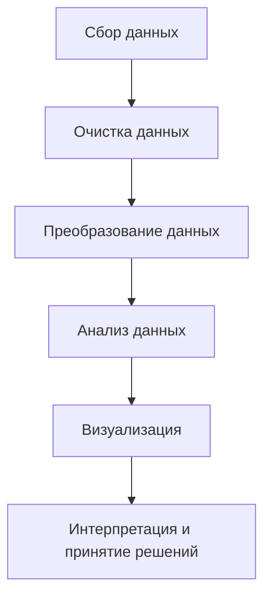
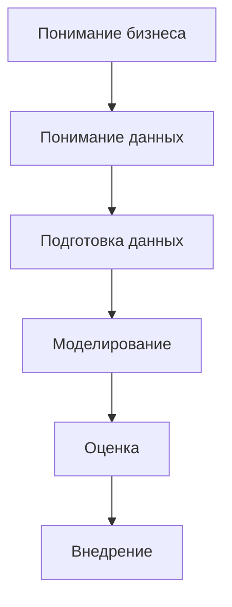

## Лекция: Введение в анализ данных

### **1. Что такое анализ данных?**

Анализ данных — это процесс сбора, обработки, интерпретации и представления данных для извлечения полезной информации и поддержки принятия решений.



#### **Основные этапы анализа данных**:

1. **Сбор данных**: получение данных из внутренних систем компании, публичных источников или с помощью специальных исследований.
     Пример: загрузка статистики с сайта [Росстат](https://rosstat.gov.ru/).
2. **Очистка данных**: устранение пропусков, ошибок и несоответствий.
     Пример: замена отсутствующих значений средней величиной.
3. **Преобразование данных**: приведение данных к удобному формату для анализа.
     Пример: объединение данных из нескольких таблиц с помощью SQL-запросов.
4. **Анализ данных**: применение методов статистики, машинного обучения или визуализации.
     Пример: выявление тенденций в динамике продаж.
5. **Интерпретация результатов**: создание выводов и рекомендаций для бизнеса.
     Пример: предложение увеличить маркетинговый бюджет на определенные сегменты клиентов.

### **2. Роль анализа данных в бизнес-анализе**

В бизнесе анализ данных помогает принимать обоснованные решения. Пример применения:

- Оценка успешности рекламной кампании.
- Прогнозирование спроса на продукцию.
- Анализ финансовых показателей компании.

#### **Важные понятия:**

- **Описательный анализ**: что произошло?
  
     > Пример: "Продажи выросли на 15% за последний квартал".
- **Диагностический анализ**: почему это произошло?
  
     > Пример: "Рост продаж связан с увеличением рекламного бюджета".
- **Прогнозный анализ**: что может произойти в будущем?
  
     > Пример: "Ожидается снижение спроса в следующем квартале".
- **Рекомендательный анализ**: что следует сделать?
  
     > Пример: "Рекомендуется увеличить маркетинговый бюджет на 20%".

### **3. Основные методологии анализа данных**

Методологии помогают организовать процесс анализа и добиться качественных результатов.

#### **3.1 CRISP-DM**

**CRISP-DM (Cross Industry Standard Process for Data Mining)** — стандартный процесс анализа данных.

Схема CRISP-DM:



Описание этапов:

- **Понимание бизнеса**: какие задачи нужно решить?
- **Понимание данных**: какие данные доступны?
- **Подготовка данных**: очистка и трансформация данных.
- **Моделирование**: выбор подходящих алгоритмов.
- **Оценка**: проверка качества моделей.
- **Внедрение**: использование результатов для принятия решений.

#### **3.2 Agile Analytics**

Agile Analytics фокусируется на итеративной и гибкой разработке аналитических решений. Каждая итерация — это мини-проект с целью получения быстрого результата.

### **4. Работа с данными**

#### **Типы данных:**

1. **Числовые данные**:
   
     > Пример: "Доход клиента = 50 000 рублей".
2. **Категориальные данные**:
   
     > Пример: "Регион проживания = Москва".
3. **Временные ряды**:
   
     > Пример: "Продажи по месяцам".

#### **Источники данных в России:**

- [Росстат](https://rosstat.gov.ru/) — статистика экономики, демографии и промышленности.
- [ЕМИСС](https://fedstat.ru/) — межведомственная система статистических данных.
- [СПАРК](https://www.spark-interfax.ru/) — информация о российских компаниях.

### **5. Практика: анализ данных в Excel или Python**

**Задание 1:** Построение сводной таблицы на основе данных Росстата.

1. Загрузите данные о среднемесячной заработной плате из [Росстат](https://rosstat.gov.ru/).
2. Импортируйте данные в Excel.
3. Постройте сводную таблицу, чтобы проанализировать изменения зарплат по регионам.

**График: Динамика средней зарплаты по регионам**


    {
      title: {
        text: 'Средняя зарплата по регионам',
        subtext: 'Данные Росстат'
      },
      tooltip: {},
      xAxis: {
        type: 'category',
        data: ['Москва', 'Санкт-Петербург', 'Новосибирск', 'Екатеринбург']
      },
      yAxis: {
        type: 'value'
      },
      series: [
        {
          name: 'Зарплата',
          type: 'bar',
          data: [80000, 70000, 50000, 60000]
        }
      ]
    }


**Код с универсальной предобработкой данных в формате CSV**:

```python
import pandas as pd

# Загрузка данных
data = pd.read_csv('population.csv')

# Просмотр первых строк для анализа структуры данных
print("Первичные данные:")
print(data.head())

# Шаг 1: Проверка на дубликаты
print("\nКоличество дубликатов:", data.duplicated().sum())
data = data.drop_duplicates()
print("Дубликаты удалены.")

# Шаг 2: Проверка на пропущенные значения
print("\nПроверка на пропущенные значения:")
print(data.isnull().sum())

# Удаление строк с полностью пропущенными данными
data = data.dropna(how='all')
print("Удалены строки, где все значения пропущены.")

# Заполнение пропущенных значений
# Пример для числовых данных: замена на среднее значение
numerical_cols = data.select_dtypes(include=['float64', 'int64']).columns
for col in numerical_cols:
    if data[col].isnull().sum() > 0:
        mean_value = data[col].mean()
        data[col].fillna(mean_value, inplace=True)
        print(f"Пропущенные значения в столбце '{col}' заменены на среднее значение: {mean_value}")

# Пример для категориальных данных: замена на наиболее часто встречающееся значение
categorical_cols = data.select_dtypes(include=['object']).columns
for col in categorical_cols:
    if data[col].isnull().sum() > 0:
        mode_value = data[col].mode()[0]
        data[col].fillna(mode_value, inplace=True)
        print(f"Пропущенные значения в столбце '{col}' заменены на моду: {mode_value}")

# Шаг 3: Проверка на некорректные значения
# Здесь можно добавить собственные проверки на основе контекста данных
for col in numerical_cols:
    if (data[col] < 0).any():  # Пример: проверка на отрицательные значения
        print(f"Внимание! В столбце '{col}' обнаружены отрицательные значения. Они будут заменены на 0.")
        data[col] = data[col].apply(lambda x: max(x, 0))

# Пример: Приведение строковых данных к нижнему регистру (для консистентности)
for col in categorical_cols:
    data[col] = data[col].str.lower()

# Пример: Удаление незначительных пробелов в строковых данных
for col in categorical_cols:
    data[col] = data[col].str.strip()

# Шаг 4: Обработка столбцов с датами
# Конвертация столбцов с датами в формат datetime
date_cols = [col for col in data.columns if 'date' in col.lower()]
for col in date_cols:
    data[col] = pd.to_datetime(data[col], errors='coerce')
    print(f"Столбец '{col}' преобразован в формат datetime.")

# Удаление строк с некорректными датами
data = data.dropna(subset=date_cols)
print("Удалены строки с некорректными датами.")

# Итоговая информация о данных
print("\nИтоговые данные после очистки:")
print(data.info())
print(data.head())
```

**Работа с данными в Excel**:

1. Откройте скачанный файл в Excel.
2. Постройте сводную таблицу для анализа численности населения по годам.
3. Визуализируйте изменения с помощью линейного графика.

**Пример:**

| Год  | Регион          | Численность |
| ---- | --------------- | ----------- |
| 2020 | Москва          | 12 500 000  |
| 2021 | Москва          | 12 600 000  |
| 2020 | Санкт-Петербург | 5 400 000   |
| 2021 | Санкт-Петербург | 5 450 000   |

#### **Визуализация данных**

**Python:**

```python
import pandas as pd
import matplotlib.pyplot as plt

# Загрузка данных
data = pd.read_csv('population.csv')

# Предварительный анализ данных
print("Структура данных:")
print(data.info())
print("\nПервые строки данных:")
print(data.head())

# Очистка данных
data = data.drop_duplicates()  # Удаление дубликатов
data = data.dropna(how='all')  # Удаление строк с полностью пропущенными значениями

# Обработка пропущенных значений
numerical_cols = data.select_dtypes(include=['float64', 'int64']).columns
for col in numerical_cols:
    if data[col].isnull().sum() > 0:
        data[col].fillna(data[col].mean(), inplace=True)

categorical_cols = data.select_dtypes(include=['object']).columns
for col in categorical_cols:
    if data[col].isnull().sum() > 0:
        data[col].fillna(data[col].mode()[0], inplace=True)

# Приведение строковых данных к единому формату
for col in categorical_cols:
    data[col] = data[col].str.strip().str.lower()

# Преобразование дат
date_cols = [col for col in data.columns if 'date' in col.lower()]
for col in date_cols:
    data[col] = pd.to_datetime(data[col], errors='coerce')

# Удаление строк с некорректными датами
data = data.dropna(subset=date_cols)

# Универсальная функция визуализации
def visualize_data(df, x_col, y_col, chart_type='line', title=None, xlabel=None, ylabel=None, save_path=None):
    """
    Универсальная функция для визуализации данных.
    
    :param df: DataFrame с данными
    :param x_col: Название столбца для оси X
    :param y_col: Название столбца для оси Y
    :param chart_type: Тип графика ('line', 'bar', 'scatter', 'hist')
    :param title: Заголовок графика
    :param xlabel: Подпись оси X
    :param ylabel: Подпись оси Y
    :param save_path: Путь для сохранения графика
    """
    plt.figure(figsize=(10, 6))
    
    if chart_type == 'line':
        plt.plot(df[x_col], df[y_col], marker='o', linestyle='-')
    elif chart_type == 'bar':
        plt.bar(df[x_col], df[y_col])
    elif chart_type == 'scatter':
        plt.scatter(df[x_col], df[y_col])
    elif chart_type == 'hist':
        plt.hist(df[y_col], bins=10)
    else:
        raise ValueError("Недопустимый тип графика. Используйте 'line', 'bar', 'scatter' или 'hist'.")
    
    plt.title(title if title else f"{y_col} vs {x_col}")
    plt.xlabel(xlabel if xlabel else x_col)
    plt.ylabel(ylabel if ylabel else y_col)
    plt.grid(True)
    
    if save_path:
        plt.savefig(save_path)
        print(f"График сохранен по пути: {save_path}")
    
    plt.show()

# Пример использования функции визуализации
if 'year' in data.columns and 'population' in data.columns:
    visualize_data(
        df=data,
        x_col='year',
        y_col='population',
        chart_type='line',
        title="Динамика численности населения",
        xlabel="Год",
        ylabel="Численность населения",
        save_path="population_trend.png"
    )

# Аналогичный пример для столбчатого графика
if 'region' in data.columns and 'population' in data.columns:
    visualize_data(
        df=data,
        x_col='region',
        y_col='population',
        chart_type='bar',
        title="Численность населения по регионам",
        xlabel="Регион",
        ylabel="Численность населения",
        save_path="population_by_region.png"
    )
```

**Особенности скрипта**:

1. **Универсальная функция `visualize_data`**:
    - Позволяет выбирать тип графика: линейный, столбчатый, точечный или гистограмма.
    - Подходит для любых данных, где есть числовая и категориальная/числовая оси.
    - Поддерживает сохранение графиков в файл.
2. **Интеграция очистки данных**:
    - Все данные проходят проверку и обработку перед построением графиков.
3. **Примеры использования**:
    - Линейный график для временных рядов.
    - Столбчатый график для сравнения значений по категориям.

**Excel:**

1. Выделите данные.
2. Вставьте линейный график.
3. Настройте оси и заголовок графика.

### **6. Домашнее задание**

1. Найдите данные на сайте [Росстат](https://rosstat.gov.ru/) по вашему региону.
2. Постройте график в Excel или Python, отражающий динамику изменения зарплат за последние 5 лет.
3. Ответьте на вопросы:
    - Какие тренды вы наблюдаете?
    - Как это может повлиять на бизнес в вашем регионе?

### **Заключение**

Анализ данных — это мощный инструмент для понимания бизнеса и принятия решений. Научившись основам анализа данных, вы сможете применить эти навыки в любой сфере экономики, будь то маркетинг, финансы или логистика.
