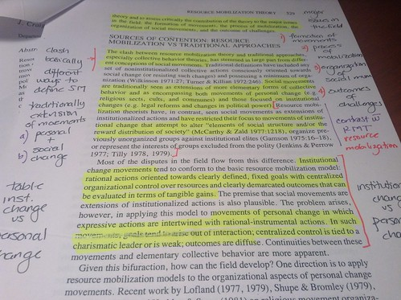
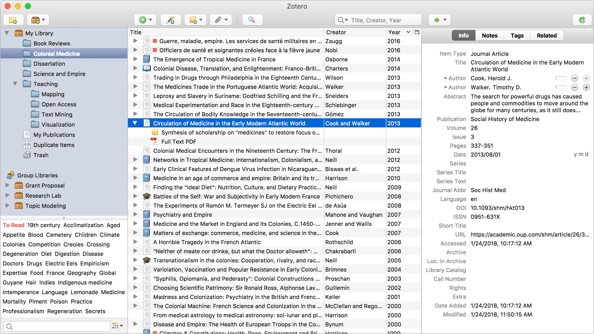

Как держать руку на пульсе новых достижений в области машинного обучения (ML), какие существуют бесплатные и открытые источники актуальных и проверенных исследованиями алгоритмов и моделей, а также подходы для эффективного внедрения в свои проекты.

<!--more-->

Если Вы прочитаете 5-20 статей по определенной теме, то будете иметь базовое представление о ней (подходы, методология, оценка качества и т.д.), а если прочитаете 50-100 статей <u>и поймете большинство из них</u>, то будете иметь хорошее представление о данной области или даже овладеете ею.

Поэтому для каждого исследователя или практикующего специалиста в области машинного обучения важно выработать привычку читать научные статьи и уметь делать это эффективно.

Но сперва необходимо ответить себе на вопросы:

## Зачем Вам это?

Можно выделить три основные цели:

- **Изучение и разведка** – прочтение и выделение основных аспектов, важных именно для Вас. Данный этап может быть как образовательным, так и разведочным для дальнейшего использования в своих исследованиях. 

	
По результатам прочтения постарайтесь обобщить и сохранить информацию в виде заметок или выделения ключевых идей в тексте, чтобы потом можно было легко вернуться к результатам прочтения.



- **Применение** – использование результатов, подходов, исходных данных, моделей и т.д., изложенных в статье, в своей научной работе или практическом проекте. Обычно это самая распространенная цель, особенно если Вы связаны с наукой или передовыми направлениями, в том числе с машинным обучением.

	
Для удобного ведения списка статей, который <u>можно конвертировать в любой из библиографических стандартов</u>, воспользуйтесь бесплатной программой и расширением для браузера [**Zotero**](https://www.zotero.org/), которая помогает собирать, организовывать, комментировать, цитировать и делиться статьями и источниками.



- **Продолжение исследования** – на основе прочитанной статьи создать своё исследование. Для этого необходимо глубоко понимать суть исследования и его методологию, чтобы иметь возможность на первом этапе повторить его, а далее реализовать под себя.

## Как читать?

### Знакомство

Прочтения научной работы – это ее изучение и принятие решения о том, стоит ли с ней работать. На данном этапе необходимо решить, хорошая ли это работа, несет ли она что-то новое для Вас и подойдет ли она для Вашего проекта. 

Плохой способ – читать от первого до последнего слова, так как это отнимет у Вас слишком много времени и сил, и Вы не сможете просмотреть большее количество статей, в итоге потратив слишком много времени без всякого результата.

Однако более эффективная стратегия такова:

- На первом этапе прочитайте название (title), аннотацию (abstract) статьи, а также рассмотрите её ключевые рисунки (figures).

- На втором этапе ознакомьтесь с ключевыми результатами (цифрами) в работе. Внимательно прочитайте введение (introduction), заключение (conclusion) и числовые результаты, поскольку, как правило, в них дается хорошее резюме того, о чем идет речь в статье.

	
Если Вы хорошо ориентируетесь и разбираетесь в теме статьи, то весьма информативным может оказаться прочтение сопутствующих работ (related work). Однако, если это не так, то понять этот раздел будет сложно. Иногда автор помещает в этот раздел работы рецензентов, чтобы повысить вероятность их принятия.


Опираясь на данную стратегию, Вы можете довольно быстро решить, интересна ли Вам статья и будете ли Вы читать статью дальше.

Поскольку речь идет в основном про статьи, связанные с машинным обучением, то в классическом её виде можно выделить 4 блока, на которые нужно смотреть в первую очередь:

**Аннотация** – общее представление о работе, какова ее цель и является ли она новой для Вас и для индустрии. Кроме того, ключевые слова (keywords) также могут нести информацию о том, подходит ли именно Вам статья.

**Заключение** – основные итоги, а также, возможно, описание дальнейших работ и значения полученных результатов.

**Данные** – какие данные и под какой лицензией использовались для обучения модели.

**Результаты** – как улучшилась модель по сравнению с другими эталонами и другими известными моделями, решающими аналогичные задачи.


Вероятнее всего, Вы будете пользоваться переводчиками при прочтении статей, и тут следует не пытаться переводить сразу весь текст. Лучше делать это последовательно, предложение за предложением, или, если позволяет знание языка, переводить только отдельные слова. 

В математических и около научных текстах существует определенный набор клише, которые легко распознать после прочтения нескольких статей.



Список математических шаблонов, правил использования союзов и предлогов, а также рекомендации для написания своих текстов, Вы сможете найти в книге:

- *Сосинский А. Б. – Mathematical English : Учебник английского для математиков.* []

Также выделим наиболее удобные и корректные переводчики для работы с научными текстами:

- [**DeepL**](https://www.deepl.com/) – удобный переводчик, способный переводить не только выделенные тексты, но и целые документы (.pdf, .docx, .pptx).
- [**QTranslate**](https://qtranslate.ru/) – объединяет в себе сразу несколько онлайн-переводчиков, что позволяет сразу сравнивать и выбирать наиболее подходящий вариант.
- [**MultiTran**](https://www.multitran.com/) – хорошо переводит научные термины и аббревиатуры, показывая сферы применения и синонимы, доступна офлайн версия.



### Погружение

Для того, чтобы получить максимальную пользу от прочитанного материала в  виде новых знаний и знакомства с новыми подходами и результатами исследований, помимо разведочного исследования статьи, о которой говорилось в предыдущем разделе, необходимо будет изучить и содержимое  всей работы.

Итак, если Вы решили изучить и понять тонкости и подходы, описанные в работе, то постарайтесь использовать следующую стратегию, чтобы извлечь из статьи максимум пользы:

1. **Не торопитесь**.

    > Научная статья – это результат долгой компиляции накопленных знаний, на написание которых ушли годы, не надейтесь освоить их за короткое время. Не забывайте про это!
    >

2. Начните ещё раз с аннотации, заключения, обзора данных и результатов, но при этом **задавайте себе вопросы**:

    – Чего пытались добиться авторы?

    – Каковы были ключевые элементы исследования?

    – Почему и зачем было сделано так, а не иначе?

    – Что Вы можете использовать из этого для себя?

    – Какие предшествующие работы легли в основу данной?

    Если у Вас остаются белые пятна в понимании при ответе на данные вопросы (а так и будет, вероятнее всего), то вот тут и нужно приступать к прочтению уже всей статьи целиком, пытаясь ответить на поставленные вопросы.

Это даст хорошее представление о работе, ее цели, методологии, использованных данных и результатах. После завершения этого процесса постарайтесь ещё раз ответить на вопросы, чтобы убедиться в том, что Вы поняли суть статьи.



При работе со сторонними и открытыми источниками, которые имеют свойство изменяться со временем или даже пропадать, имеет смысл архивировать содержимое web-страниц. Причем так, что бы это было верифицировано, т.е. без возможности дополнительных вставок и корректировок, как Вами, так и третьими лицами, чтобы всегда можно было показать именно то, что послужило отсылкой или источником.

Наиболее распространенные среди открытых инструментов для архивирования web-страниц:

- [**archive.today**](https://archive.today/) – быстрый и удобный инструмент, за счет расширения для браузера в один клик архивирует и показывает уже существующие версии сайта, если таковые делались ранее, также имеется возможность поиска.
- [**InternetArchive**](https://archive.org/web/) – наибольшая из существующих база сохраненных web-страниц.
- [**ArchiveBox**](https://github.com/pirate/ArchiveBox/wiki/Quickstart) – система архивации, которую можно запустить [локально на вашем сервере](https://xakep.ru/2021/02/01/archivebox/).



### Использование

Убедившись в том, что статья подходит для Вашего проекта, и Вы хорошо понимаете изложенные концепции, можно переходить к применению и апробации результатов. 

Вот как можно подойти к этому вопросу:

1. **Запуск кода и поиск данных** – если автор не ссылается в самой статье на сторонние хранилища, имеет смысл провести поиск по названию статьи,  авторам, кодовым названиям дата-сетов и моделей, на таких ресурсах как: [GitHub](https://github.com), [Kaggle](https://www.kaggle.com/), [HuggingFace](https://huggingface.co/), [PapersWithCode](https://paperswithcode.com/), [Dryad](https://datadryad.org/search).

2. **Построение модели** – при необходимости реализуйте модель с нуля, при этом выделяя следующие её аспекты:

    - <u>Архитектура модели (Model Architecture)</u>: почти в каждой статье присутствует описание, либо диаграмма всей архитектуры.

    - <u>Входной и выходной слой (Inputs & Outputs)</u>: чёткое понимание входных и выходных данных у модели позволит лучше понять ее работу и то, что и как она делает.

    - <u>Новые типы слоёв (New or novel layers)</u>: новые подходы или типы слоёв, используемые в модели, в большинстве статей по машинному обучению являются центральной темой, поэтому основной код и содержимое статьи будут именно об этом.

    - <u>Расчет потерь (Loss calculation)</u>: важно понимать все нюансы используемого подхода оценки и расчета потерь, особенно перед внедрением, поскольку это может повлиять уже на Ваши результаты. Кроме того, необходимо понять, на каком основании она была выбрана и, возможно, Вам придется изменить или дополнить ее, чтобы она соответствовала Вашему проекту.

    - <u>Обучение модели (Model Training)</u>: необходимо знать детали того, как проводилось обучение модели, какие гиперпараметры  (hyperparameter) использовались, какой размер тренировочных объектов (batch size), эпохи (epoch) и конфигурации модели.

    > Исследовательские работы строятся друг на друге, поэтому предполагается, что у Вас есть определенный опыт и знания, связанные с направлением исследования. Выделите и запишите те моменты, которые Вы не поняли, и проведите поиск среди источников.

    Иногда даже при наличии данных обучить или переобучить модель на всём массиве данных бывает сложно, так как это может занять слишком много времени, поэтому попробуйте <u>применить модель только на подмножестве данных</u>, чтобы убедиться, что реализованная модель работает так, как ожидалось, а затем применить ее к своим данным.

3. **Применение модели** – для начала попробуйте применить модель в Вашем проекте, без каких-либо изменений, и уже после анализа полученных результатов, попробуйте модифицировать под свой проект и данные.

    Если же Вы решите использовать содержимое статьи в своем исследовании или продолжить его, то, обязательно следуя предыдущим подходам, не оставляя белых пятен в понимании происходящего, постарайтесь обосновать все выбранные аспекты модели, и уже в своей работе либо опишите свой выбор, либо оставьте ссылки на источники.



Пытаться суммаризовать научные тексты с помощью специальных инструментов нежелательно, так как это не всегда может дать желаемого результата, поскольку, как правило, в науных статьях текст уже содержит исключительно суть работы и исследования. Данный подход может лишь помочь на первом этапе знакомства со статьей.

Удобный промт для такой суммаризации:

`Пожалуйста, суммаризуйте текст ниже с акцентом на ключевые аргументы, основные результаты и выводы автора(ов). Обратите внимание на важные факты, данные и примеры, чтобы обеспечить полноту и точность суммарной версии. Придерживайтесь научного стиля и формата. Текст: [текст статьи]`

Или воспользуйтесь готовыми суммаризаторами файлов:

- [**ChatPDF**](https://www.chatpdf.com/) – удобный ресурс для суммаризации и погружения в содержимое прикрепленного Вами файла по принципу вопросов и ответов (QA).
- [**QuillBot**](https://quillbot.com/summarize) – помимо суммаризации способен исправлять грамматические ошибки, переводить и проверять на плагиат.



## Где найти статьи?

Ну и наконец, где же брать и как мониторить эти самые статьи по машинному обучению и не только. Для начала стоит упомянуть, что существует два вида научных публикаций: препринт (preprint) и публикация в научном журнале.

> [:(fa-brands fa-wikipedia-w): Препринт](https://ru.wikipedia.org/wiki/%D0%9F%D1%80%D0%B5%D0%BF%D1%80%D0%B8%D0%BD%D1%82) – содержит материалы, которые автор намерен опубликовать в каком-либо издании, но предварительно хочет, чтобы определенный круг специалистов ознакомился и обсудил с ними поставленные и рассмотренные проблемы, и полученные результаты, а также <u>зафиксировать за собой</u>, собственно, <u>авторство</u> над всем содержимым.
>
> В отличие от научных журналов, публикация препринтов не подразумевает прохождение рецензирования, однако все работы модерируются администраторами на предмет потенциальных противоречий, плагиата и дублирования.

Благодаря доступности, популярности и открытости формата препринтов, рассмотренные ниже источники, преимущественно, посвящены данному формату:

- [**arXiv.org**](https://arxiv.org/) – самая большая и популярная платформа с открытым доступом для научных статей и препринтов по физике, математике, астрономии, информатике, биологии, электротехнике, статистике, финансовой математике и экономике. Перед публикацией статьи не рецензируются, однако проходят первичную проверку модераторов.
- [**SciRate**](https://scirate.com/) – удобный сайт с возможностью подписаться на интересующую научную категории и сортировать статьи по дате и рейтингу, а также комментировать научные работы.
- [**PubPeer**](https://pubpeer.com/) – платформа по принципу web-форума для [анонимной экспертной оценки](https://habr.com/ru/articles/398075/), т.е. не слепого рецензирования научных работ, позволяя каждому размещать анонимные комментарии по поводу научных исследований.
- [**PapersWithCode**](https://portal.paperswithcode.com/) – ещё одна платформа с возможностью размещения и чтению исследований по машинному обучению, астрономии, физике, компьютерным наукам, математике и статистике. Основная специфика в том, что все статьи имеют программный код, ссылки на репозитории и данные, <u>а также возможность редактирования и дополнения</u>.
- [**Consensus**](https://consensus.app/search/) – база статей из научных журналов с удобным поиском и подбором по ключевым словам, а также с возможностью суммаризовать текст статей.
- [**gonzo-обзоры ML статей**](https://t.me/gonzo_ML) – телеграмм канал с разбором популярных статей по машинному обучению.

> Не забывайте, что если статья доступна только в платном научном журнале, но вам известен её DOI или название статьи, то Вы можете воспользоваться бесплатной базой [**Sci-Hub**](https://sci-hub.ru/) или [**LibGen**](https://libgen.fun/scimag/index.html).

