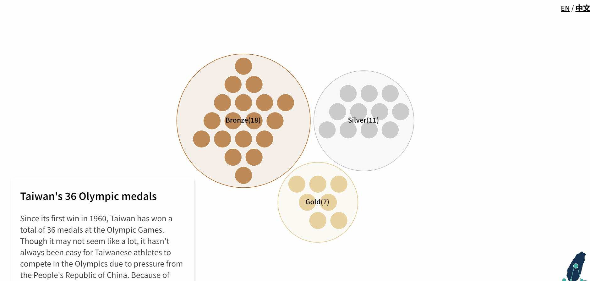

Как рассказать историю про данные, скрытые артефакты, исследование, и самое главное сделать это эффектно и эффективно, для этого подходит формат Datastory или Datastorytelling. Открытые frontend-инструменты способны реализовать диаграммы и инфографику любой сложности, а доступность и удобный формат изучения, поможет сделать Ваше исследование на данных, более доступным.

<!--more-->

## Что такое Datastory?


[:(fa-solid fa-link fa-shake): <u>The bias variance tradeoff</u>](https://mlu-explain.github.io/bias-variance/):


[:(fa-solid fa-link fa-shake): <u>Taiwan olympic medals</u>](https://taiwandatastories.com/taiwan-olympic-medals/):



[:(fa-solid fa-link fa-shake): <u>Когда пришел Наполеон</u>](https://1812.tass.ru/):


## Инструменты

Рассмотрим основыное frontend-инструменты которые лежат в основе реализации шаблона: [Scrollama.js](https://pudding.cool/process/introducing-scrollama/), [D3.js](https://d3js.org/), [Three.js](https://threejs.org/).

### Scrollama.js





Для удобстава представим весь код в одном листинге и его результат:

```html

```

codepen

### D3.js





### Three.js





## Реализация


```html

```

```css

```

```js

```


<iframe height="400" style="width: 100%;" scrolling="no" title="test" src="https://codepen.io/mlnchkdv/embed/gOQEjVv?default-tab=html%2Cresult&editable=true" frameborder="no" loading="lazy" allowtransparency="true" allowfullscreen="true">
  See the Pen <a href="https://codepen.io/mlnchkdv/pen/gOQEjVv">
  test</a> by mlnchkdv (<a href="https://codepen.io/mlnchkdv">@mlnchkdv</a>)
  on <a href="https://codepen.io">CodePen</a>.
</iframe>


Окончательный код можно найти по ссылке: [:(fa-brands fa-codepen): название]().