Успешная защита бакалаврских проектов на механико-математическом факультете: Партнерство с Дизайн Центром и Подготовка к Конференции YCAMD2024.

<!--more-->

  

    

      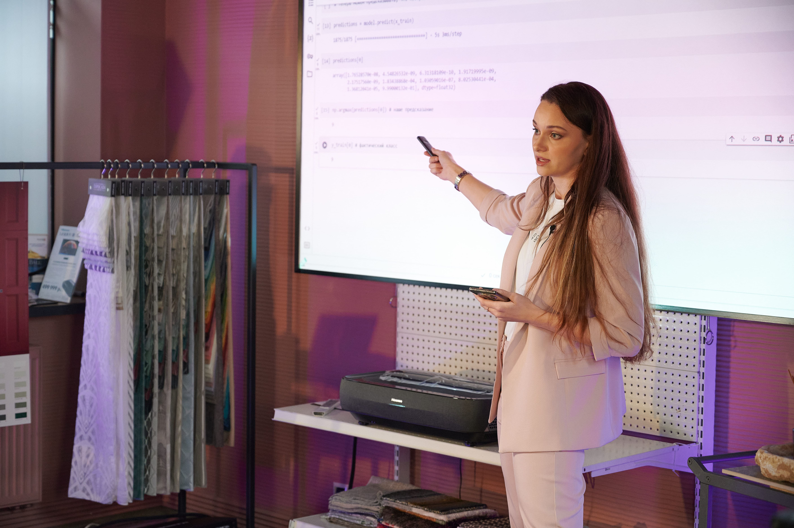
    

    

      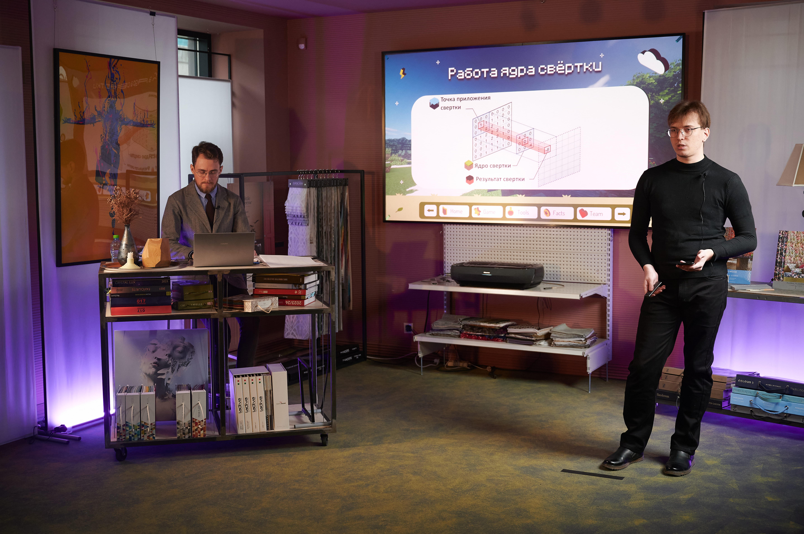
    

    

      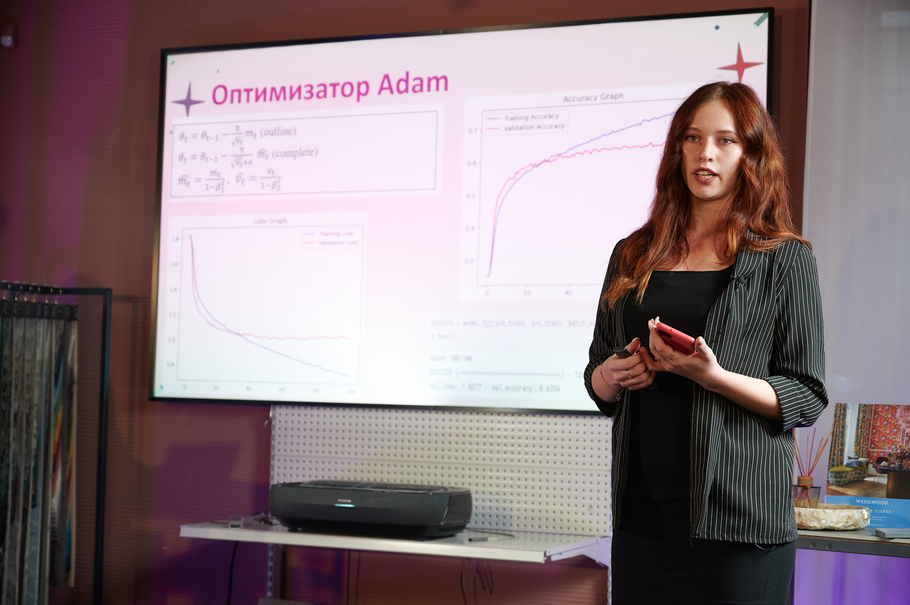
    

  

  <button class="prev" onclick="plusSlides(this.parentElement, -1)" style="cursor: pointer; position: absolute; top: 50%; width: auto; padding: 16px; margin-top: -22px; color: white; font-weight: bold; font-size: 18px; transition: 0.6s ease; border-radius: 0 3px 3px 0; user-select: none; background-color: rgba(0,0,0,0.5); left: 0;">&#10094;</button>
  <button class="next" onclick="plusSlides(this.parentElement, 1)" style="cursor: pointer; position: absolute; top: 50%; width: auto; padding: 16px; margin-top: -22px; color: white; font-weight: bold; font-size: 18px; transition: 0.6s ease; border-radius: 3px 0 0 3px; user-select: none; background-color: rgba(0,0,0,0.5); right: 0;">&#10095;</button>
  

Мы рады объявить о успешном завершении защиты бакалаврских проектов студентов механико-математического факультета в рамках специализации «Интеллектуальные информационные системы». Сотрудничество нашего университета с [креативным кластером «Дизайн Центр»](https://designcenter.me/) подчеркивает нашу приверженность инновациям и взаимодействию с ведущими игроками индустрии.

  

    

      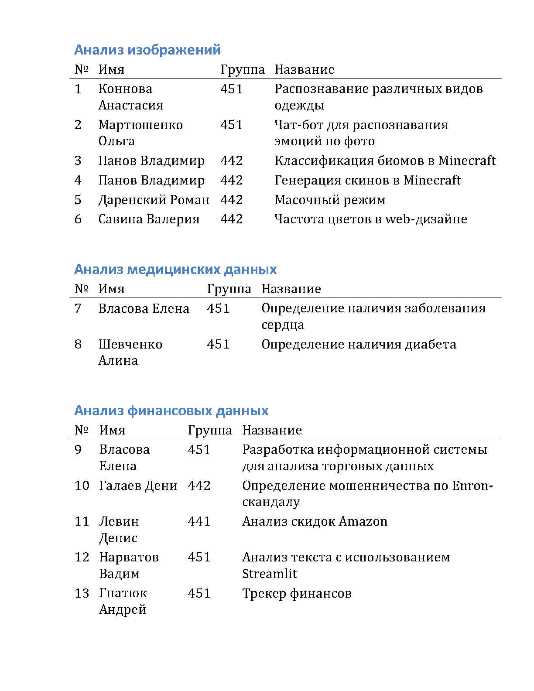
    

    

      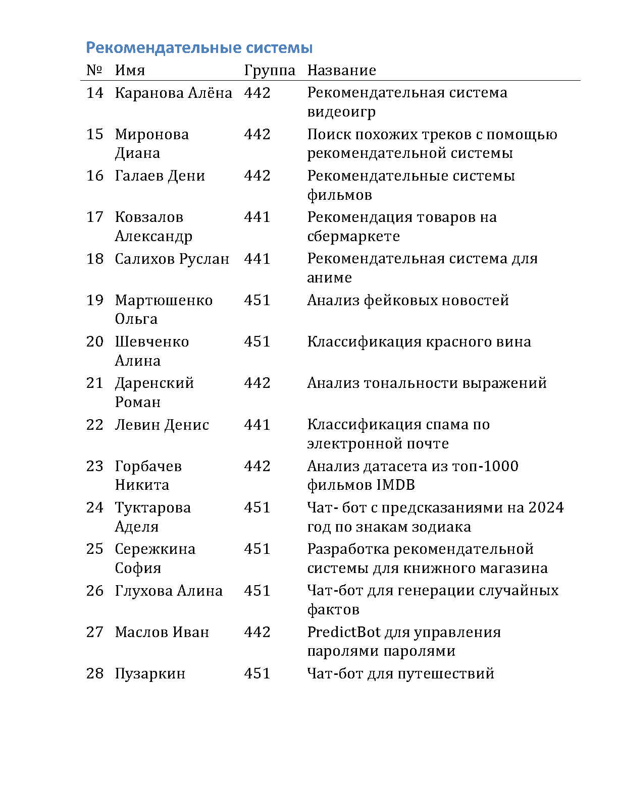
    

  

  <button class="prev" onclick="plusSlides(this.parentElement, -1)" style="cursor: pointer; position: absolute; top: 50%; width: auto; padding: 16px; margin-top: -22px; color: white; font-weight: bold; font-size: 18px; transition: 0.6s ease; border-radius: 0 3px 3px 0; user-select: none; background-color: rgba(0,0,0,0.5); left: 0;">&#10094;</button>
  <button class="next" onclick="plusSlides(this.parentElement, 1)" style="cursor: pointer; position: absolute; top: 50%; width: auto; padding: 16px; margin-top: -22px; color: white; font-weight: bold; font-size: 18px; transition: 0.6s ease; border-radius: 3px 0 0 3px; user-select: none; background-color: rgba(0,0,0,0.5); right: 0;">&#10095;</button>
  

На мероприятии студенты представили **28** проектов, демонстрируя знания и креативный подход к IT-задачам. Каждый проект был тщательно подготовлен и защищен в формате презентаций. Руководители из разных сфер обеспечили комплексный подход к исследованиям. Комиссия состояла:

[Балаш В.А.](https://www.sgu.ru/person/balash-vladimir-alekseevich) (профессор, д.э.н.), 
[Шаталина А.В.](https://www.sgu.ru/person/shatalina-anna-vasilevna) (доцент, к.ф.-м.н.), 
[Андрейченко Д.К.](https://www.sgu.ru/person/andreychenko-dmitriy-konstantinovich) (профессор, д.ф.-м.н.), 
[Тихонова С.В.](https://www.sgu.ru/person/tihonova-sofya-vladimirovna) (профессор, д.ф.н.), 
[Сидоров С.П.](https://www.sgu.ru/person/sidorov-sergey-petrovich) (доцент, д.ф-м.н.), 
[Мельничук Д.В.](https://www.sgu.ru/person/melnichuk-dmitriy-vadimovich) (доцент, к.ф.-м.н.).

  

    

      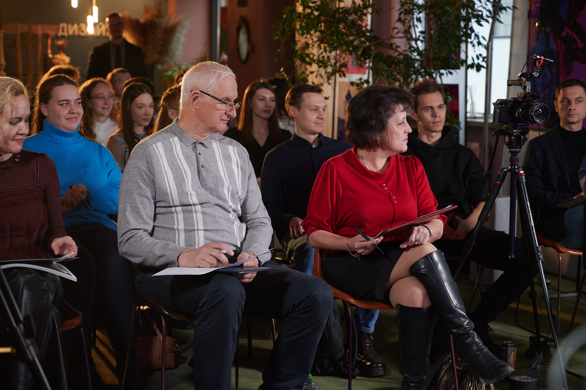
    

    

      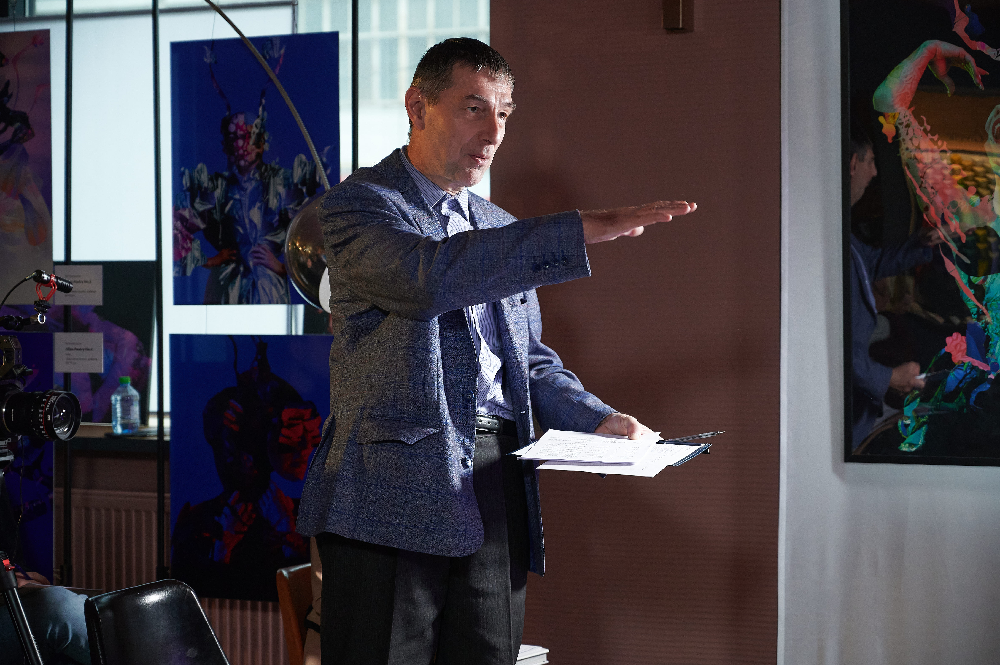
    

    

      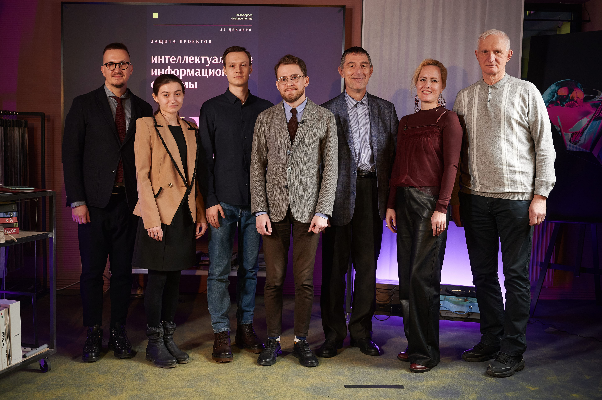
    

  

  <button class="prev" onclick="plusSlides(this.parentElement, -1)" style="cursor: pointer; position: absolute; top: 50%; width: auto; padding: 16px; margin-top: -22px; color: white; font-weight: bold; font-size: 18px; transition: 0.6s ease; border-radius: 0 3px 3px 0; user-select: none; background-color: rgba(0,0,0,0.5); left: 0;">&#10094;</button>
  <button class="next" onclick="plusSlides(this.parentElement, 1)" style="cursor: pointer; position: absolute; top: 50%; width: auto; padding: 16px; margin-top: -22px; color: white; font-weight: bold; font-size: 18px; transition: 0.6s ease; border-radius: 3px 0 0 3px; user-select: none; background-color: rgba(0,0,0,0.5); right: 0;">&#10095;</button>
  

Присутствие докторов наук и профессоров смежных специальностей повысило академическую значимость защиты, обеспечив студентам ценную обратную связь от экспертов, а место проведения, [Дизайн Центр](https://designcenter.me/), идеально подходило для обмена идеями и взаимодействия участников.

Также на мероприятии была анонсирована конференции [YCAMD2024](https://t.me/youthscience), которая будет направлена на развитие научных исследований и партнерских отношений. 

Мы гордимся достижениями студентов и благодарим всех участников. YCAMD станет ключевым событием для специалистов в области машинного обучения и анализа данных, демонстрируя достижения и открывая новые горизонты для инноваций. Конференция способствует формированию междисциплинарных связей между студентами, наукой и бизнесом.

  

    

      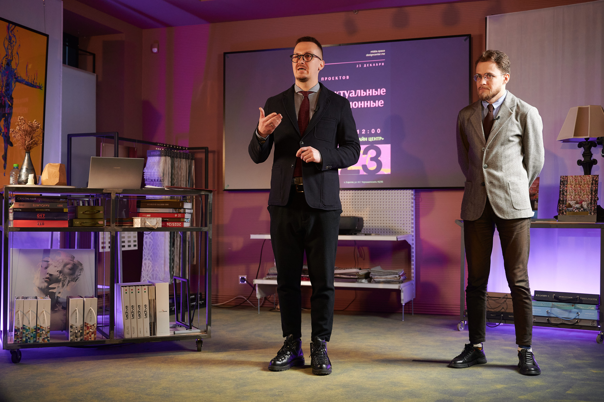
    

    

      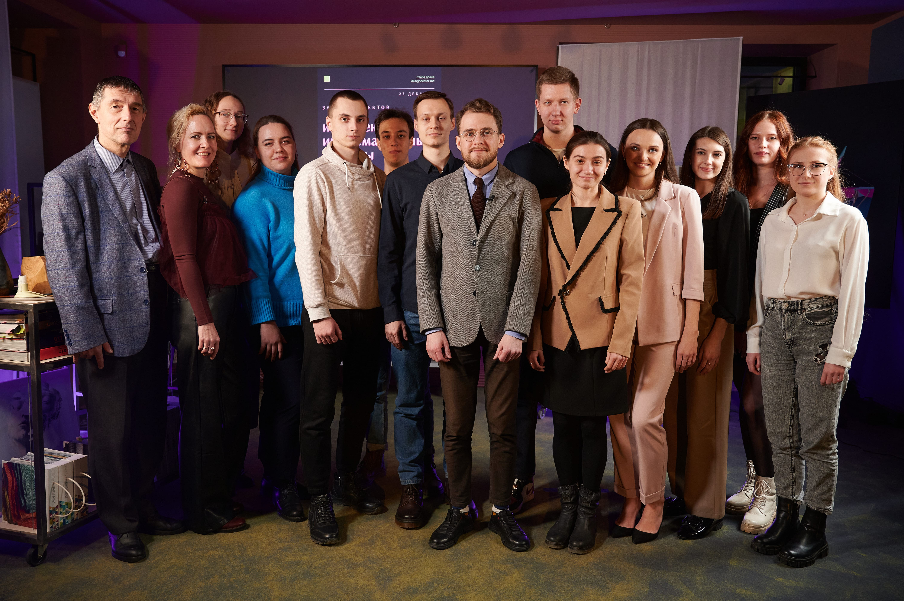
    

    

      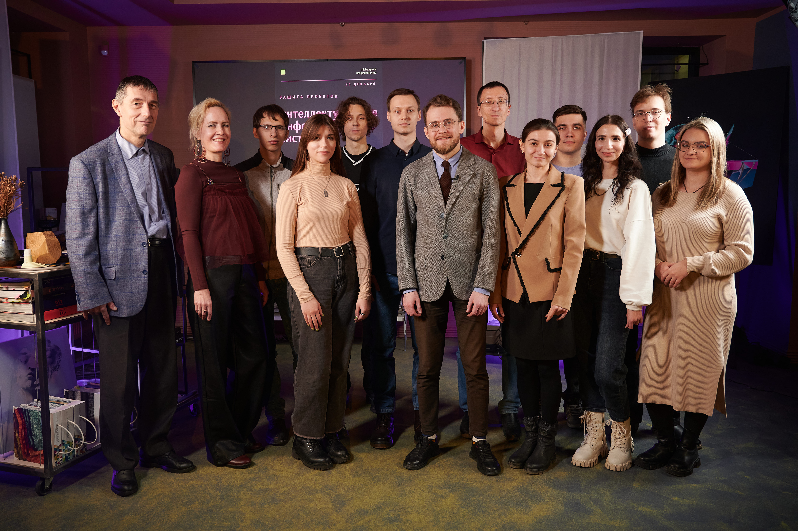
    

  

  <button class="prev" onclick="plusSlides(this.parentElement, -1)" style="cursor: pointer; position: absolute; top: 50%; width: auto; padding: 16px; margin-top: -22px; color: white; font-weight: bold; font-size: 18px; transition: 0.6s ease; border-radius: 0 3px 3px 0; user-select: none; background-color: rgba(0,0,0,0.5); left: 0;">&#10094;</button>
  <button class="next" onclick="plusSlides(this.parentElement, 1)" style="cursor: pointer; position: absolute; top: 50%; width: auto; padding: 16px; margin-top: -22px; color: white; font-weight: bold; font-size: 18px; transition: 0.6s ease; border-radius: 3px 0 0 3px; user-select: none; background-color: rgba(0,0,0,0.5); right: 0;">&#10095;</button>
  

Итоговый сборник проектов станет важным ресурсом, способствующим карьере студентов и выпускников. Проекты показывают интеграцию технологий, дизайна и бизнеса, открывая новые пути сотрудничества.

	<video style="max-width: 100%; height: auto;" controls loop>
        <source src="https://mlabs.space/blog/iis_defense/video/video_2024-05-30_17-24-33.mp4" type="video/mp4">
    </video>

[Креативный кластер «Дизайн Центр»](https://designcenter.me/), как партнер мероприятия, гордится поддержкой такой инициативы. YCAMD играет ключевую роль в стимулировании инноваций и креативности среди молодых специалистов, способствуя развитию высоких технологий и национальной экономики. 

[Фото-банк мероприятия](https://cloud.mail.ru/public/8BUK/k4mhJfPw2).

