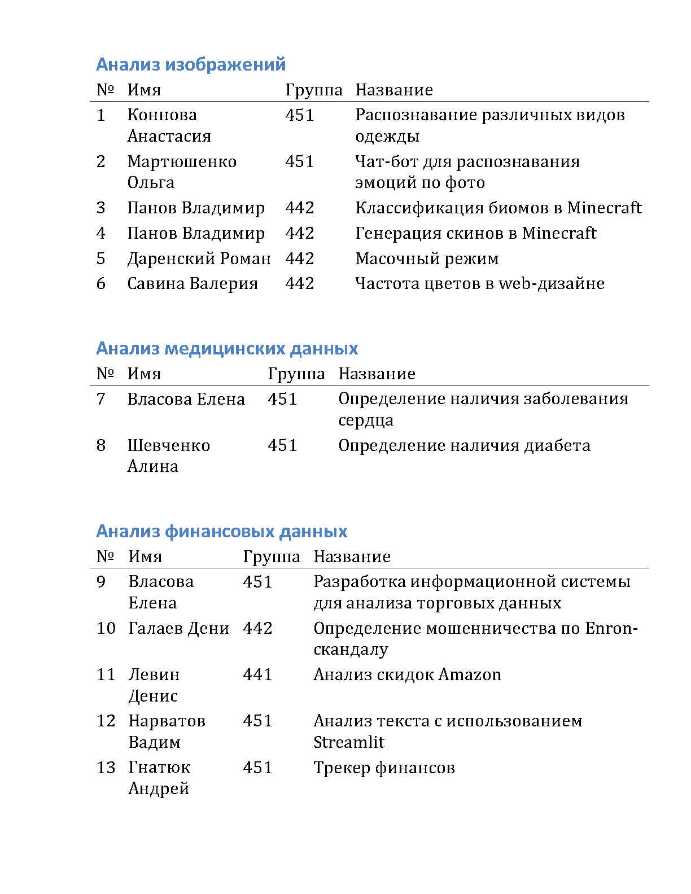

1. Вам необходимо ознакомиться с [шаблоном ВКР](../files/Шаблон-ИФиЖ.docx) и [примером ВКР](../files/Пример_ВКР_(ycadm.ru).docx).

2. Если вашей командой было выбрано создание лэндинга для одного из приложений:

    

    

    То ознакомьтесь с презентацией проекта [часть 1](https://cloud.mail.ru/public/LKfg/U38MgwQ8G) и [часть 2](https://cloud.mail.ru/public/v8Kf/o8pqZe6ra).

3. Выберете наиболее подходящий шаблон сайта среди готовых [примеров](../examples), который бы лучше всего подходил для реализации поставленной задачи.

4. Модифицируйте шаблон сайта данными (текст, картинки, шрифт, цвета и т.д.) взятыми из соответствующей презентации. Если данных будет не хватать, то можете добавить из дополнительных источников.

5. К **13 апреля** подготовить и оформить сайт, ВКР и презентацию для предзащиты проектов.

