## Как устроен блокчейн

Начнем разговор о технологии блокчейн с того случая, где произошло первое ее применение, а также для чего эта технология была изначально разработана. Технология блокчейн состоит из нескольких элементов, каждый из которых был известен и использовался в компьютерных науках задолго до появления блокчейна. Но именно в этой комбинации все части технологии обрели уникальное значение.



- **1991**

> В 1991 году два ученых, Стюарт Хабер и Скотт Сторнетта, опубликовали свою работу в области криптографии. В их работе была предложена цепочка блоков, защищенная с помощью криптографических методов, что предотвращало изменения содержимого и даты. Эта система позже стала известна как технология блокчейн, где каждый блок хранил важную информацию.

- **1992**

> Система была улучшена в 1992 году, когда в нее были добавлены деревья Меркла, что сделало ее более эффективной. Это позволило добавлять несколько документов в один блок в блокчейне. К сожалению, развитие технологии было приостановлено в 2004 году из-за патента.

- **2000**

> В 2000 году Стефан Конст опубликовал свою теорию о криптографически защищенных цепочках и их реализации.

- **2004**

> В 2004 году Хэл Финни представил систему цифровых денег под названием Reusable Proof of Work (RPoW), которая решала проблему двойного расходования, регистрируя права собственности на токены.

- **2008**

> В 2008 году Сатоши Накамото модифицировал модель дерева Меркла, создав более безопасную систему с историей обмена данными. Этот концепт распределенного блокчейна был изложен в его знаменитой статье "Пиринговая электронная система денежных расчетов". Эта сеть с отметками времени стала основой для технологии блокчейн.

- **2009**

> В 2009 году Сатоши Накамото опубликовал статью о биткоине, что стало важным моментом в истории блокчейна. Блокчейн достиг нового уровня безопасности. В том же году Джеймс Хауэллс, ИТ-специалист из Великобритании, начал майнить биткоины, потратив на это более 14 000 фунтов стерлингов. В 2013 году он выбросил жесткий диск, на котором хранились его биткоины, и позже не смог получить доступ к своим монетам, стоимость которых достигла более 105 миллионов фунтов к 2017 году.

- **2014**

> В 2014 году технология блокчейн была отделена от криптовалют, что привело к появлению Блокчейна 2.0. Это изменило фокус отраслей с цифровых валют на развитие самой технологии блокчейн.

- **2015**

> В 2015 году Виталик Бутерин и его соучредители создали и запустили сеть Ethereum Frontier. Ethereum стал второй по рыночной капитализации криптовалютой после биткоина и предложил функциональность умных контрактов, а также возможность разворачивания децентрализованных приложений.
>
> Фонд Linux также запустил проект Hyperledger в том же году. Это был проект с открытым исходным кодом, направленный на совместную разработку распределенных реестров с целью улучшения производительности глобальных транзакций.

- **2016**

> В 2016 году блокчейн начал набирать популярность в мейнстриме, и его стали рассматривать как единый термин, а не как два разных слова. В этом же году децентрализованная автономная организация Ethereum (DAO) подверглась взлому, что привело к разделению сети (хардфорк) Ethereum. В то же время была взломана криптовалютная биржа Bitfinex, и было украдено 120 000 биткоинов.

- **2017**

> В 2017 году Япония признала биткоин законным средством платежа. В этом же году компания Block.One запустила систему EOS.IO в качестве децентрализованной операционной системы, поддерживающей развертывание децентрализованных приложений.

- **2018**

> Биткоин отметил свое десятилетие в 2018 году, но не все было радужно — онлайн-платформы начали запрещать рекламу криптовалют, в том числе Google, Facebook и Twitter. К концу 2018 года стоимость биткоина снизилась до значительного минимума — 3157,23 фунтов стерлингов.

- **2019**

> В 2019 году сеть Ethereum превысила 1 миллион транзакций в день. Вскоре Amazon анонсировал сервис Amazon Managed Blockchain на платформе Amazon Web Services (AWS).

- **2020**

> В 2020 году была запущена Beacon Chain для подготовки к Ethereum 2.0. В этот же год начали набирать популярность стейблкоины — более стабильные криптовалюты по сравнению с традиционными.

- **2021**

> 2021 год стал самым насыщенным для технологии блокчейн, включая влияние пандемии COVID-19. Этот год стал важным этапом в развитии цифровых активов и технологии блокчейн.

- **2022**

> В 2022 году популярность NFT возросла, что привело к появлению новых прекрасных возможностей для торговли и заработка с помощью NFT. Его поддержали на Метавселенной несколько корпоративных гигантов, таких как Adidas, Puma, Nike, Walmart, Gucci и Ferrari. Эти компании создали и продвигали дизайн NFT, основанный на их продукции, для аватаров на Metaverse. 
>
> Однако NFT не везде были восприняты положительно: в Индии цифровые активы облагаются налогом в размере 30 %. Блокчейн и его применение продолжают исследовать и тестировать в различных областях, таких как блокчейн в цепочке поставок, спутниковая связь с использованием смарт-контрактов, развлечения, автоматизация и недвижимость.

- **2023**

> Несмотря на недавние неудачи с криптовалютами, компании продолжают изучать технологию блокчейн с повышенной бдительностью. Хотя традиционно она находит применение в финансовой и банковской сферах, область ее применения выходит далеко за рамки. Вспомните игры, медиа, недвижимость, здравоохранение, кибербезопасность, смарт-контракты, NFT, IoT, транспорт, управление цепочками поставок и даже государственные услуги. 
>
> Однако настоящим революционным событием может стать Web 3.0 - итерация интернета, которая обещает децентрализацию и надежную защиту данных, что позволит технологии блокчейн достичь новых высот!



**Ссылки для дополнительного изучения:**

- [Статья о блокчейне на Wikipedia](https://ru.wikipedia.org/wiki/%D0%91%D0%BB%D0%BE%D0%BA%D1%87%D0%B5%D0%B9%D0%BD)
- Основы криптографии: [Link 1](https://www.symmetron.ru/articles/osnovy-kriptografii/), [Link 2](https://tproger.ru/translations/understanding-cryptography), [Link 3](https://habr.com/ru/companies/yandex/articles/324866/).

### Основные принципы блокчейна

Блокчейн представляет собой распределенную базу данных, которая объединяет блоки информации в цепочку. Каждый блок содержит запись о предыдущем блоке, благодаря чему создается единая последовательность. Этот метод обеспечивает неизменность данных и защищает от подделок.

Ключевыми элементами блокчейна являются:

- **Децентрализация**: информация хранится не в одном центральном месте, а на множестве узлов сети.
- **Прозрачность**: все транзакции записываются в публичный реестр, доступный для проверки.
- **Криптографическая защита**: все данные шифруются, что обеспечивает безопасность и анонимность участников.

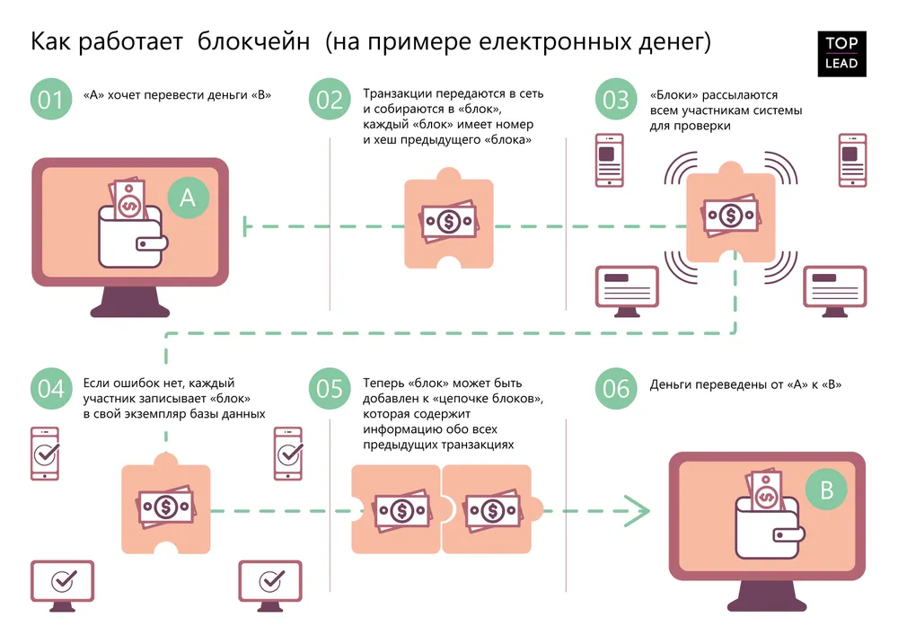

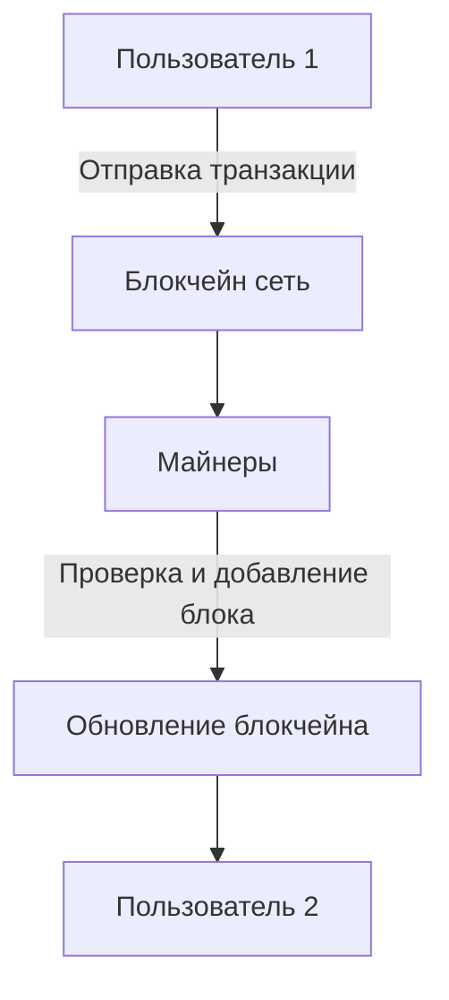

### Применение блокчейна в биткоине

Первое практическое применение блокчейна произошло в криптовалюте биткоин. Основная задача блокчейна в этом случае заключается в хранении информации о транзакциях и предотвращении двойного расходования средств. Биткоин-блокчейн состоит из блоков, каждый из которых содержит информацию о транзакциях и ссылку на предыдущий блок.

| Параметр  | Описание                                   |
| --------- | ------------------------------------------ |
| Блок      | Структурная единица, содержащая транзакции |
| Хеш       | Криптографический идентификатор блока      |
| Сложность | Параметр, регулирующий сложность майнинга  |

#### Как создаются блоки?

Создание нового блока происходит через процесс, называемый **майнингом**. Майнеры решают сложные математические задачи, чтобы добавить новый блок в цепочку. Этот процесс обеспечивает защиту сети и предотвращает возможность изменения уже записанных данных.

Майнинг биткоина — не какое-то там священное таинство. Майнинг не связан с поиском новых биткоинов где-то в глубинах интернета. Майнинг — это когда тысячи компьютеров по всему миру гудят по подвалам, перебирая миллионы чисел в секунду, пытаясь подобрать хеш, начинающийся на 10 нулей. Им даже не обязательно для этого находиться в сети.

Почему именно на 10 нулей? А просто так, в этом нет никакого смысла. Так придумал Сатоши. Потому что это одна из тех задач, на которую точно всегда есть решение, но оно точно не может быть найдено быстрее, чем долгим монотонным перебором вариантов.

Сложность майнинга напрямую зависит от размера сети, то есть её суммарной мощности. Если вы создадите свой блокчейн и запустите его себя дома на двух ноутбуках, то задача должна быть попроще. Например чтобы хеш начинался только с одного нуля, или чтобы сумма четных разрядов была равна сумме нечетных.

Чтобы найти начинающийся на 10 нулей хеш, у одного компьютера уйдет несколько десятков лет. Но если объединить тысячи компьютеров в единую сеть и искать параллельно, то по теории вероятностей эта задача решается в среднем за 10 минут. Это и есть время появления нового блока в блокчейне биткоина. Каждые 8-12 минут кто-то на земле находит такой хеш и получает привилегию анонсировать свою находку на всех, избежав тем самым проблемы кто был первым.

**Дополнительные материалы:**

- [Как работает майнинг?](https://vas3k.blog/blog/blockchain/)

### Особенности технологии

Одной из особенностей блокчейна является использование **криптографических хеш-функций**. Эти функции преобразуют данные в уникальные последовательности символов фиксированной длины (хеш). Даже малейшее изменение исходных данных приведет к кардинальному изменению хеша, что делает подделку практически невозможной.

Пример хеш-функции:

- Исходные данные: "Hello, Blockchain!"
- Хеш: "2cf24dba5fb0a30e26e83b2ac5b9e29e1b161e5c1fa7425e73043362938b9824"

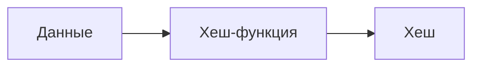

### Применение блокчейна в различных отраслях

Технология блокчейн нашла свое применение не только в криптовалютах, но и в других сферах, таких как логистика, здравоохранение, и финансы. Благодаря своей прозрачности и безопасности, блокчейн позволяет улучшить процессы и минимизировать риски.

#### Логистика

В логистике блокчейн используется для отслеживания перемещения товаров и обеспечения прозрачности поставок. Например, информация о каждой партии товара записывается в блокчейн, что исключает возможность подделки данных о поставках.

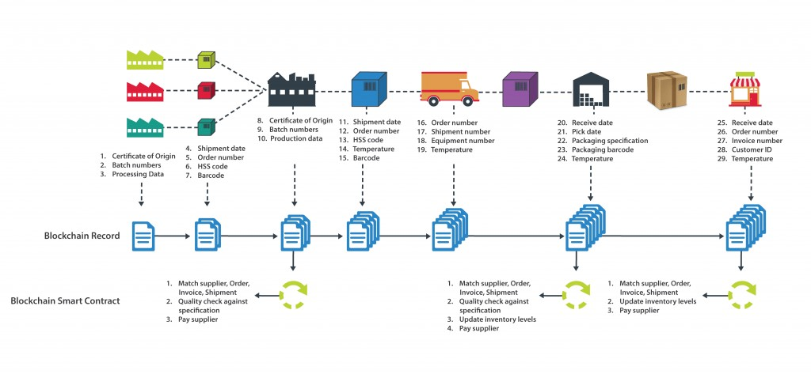

**Преимущества применения Blockchain в логистике**

Транспортная логистика – часть сферы международных перевозок. Процесс доставки грузов зачастую не обходится без подводных камней. Проблема поиска машин и грузов для обеих сторон остается актуальной, не смотря на развитие интернет технологий. Этим и пользуются посредники. Наличие цепочки лишних людей повышает стоимость перевозки. Кроме того, из-за отсутствия у владельца возможности контролировать груз в пути на рынке во всю процветают контрабанда и серые схемы.

Процесс доставки осложнен взаимодействием между чиновниками, логистами и экспедиторами. Ситуацию усугубляют таможенные вопросы и бумажная волокита, связанная с разрешительной документацией и декларированием грузов.

Эти проблемы может решить внедрение блокчейна, который может изменить рабочий процесс транспортирования грузов. Вот основные преимущества технологии блокчейн в логистике:

- **Позволяет удешевить логистику**;
- **Исключает возможность подделки данных**. Заведенный единожды документ, например, коносамент, расписка или сертификат соответствия, остается в системе в первоначальном виде навсегда;
- **Устраняет ненужных посредников**;
- **Предотвращает неправильную маркировку незаконных товаров и других попыток мошенничества**;
- **Позволяет на порядок сократить время на документооборот**, быстро находить то звено перевозки, где была допущена ошибка, и сократить затраты бизнеса из-за потерь.

**Дополнительные материалы:**

- [Блокчейн в логистике](https://www.ablcompany.ru/news/blokcheyn-kak-tehnologiya-budushchego-budet-ispolzovana-v-logistike)

#### Здравоохранение
В здравоохранении блокчейн помогает в безопасном хранении медицинских данных, позволяя врачам и пациентам получать доступ к информации без риска утечек.

Преимущества блокчейна в здравоохранении:

- Безопасное хранение медицинских записей
- Контроль доступа к данным
- Ускорение обмена информацией

## Блокчейн Ethereum и смарт-контракты

Ethereum — это не просто криптовалюта, это целая платформа для создания децентрализованных приложений и умных контрактов. Смарт-контракты играют важную роль в этой экосистеме, обеспечивая автоматизацию и прозрачность процессов.

**Ссылки для дополнительного изучения:**
- [Что такое Ethereum? (Wikipedia)](https://ru.wikipedia.org/wiki/Ethereum)
- [Документация Ethereum](https://ethereum.org/ru/developers/docs/)
- [Как устроен Ethereum и смарт-контракты](https://vas3k.blog/blog/ethereum/)

### Экономика и смарт-контракты

Если мы посмотрим на экономику в целом, то увидим процессы производства, распределения и потребления. Все эти процессы взаимосвязаны, и для их эффективного существования очень важно обеспечить четкое взаимодействие между всеми участниками. Здесь на помощь приходят смарт-контракты, которые позволяют автоматически и безопасно выполнять договоренности между сторонами без необходимости участия третьих лиц.

**Смарт-контракт** — это программируемый контракт, который автоматически исполняется при выполнении определенных условий. Пример: если покупатель отправил нужную сумму, товар автоматически отправляется покупателю. Смарт-контракты обеспечивают прозрачность и доверие в системе.

Смарт-контракты могут использоваться в самых разных сферах:
- **Финансовые услуги**: смарт-контракты применяются для автоматизации кредитных соглашений, страхования и расчетов. Примером является проект [MakerDAO](https://makerdao.com/), который позволяет пользователям получать кредиты в криптовалюте на основе залога.
- **Недвижимость**: сделки с недвижимостью могут быть заключены с помощью смарт-контрактов, что ускоряет процесс передачи прав собственности и снижает вероятность мошенничества. Примером является платформа [Propy](https://propy.com/), которая предлагает решения для покупки недвижимости на основе блокчейна.
- **Логистика и цепочки поставок**: смарт-контракты могут использоваться для автоматизации процесса отслеживания и управления поставками, улучшая прозрачность. Примером является проект [VeChain](https://www.vechain.org/), который использует блокчейн для отслеживания цепочки поставок.

### Основные характеристики Ethereum

Ethereum — это платформа с децентрализованной сетью, работающая на технологии блокчейн. Основные характеристики:

- **Децентрализация**: Данные хранятся на множестве узлов, и никакая центральная власть не может изменить их.
- **Прозрачность**: Все транзакции и смарт-контракты доступны для проверки.
- **Умные контракты**: Код, который выполняется автоматически при наступлении заданных условий.

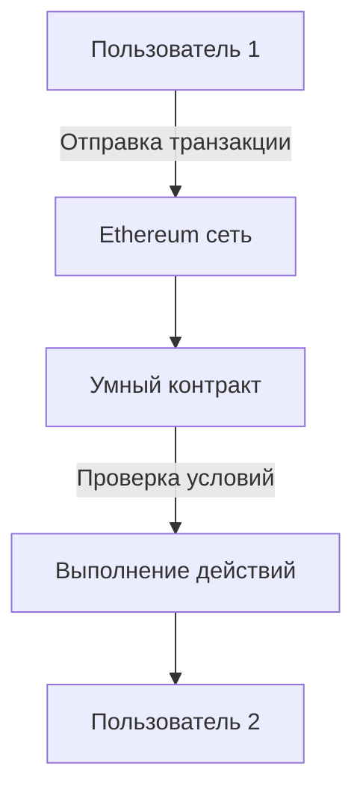

### Пример использования смарт-контрактов

Смарт-контракты могут использоваться для множества задач, например, для автоматического выполнения условий в сделках купли-продажи, для управления цифровыми активами и даже для голосования.

| Применение          | Описание                                                     |
| ------------------- | ------------------------------------------------------------ |
| Купля-продажа       | Смарт-контракты обеспечивают автоматическое выполнение условий сделки |
| Управление активами | Децентрализованное управление цифровыми активами, такими как токены |
| Голосование         | Создание безопасных и прозрачных систем голосования          |

### Ethereum vs Биткоин

Ethereum и биткоин — это две крупнейшие криптовалюты, но они имеют разные цели и возможности. В то время как биткоин ориентирован на создание альтернативы традиционным деньгам, Ethereum предоставляет платформу для разработки децентрализованных приложений.

| Параметр                   | Bitcoin                   | Ethereum                       |
| -------------------------- | ------------------------- | ------------------------------ |
| Цель                       | Замена традиционных денег | Платформа для умных контрактов |
| Время блока                | ~10 минут                 | ~15 секунд                     |
| Возможность создания DApps | Нет                       | Да                             |

### Hard Fork и DAO

В 2016 году произошел важный инцидент с Ethereum — взлом Decentralized Autonomous Organization (DAO). DAO была децентрализованной организацией, которая позволяла инвесторам принимать решения на основе голосования, используя смарт-контракты. В результате взлома было похищено около 3,6 миллиона ETH. Это привело к хардфорку сети, в результате которого возникли две сети: **Ethereum** и **Ethereum Classic**.

- **Ethereum** (ETH) продолжил существовать с изменениями в блокчейне, чтобы вернуть похищенные средства.
- **Ethereum Classic** (ETC) остался на старой цепочке без внесения изменений, следуя принципу "код есть закон".

Примером использования DAO сегодня является [Aragon](https://aragon.org/), платформа для создания децентрализованных автономных организаций, позволяющая участникам управлять своими активами и принимать коллективные решения.

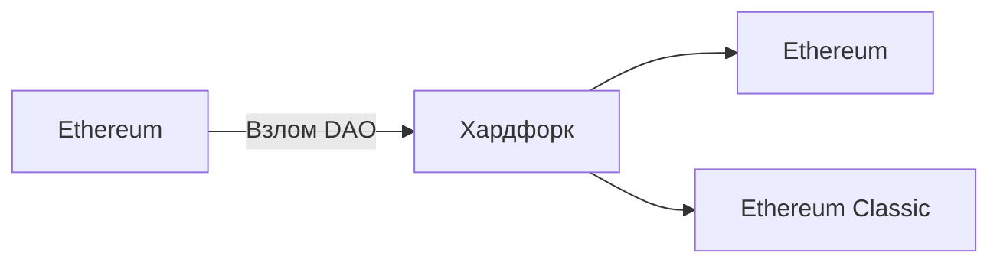

### Реальные проекты, использующие смарт-контракты

- **Uniswap**: децентрализованная биржа, которая позволяет пользователям обменивать криптовалюты напрямую друг с другом с использованием смарт-контрактов. [Uniswap](https://uniswap.org/) использует смарт-контракты для автоматического определения цен и выполнения обменов.
- **Chainlink**: проект, предоставляющий смарт-контрактам доступ к внешним данным, таким как API, через децентрализованные оракулы. Это помогает смарт-контрактам взаимодействовать с данными из реального мира. Подробнее: [Chainlink](https://chain.link/).
- **Compound**: протокол для децентрализованного кредитования и заимствования криптовалют. Пользователи могут зарабатывать проценты, предоставляя свои активы другим пользователям через смарт-контракты. [Compound](https://compound.finance/).

Ethereum и смарт-контракты открывают новые возможности для автоматизации процессов и создания децентрализованных приложений. Эти технологии находят применение в самых разных областях, от финансов и страхования до управления цепочками поставок и голосования.

**Полезные ссылки:**

- [Как создать смарт-контракт на Ethereum](https://ethereum.org/ru/smart-contracts/)

## Задача византийских генералов и византийские хакеры Накамото

Одна из самых важных концепций в теории блокчейна — задачу византийских генералов. Эта задача объясняет, как можно достичь согласия в децентрализованной сети, где некоторые узлы могут быть ненадежными или злонамеренными. Решение этой задачи стало основой для многих систем блокчейна, включая биткоин и Ethereum.

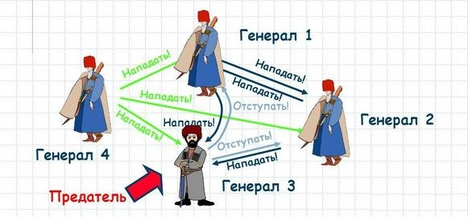

**Ссылки для дополнительного изучения:**

- [Задача византийских генералов на Wikipedia](https://ru.wikipedia.org/wiki/Задача_византийских_генералов)
- [Основы распределенных систем](https://systems.education/foss-disturbedsystemsessentials)

### Задача византийских генералов

Задача византийских генералов описывает проблему достижения консенсуса в распределенной системе. Представьте, что у вас есть несколько генералов, которые должны согласовать атаку на город. Некоторые генералы могут быть предателями и пытаться саботировать план. Как достичь согласия, чтобы все честные генералы приняли единое решение?

В контексте блокчейна эта проблема описывает, как узлы сети могут согласиться на состояние блокчейна, даже если некоторые узлы пытаются обмануть или отправить ложные данные. Решение этой проблемы лежит в основе безопасности и стабильности распределенных систем.

### Доказательство работы (Proof of Work)

Одним из способов достижения консенсуса в сети блокчейна является механизм **Proof of Work (доказательство работы)**. В этой системе множество узлов выполняют одну и ту же работу, но только один узел получает вознаграждение за успешное добавление нового блока в цепочку. Узлы конкурируют между собой, пытаясь первыми решить сложную математическую задачу.

На первый взгляд такая система может показаться избыточной и сложной, но ее цель заключается в обеспечении безопасности сети. Благодаря Proof of Work злоумышленникам становится крайне трудно изменить данные в блокчейне, так как им пришлось бы переделать все блоки, что требует огромных вычислительных ресурсов.

**Ссылки для дополнительного изучения:**

- [Proof of Work на Wikipedia](https://ru.wikipedia.org/wiki/Proof_of_Work)

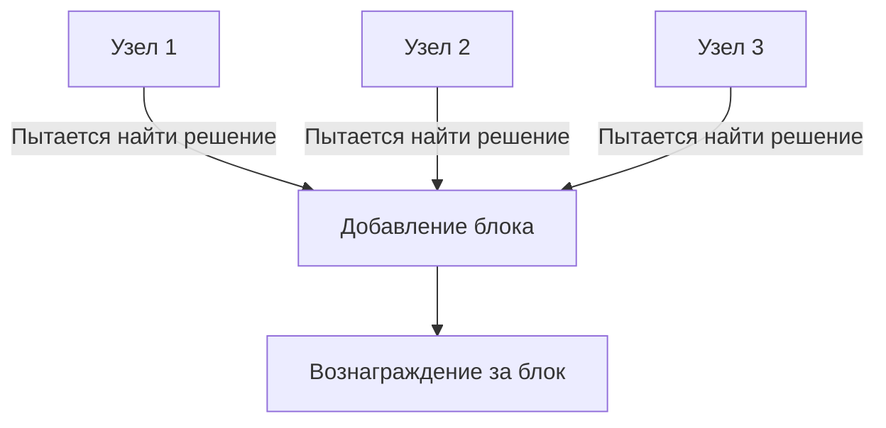

### Византийские хакеры Накамото

Решение задачи византийских генералов было реализовано Сатоши Накамото при создании биткоина. Сатоши представил децентрализованную систему, в которой узлы могут проверять и подтверждать транзакции, при этом даже если часть узлов будет вести себя злонамеренно, они не смогут изменить состояние всей сети.

**Сеть биткоина** использует Proof of Work для защиты от византийских атак, что делает ее устойчивой к любым попыткам изменить данные. Каждый узел в сети проверяет работу других узлов, что обеспечивает надежность и безопасность.

Примером реального применения этого принципа является **биткоин**. Сеть биткоина включает тысячи узлов, которые одновременно проверяют транзакции и добавляют блоки в блокчейн. Этот процесс обеспечивает децентрализацию и защищает систему от централизованных атак.

### Применение концепции византийских генералов в блокчейне

Концепция византийских генералов нашла применение не только в биткоине, но и в других блокчейн-проектах:
- **Ethereum**: использует улучшенные методы консенсуса, включая Proof of Stake, чтобы сделать сеть более эффективной и менее энергоемкой.
- **Hyperledger Fabric**: платформа для создания частных блокчейнов, которая также решает проблему консенсуса с использованием различных механизмов.

| Проект             | Механизм консенсуса            |
| ------------------ | ------------------------------ |
| Bitcoin            | Proof of Work                  |
| Ethereum           | Proof of Stake                 |
| Hyperledger Fabric | Различные алгоритмы консенсуса |

**Дополнительные материалы:**

- [Алгоритмы Консенсуса в Блокчейне: POW, POS и другие](https://bytwork.com/articles/consensus)
- [Алгоритмы консенсуса: что это и какие бывают](https://www.ixbt.com/live/crypto/algoritmy-konsensusa-chto-eto-k-i-kakie-byvayut.html)

**Ссылки на реальные проекты:**

- [Bitcoin](https://bitcoin.org/): оригинальная сеть, использующая Proof of Work для достижения консенсуса.
- [Ethereum](https://ethereum.org/ru/): блокчейн второго поколения, переходящий на Proof of Stake для повышения эффективности.
- [Hyperledger](https://www.hyperledger.org/): платформа для создания корпоративных блокчейн-решений.

## Чем отличаются блокчейны и распределенные реестры

Блокчейн и распределенный реестр, очень часто эти термины используют как синонимы, но это не совсем корректно. Блокчейны и распределенные реестры имеют схожие принципы, но между ними есть существенные отличия. Мы также рассмотрим многообразие различных систем с блокчейнами и распределенными реестрами, чтобы понять, как они отличаются друг от друга.

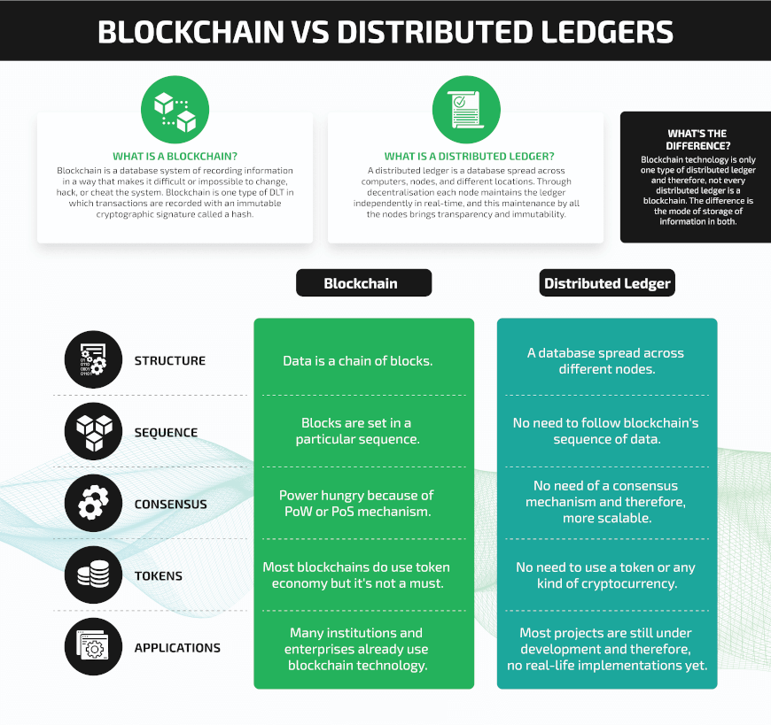

**Ссылки для дополнительного изучения:**
- [Блокчейн на Wikipedia](https://ru.wikipedia.org/wiki/%D0%91%D0%BB%D0%BE%D0%BA%D1%87%D0%B5%D0%B9%D0%BD)

### Блокчейн и распределенные реестры: основные отличия

Блокчейн — это тип распределенного реестра, но не все распределенные реестры являются блокчейнами. Рассмотрим основные отличия:

- **Структура данных**: в блокчейне данные хранятся в виде последовательных блоков, которые связаны друг с другом. В распределенных реестрах данные могут храниться по-разному, и необязательно в виде цепочки блоков.
- **Механизмы консенсуса**: блокчейны обычно используют такие механизмы консенсуса, как Proof of Work (PoW) или Proof of Stake (PoS), чтобы подтвердить добавление новых блоков. В распределенных реестрах могут использоваться различные механизмы, и они не всегда включают энергозатратные вычисления.
- **Применение**: блокчейн чаще всего используется для криптовалют и финансовых операций, а распределенные реестры могут использоваться в различных сферах, таких как управление данными и идентификация.

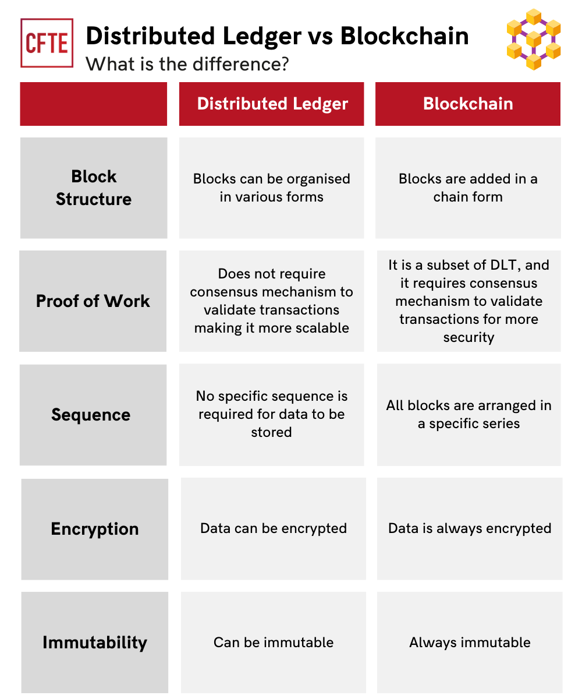

| Характеристика       | Блокчейн       | Распределенный реестр |
| -------------------- | -------------- | --------------------- |
| Структура данных     | Цепочка блоков | Гибкая структура      |
| Механизмы консенсуса | PoW, PoS       | Различные методы      |
| Применение           | Криптовалюты   | Управление данными    |

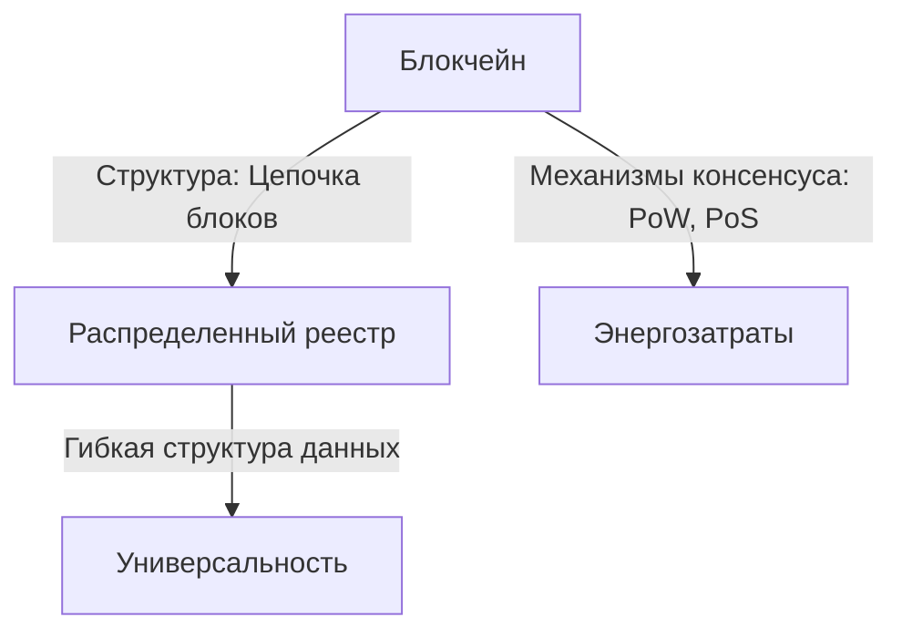

### Примеры распределенных реестров и блокчейнов

- **Hyperledger Fabric** – распределенный реестр, разработанный для использования в корпоративной среде. Он поддерживает использование различных механизмов консенсуса и обеспечивает высокий уровень конфиденциальности данных. [Hyperledger](https://www.hyperledger.org/).
- **Ripple** – распределенная платежная система, использующая собственный реестр для проведения транзакций. Ripple фокусируется на ускорении международных переводов.  [Ripple](https://ripple.com/).
- **Corda** – платформа для финансовых учреждений, которая предоставляет возможности распределенного реестра без использования традиционной цепочки блоков. [Corda](https://www.corda.net/).

**Примеры блокчейнов**:
- **Bitcoin**: использует блокчейн для хранения всех транзакций в сети. Биткоин является самым известным примером использования блокчейна.
- **Ethereum**: платформа для создания децентрализованных приложений, использующая блокчейн для хранения информации и умных контрактов.

### Применение распределенных реестров и блокчейнов

Распределенные реестры и блокчейны могут использоваться в разных сферах, каждая из которых имеет свои особенности:
- **Финансовый сектор**: блокчейны, такие как Bitcoin и Ethereum, используются для проведения транзакций и создания смарт-контрактов.
- **Идентификация**: распределенные реестры используются для безопасного хранения данных об идентификации граждан. Примером может служить проект [Sovrin](https://sovrin.org/), который предоставляет децентрализованную систему идентификации.
- **Управление цепочками поставок**: распределенные реестры могут использоваться для отслеживания товаров и управления цепочками поставок. Пример: [VeChain](https://www.vechain.org/), который отслеживает происхождение товаров и обеспечивает их подлинность.

| Сфера                 | Применение                       | Пример            |
| --------------------- | -------------------------------- | ----------------- |
| Финансы               | Транзакции, смарт-контракты      | Bitcoin, Ethereum |
| Идентификация         | Хранение данных об идентификации | Sovrin            |
| Управление поставками | Отслеживание товаров             | VeChain           |

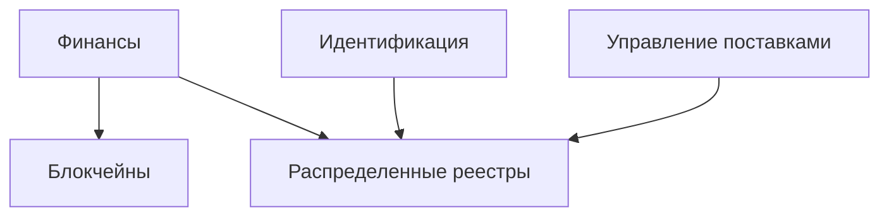

Несмотря на то, что блокчейны и распределенные реестры имеют много общего, они отличаются по своей структуре, механизму консенсуса и областям применения. Блокчейн — это лишь один из видов распределенных реестров, и его основное применение связано с криптовалютами. В то же время распределенные реестры могут применяться в самых разных областях, начиная от финансов и заканчивая идентификацией.

**Полезные ссылки:**

- [Что такое распределенный реестр](https://imiblockchain.com/blockchain-vs-distributed-ledger-technology/)
- [Отличия блокчейна и распределенных реестров](https://markovate.com/blog/blockchain-vs-distributed-ledger/)
- [Глоссарий от Ethereum](https://ethereum.org/ru/glossary/)
- [Статья: Блокчейн и распределенные реестры как виды баз данных](https://maginnov.ru/assets/files/volumes/2018.12/blokchejn-i-raspredelennye-reestry-kak-vidy-baz-dannyh.pdf)
- [Принцып работы распределенных систем](https://blog.cfte.education/distributed-ledger-in-blockchain/)

## Распределенные финансы (DeFi)

Распределенные финансы или DeFi (Decentralized Finance) – одна из наиболее быстроразвивающихся отраслей, связанных с внедрением блокчейнов. DeFi основана на открытых (public, permissionless) блокчейнах и токенах, которые являются базовым элементом этих систем. Мы обсудим, как работает DeFi, какие технологии применяются и какие возможности это открывает.

")

**Ссылки для дополнительного изучения:**
- [Что такое DeFi? (Wikipedia)](https://ru.wikipedia.org/wiki/DeFi)
- [DeFi глоссарий для начинающих](https://smart-lab.ru/blog/853046.php)

### Основные компоненты DeFi

DeFi представляет собой финансовую систему, построенную на блокчейн-технологиях, которая работает без участия традиционных финансовых посредников, таких как банки и кредитные учреждения. Основные компоненты DeFi включают:

- **Токены**: токены представляют собой цифровые активы, которые используются для транзакций и заключения смарт-контрактов в сети.
- **Смарт-контракты**: смарт-контракты обеспечивают автоматическое выполнение договоренностей, таких как кредиты и обмен токенов, без участия посредников.
- **Протоколы ликвидности**: системы, которые позволяют пользователям предоставлять свои токены в пул ликвидности для получения вознаграждений. Например, протокол [Uniswap](https://uniswap.org/) обеспечивает обмен токенами с использованием пула ликвидности.

| Компонент             | Описание                                           |
| --------------------- | -------------------------------------------------- |
| Токены                | Цифровые активы для транзакций и смарт-контрактов  |
| Смарт-контракты       | Автоматическое выполнение условий сделки           |
| Протоколы ликвидности | Предоставление токенов для поддержания ликвидности |

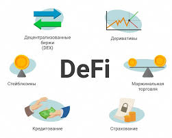

### Примеры DeFi-платформ

- **Uniswap** – децентрализованная биржа (DEX), которая позволяет пользователям обменивать токены напрямую друг с другом без участия централизованных бирж. [Uniswap](https://uniswap.org/).
- **Aave** – платформа для кредитования и заимствования цифровых активов, которая позволяет пользователям зарабатывать проценты на своих активах или брать займы под залог. [Aave](https://aave.com/).
- **MakerDAO** – система для создания стейблкоина DAI, который привязан к стоимости доллара. Пользователи могут предоставлять свои токены в качестве залога для выпуска DAI. [MakerDAO](https://makerdao.com/).

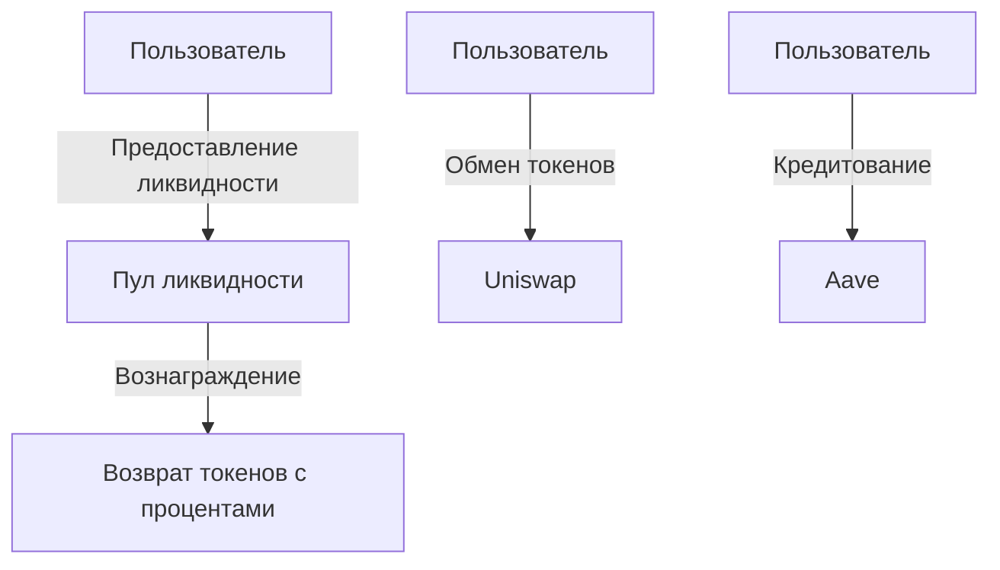

### Преимущества и риски DeFi

**Преимущества DeFi**:
- **Децентрализация**: все транзакции происходят без участия централизованных организаций, что обеспечивает прозрачность и независимость.
- **Доступность**: доступ к DeFi имеют все пользователи с подключением к интернету, независимо от их местоположения и финансового статуса.
- **Прозрачность**: все операции происходят в открытой сети блокчейн, что обеспечивает проверяемость транзакций.

**Риски DeFi**:
- **Технические риски**: смарт-контракты могут содержать ошибки, которые злоумышленники могут использовать для атаки.
- **Регуляторные риски**: из-за отсутствия регулирующих органов возможны правовые неопределенности в разных юрисдикциях.
- **Волатильность**: стоимость токенов в DeFi может сильно колебаться, что увеличивает риск потерь.

| Преимущества    | Риски              |
| --------------- | ------------------ |
| Децентрализация | Технические риски  |
| Доступность     | Регуляторные риски |
| Прозрачность    | Волатильность      |

### Применение DeFi в различных сферах

- **Кредитование и заимствование**: пользователи могут зарабатывать проценты на своих активах или брать займы под залог. Пример: [Aave](https://aave.com/).
- **Децентрализованные биржи (DEX)**: биржи, которые позволяют пользователям обменивать токены напрямую, не прибегая к услугам посредников. Пример: [Uniswap](https://uniswap.org/).
- **Стейблкоины**: криптовалюты, привязанные к стоимости традиционных активов, таких как доллар США. Пример: [DAI](https://makerdao.com/).

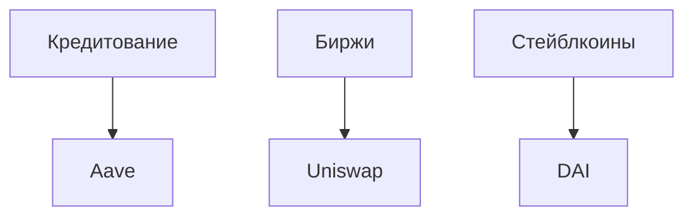

DeFi представляет собой революционный подход к финансовой системе, предоставляя людям возможность использовать децентрализованные финансовые услуги без участия банков и других посредников. Несмотря на все риски, DeFi открывает новые возможности для управления активами и создания финансовых продуктов, которые недоступны в традиционной банковской системе.

**Полезные ссылки:**
- [Что такое DeFi? Руководство для начинающих](https://vc.ru/crypto/768974-chto-takoe-defi-rukovodstvo-dlya-nachinayushih)
- [Как начать использовать DeFi](https://rb.ru/story/whats-defi/)

## Новые компетенции в распределенных реестрах - от разработчика смарт-контрактов до менеджера

С развитием технологий распределенных реестров и блокчейнов появляются новые профессии и компетенции, которые становятся крайне востребованными. Это не только профессии, связанные с программированием, но и роль менеджеров, специалистов по безопасности, аналитиков и других экспертов. Сегодня мы обсудим, какие навыки требуются для работы в этих областях и какие новые возможности открываются перед специалистами.

**Ссылки для дополнительного изучения:**

- [Профессии в блокчейн-технологиях](https://cornerstone.ru/page26074189.html)
- [Как стать разработчиком смарт-контрактов](https://habr.com/ru/articles/756542/)

### Основные компетенции в блокчейн-сфере

Работа в сфере блокчейнов требует набора компетенций, которые варьируются в зависимости от конкретной роли. Рассмотрим основные роли и навыки, которые необходимы для каждой из них:

- **Разработчик смарт-контрактов**: основной навык — программирование на языках, таких как Solidity (для Ethereum) и Rust (для Polkadot). Разработчики должны понимать принципы работы блокчейнов и уметь писать безопасный код для смарт-контрактов.
- **Менеджер проектов в блокчейн-сфере**: этот специалист должен понимать, как работают распределенные реестры и блокчейны, и быть способен координировать работу команды разработчиков и аналитиков. Важно также знание основ управления проектами.
- **Специалист по безопасности**: умение анализировать код смарт-контрактов, выявлять уязвимости и разрабатывать стратегии защиты от атак. Это крайне важная роль, учитывая децентрализованную и открытую природу блокчейнов.

| Роль                         | Основные навыки                                  |
| ---------------------------- | ------------------------------------------------ |
| Разработчик смарт-контрактов | Программирование на Solidity, знание блокчейнов  |
| Менеджер проектов            | Управление проектами, знание блокчейн-технологий |
| Специалист по безопасности   | Анализ безопасности, выявление уязвимостей       |

### Три типа консенсуса в блокчейне

Для работы с открытыми блокчейнами важно понимать, что они используют не один тип консенсуса, а целых три:

- **Технический консенсус**: сетевые узлы должны договориться о порядке добавления новых блоков. Для этого применяются алгоритмы, такие как Proof of Work или Proof of Stake.
- **Экономический консенсус**: участники сети мотивированы экономически к честному поведению, так как любое нарушение влечет за собой потери. Этот вид консенсуса основан на экономических стимулах, таких как награды за майнинг.
- **Социальный консенсус**: сообщество пользователей должно согласиться с правилами работы сети. Если часть сообщества решает изменить правила (например, в случае хардфорка), важно, чтобы большинство приняло эти изменения.

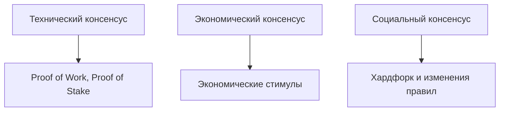

**Пример реального использования консенсусов**: В 2016 году, после взлома DAO, сообщество Ethereum приняло решение о хардфорке, что привело к созданию двух цепочек: Ethereum и Ethereum Classic. Это пример, когда социальный консенсус был ключевым для изменения правил сети.

### Профессии и роли в распределенных реестрах

- **Аналитик блокчейн-данных**: Этот специалист анализирует данные блокчейна для выявления трендов и создания отчетов. Необходимо знание статистики и инструментов анализа данных.
- **Криптоэкономист**: Специалист, занимающийся разработкой экономических моделей, которые лежат в основе токенов и систем вознаграждений в блокчейн-проектах. Важно понимание как экономики, так и технологии блокчейн.
- **Архитектор блокчейн-решений**: Отвечает за проектирование инфраструктуры блокчейн-систем. Необходимо глубокое знание распределенных систем и технологий блокчейн.

| Профессия                   | Описание                                   |
| --------------------------- | ------------------------------------------ |
| Аналитик блокчейн-данных    | Анализ данных блокчейна, создание отчетов  |
| Криптоэкономист             | Разработка экономических моделей и токенов |
| Архитектор блокчейн-решений | Проектирование блокчейн-инфраструктуры     |

### Новые возможности и вызовы

Сфера блокчейнов и распределенных реестров предлагает множество возможностей для карьерного роста, но она также требует адаптации и готовности учиться. Новые технологии требуют новых компетенций, и для успешной карьеры важно постоянно обновлять свои знания.

**Преимущества карьеры в блокчейн-сфере**:
- Высокий спрос на специалистов и высокие зарплаты.
- Возможность работы в международных проектах.
- Вовлеченность в передовые технологии и инновации.

**Вызовы карьеры в блокчейн-сфере**:
- Быстро меняющаяся среда, требующая постоянного обучения.
- Высокие требования к безопасности и качеству кода.
- Необходимость работы с различными юрисдикциями и регуляторами.

| Возможности                     | Вызовы                            |
| ------------------------------- | --------------------------------- |
| Высокий спрос на специалистов   | Быстро меняющаяся среда           |
| Работа в международных проектах | Высокие требования к безопасности |
| Передовые технологии            | Юридическая неопределенность      |

С развитием технологий блокчейнов и распределенных реестров открываются новые профессии и возможности для специалистов разных направлений — от программистов до аналитиков и менеджеров. Для успешной карьеры в этой сфере важно обладать не только техническими навыками, но и пониманием экономики и управления проектами. Блокчейн меняет мир, и профессионалы, готовые освоить эти технологии, будут в авангарде этих изменений.

