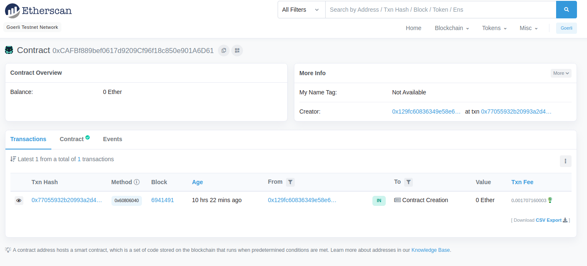

На этом семинаре мы научимся создавать и развертывать смарт-контракт в тестовой сети Goerli, используя инструменты, такие как виртуальный кошелек [Metamask](https://metamask.io/), язык программирования [Solidity](https://docs.soliditylang.org/en/v0.8.0/), среду разработки [Hardhat](https://hardhat.org/) и API-платформу для блокчейн-разработчиков [Alchemy](https://dashboard.alchemyapi.io/signup). Это руководство предназначено как для новичков, так и для тех, кто уже имеет базовые знания о блокчейне, но хочет освоить процесс работы со смарт-контрактами.

### Что такое блокчейн и смарт-контракты?

#### Что такое блокчейн?

Блокчейн — это технология, лежащая в основе криптовалют, таких как Bitcoin и Ethereum. По сути, блокчейн — это большая децентрализованная база данных или реестр, который хранит информацию в виде последовательности блоков. Эти блоки связаны между собой и образуют цепочку, отсюда и название — блокчейн (blockchain). 

Каждый блок содержит данные о транзакциях (например, кто кому и сколько отправил денег), временную метку и уникальный код (хэш), который связывает его с предыдущим блоком. Одной из ключевых особенностей блокчейна является его безопасность — данные в блоках невозможно изменить без согласия всей сети, что делает блокчейн надежным и защищенным от взлома.

#### Что такое смарт-контракт?

Теперь, когда у вас есть общее представление о блокчейне, давайте поговорим о смарт-контрактах. Смарт-контракт — это программа, которая автоматически выполняет условия соглашения, заложенные в ее коде, когда наступают определенные события или условия. Эти контракты хранятся в блокчейне и могут взаимодействовать с пользователями и другими смарт-контрактами.

Представьте себе обычный контракт, например, договор аренды жилья. В этом договоре указаны условия: арендатор обязан платить определенную сумму в определенные сроки, а владелец недвижимости обязуется предоставить жилье. В случае нарушения условий одна из сторон может обратиться в суд. 

Смарт-контракт работает по схожему принципу, но его выполнение не требует участия третьих лиц (например, суда). Условия договора закладываются в код смарт-контракта, и когда наступают оговоренные условия, контракт автоматически выполняет соответствующие действия. Например, если арендатор переводит деньги на счет владельца, смарт-контракт может автоматически передать доступ к арендованной недвижимости.

#### Ethereum — платформа для смарт-контрактов

Платформа Ethereum, на которой мы будем работать, — это один из самых популярных блокчейнов для создания и работы со смарт-контрактами. В отличие от Bitcoin, который изначально был создан только для цифровых транзакций, Ethereum поддерживает более сложные приложения. Благодаря Ethereum разработчики могут создавать децентрализованные приложения (dApps), которые работают на основе смарт-контрактов.

В рамках этого мануала будет разработан и развернут смарт-контракт на тестовой сети Ethereum под названием Goerli. Эта сеть предназначена для тестирования, и в ней используются тестовые эфиры (ETH), которые не имеют реальной стоимости. Это позволяет нам безопасно и без затрат разрабатывать и тестировать контракты, прежде чем запускать их в основной сети Ethereum.

#### Какие инструменты мы будем использовать?

Для создания и развертывания смарт-контракта нам понадобятся несколько инструментов:

1. **Metamask** — это виртуальный кошелек, который используется для управления вашими Ethereum-адресами и взаимодействия с блокчейном. Он устанавливается как расширение в браузер и позволяет безопасно подписывать транзакции, отправлять эфир и взаимодействовать с контрактами.

2. **Solidity** — язык программирования, используемый для написания смарт-контрактов в сети Ethereum. Этот язык был специально разработан для взаимодействия с блокчейном.

3. **Hardhat** — это среда разработки, которая помогает компилировать, тестировать и развертывать смарт-контракты. Она также облегчает отладку и выполнение операций в локальной сети перед тем, как развернуть контракт в реальной сети.

4. **Alchemy** — это API-платформа, которая предоставляет разработчикам инструменты для взаимодействия с блокчейном Ethereum. Благодаря Alchemy нам не нужно управлять собственными узлами сети, что значительно упрощает процесс разработки.

#### Что мы будем делать на семинаре?

Ниже шаг за шагом создание простого смарт-контракта, который будет хранить текстовое сообщение и позволит обновлять его. Также развернете этот контракт в тестовой сети Goerli, чтобы убедиться, что он работает правильно.

Вот основные шаги:
1. Подключение к сети Ethereum через платформу Alchemy.
2. Создание Ethereum-аккаунта с помощью кошелька Metamask.
3. Получение тестовых эфиров для взаимодействия с сетью.
4. Инициализация проекта и настройка окружения.
5. Написание кода смарт-контракта на языке Solidity.
6. Развертывание контракта в тестовой сети и взаимодействие с ним.

### Шаг 1: Подключение к сети Ethereum

Ethereum — это децентрализованная платформа, на которой можно создавать и развертывать смарт-контракты. Чтобы взаимодействовать с этой сетью, нужно настроить доступ. Самый простой способ — воспользоваться API платформы Alchemy, которая позволяет взаимодействовать с блокчейном Ethereum, не запуская собственные узлы.

1. Зарегистрируйтесь на платформе [Alchemy](https://alchemy.com/).
2. После регистрации создайте бесплатное приложение на платформе Alchemy, которое позволит вам отправлять запросы в тестовую сеть Goerli.

Чтобы создать приложение, выполните следующие шаги:

- Перейдите в меню "Apps" и выберите "Create App".


- Назовите ваше приложение "Hello World" и укажите краткое описание.
- В качестве окружения выберите "Staging", а сеть — "Goerli".


> **Важно!** Убедитесь, что выбрана тестовая сеть Goerli, чтобы вы работали с тестовой валютой, а не реальными средствами.

## Шаг 2: Создание учетной записи Ethereum

Учетная запись Ethereum необходима для отправки и получения транзакций в блокчейне. Мы будем использовать Metamask — это популярный виртуальный кошелек, который можно установить как расширение для браузера.

1. Перейдите на [официальный сайт Metamask](https://metamask.io/download.html) и скачайте расширение для вашего браузера.
2. Создайте новый аккаунт, если у вас его еще нет.
3. Переключите сеть на Goerli Test Network, чтобы использовать тестовые эфириумы (fake ETH), а не реальные средства.


## Шаг 3: Получение тестовых эфиров

Для развертывания смарт-контракта нам потребуется небольшое количество эфириумов (ETH), но не реальных, а тестовых. Эти тестовые средства можно получить через Goerli Faucet.

1. Перейдите на [Goerli Faucet](https://goerlifaucet.com/) и введите ваш адрес Goerli из Metamask.
2. Нажмите кнопку "Send Me Eth" и дождитесь поступления средств. Это может занять некоторое время (в среднем около 30 минут).

## Шаг 4: Проверка баланса

Чтобы убедиться, что средства поступили на ваш счет, можно сделать запрос через инструмент Alchemy Composer. Это простой инструмент для выполнения запросов к сети Ethereum.

1. Перейдите на страницу [Alchemy Composer](https://composer.alchemyapi.io/?composer_state=%7B%22network%22%3A0%2C%22methodName%22%3A%22eth_getBalance%22%2C%22paramValues%22%3A%5B%22%22%2C%22latest%22%5D%7D).
2. Введите ваш Goerli-адрес и нажмите "Send Request".

Вы получите результат в формате JSON:

```json
{
  "jsonrpc": "2.0",
  "id": 0,
  "result": "0x2B5E3AF16B1880000"
}
```

Этот результат отображается в минимальных единицах эфира — в "wei". Чтобы преобразовать значение в ETH, используйте формулу: $1 \text{ ETH} = 10^{18} \text{ wei}$. Это означает, что результат `0x2B5E3AF16B1880000` равен 5 ETH.

## Шаг 5: Инициализация проекта

Теперь мы создадим проект для нашего смарт-контракта.

1. Откройте командную строку и создайте папку проекта:

   ```bash
   mkdir hello-world
   cd hello-world
   ```

2. Инициализируйте проект с помощью npm:

   ```bash
   npm init
   ```

> Вам будет предложено заполнить информацию о проекте, вы можете использовать настройки по умолчанию.

## Шаг 6: Установка Hardhat

Hardhat — это инструмент для локальной разработки, тестирования и развертывания смарт-контрактов. Он позволяет компилировать и развертывать смарт-контракты в сети Ethereum.

1. Установите Hardhat в проект:

   ```bash
   npm install --save-dev hardhat
   ```

2. Создайте файл конфигурации Hardhat:

   ```bash
   npx hardhat
   ```

Выберите опцию "Create an empty hardhat.config.js".

## Шаг 7: Создание структуры проекта

Чтобы поддерживать структуру проекта в порядке, создадим две папки:

- `contracts/` — для хранения файлов со смарт-контрактами.
- `scripts/` — для скриптов развертывания и взаимодействия с контрактами.

```bash
mkdir contracts
mkdir scripts
```

## Шаг 8: Написание смарт-контракта

Теперь мы напишем наш первый смарт-контракт на языке Solidity. Это будет простой контракт, который сохраняет строку текста и позволяет её обновить.

1. В папке `contracts/` создайте новый файл под названием `HelloWorld.sol`.
2. Вставьте следующий код:

```solidity
pragma solidity >=0.7.3;

contract HelloWorld {
    string public message;

    event UpdatedMessages(string oldStr, string newStr);

    constructor(string memory initMessage) {
        message = initMessage;
    }

    function update(string memory newMessage) public {
        string memory oldMsg = message;
        message = newMessage;
        emit UpdatedMessages(oldMsg, newMessage);
    }
}
```

> Этот смарт-контракт сохраняет сообщение при создании и позволяет обновить его с помощью функции `update()`.

## Шаг 9: Подключение Metamask и Alchemy к проекту

Для взаимодействия с блокчейном через Metamask нам нужно экспортировать приватный ключ нашего кошелька. Также нам понадобится API-ключ Alchemy для отправки транзакций.

1. Установите пакет dotenv для работы с переменными окружения:

   ```bash
   npm install dotenv --save
   ```

2. Создайте файл `.env` в корне проекта и добавьте туда ваши ключи:

   ```env
   API_URL = "https://eth-goerli.alchemyapi.io/v2/your-api-key"
   PRIVATE_KEY = "your-metamask-private-key"
   ```

> Никогда не делитесь вашим приватным ключом и не публикуйте его в открытых источниках!

## Шаг 10: Установка Ethers.js

[Ethers.js](https://docs.ethers.io/v5/) — это библиотека, которая упрощает взаимодействие с сетью Ethereum. Установите её в проект:

```bash
npm install --save-dev @nomiclabs/hardhat-ethers "ethers@^5.0.0"
```

## Шаг 11: Настройка Hardhat

Теперь обновим файл `hardhat.config.js`, чтобы указать параметры подключения к сети Goerli.

```js
require('dotenv').config();
require("@nomiclabs/hardhat-ethers");

const { API_URL, PRIVATE_KEY } = process.env;

module.exports = {
   solidity: "0.7.3",
   defaultNetwork: "goerli",
   networks: {
      goerli: {
         url: API_URL,
         accounts: [`0x${PRIVATE_KEY}`]
      }
   },
};
```

## Шаг 12: Компиляция контракта

Теперь давайте скомпилируем наш смарт-контракт. Для этого выполните команду:

```bash
npx hardhat compile
```

Если всё прошло успешно, ваш контракт будет скомпилирован, и Hardhat создаст необходимые файлы.

## Шаг 13: Скрипт для развертывания контракта

Для развертывания контракта в сети нам нужен специальный скрипт. Создайте файл `deploy.js` в папке `scripts` и добавьте следующий код:

```js
async function main() {
    const HelloWorld = await ethers.getContractFactory("HelloWorld");
    const hello_world = await HelloWorld.deploy("Hello World!");
    console.log("Contract

 deployed to address:", hello_world.address);
}

main()
  .then(() => process.exit(0))
  .catch(error => {
    console.error(error);
    process.exit(1);
  });
```

Этот скрипт выполнит развертывание контракта в сети Goerli.

## Шаг 14: Развертывание контракта

Теперь мы готовы развернуть наш контракт. Для этого выполните команду:

```bash
npx hardhat run scripts/deploy.js --network goerli
```



После успешного выполнения команды в консоли будет выведен адрес вашего контракта. Скопируйте его и сохраните — он понадобится для дальнейшей работы.


## Результат


Вы успешно развернули свой первый смарт-контракт в сети Ethereum! Теперь вы можете исследовать его на [Goerli Etherscan](https://goerli.etherscan.io/), используя адрес контракта.

### Дополнительные ресурсы:
- [Документация по Solidity](https://docs.soliditylang.org/en/v0.8.0/)
- [Руководство по транзакциям в Ethereum](https://ethereum.org/en/developers/docs/transactions/)
- [Alchemy Dashboard для аналитики](https://dashboard.alchemyapi.io/explorer)

